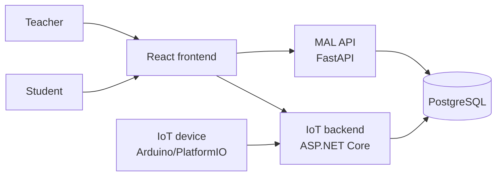
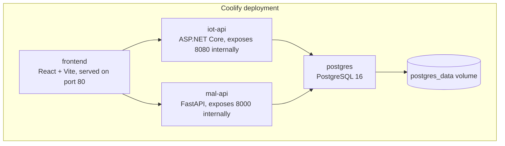
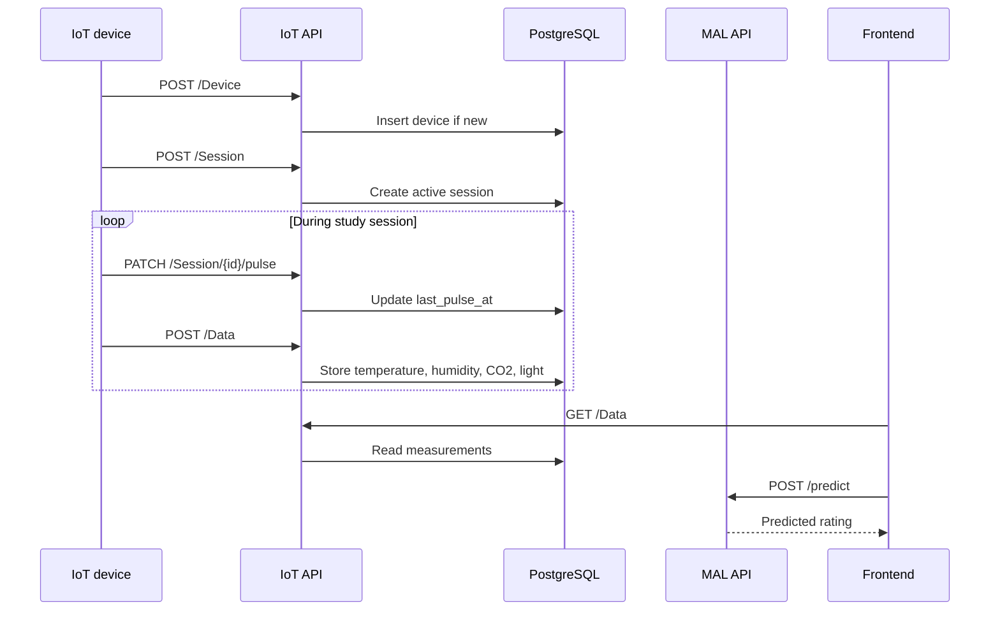
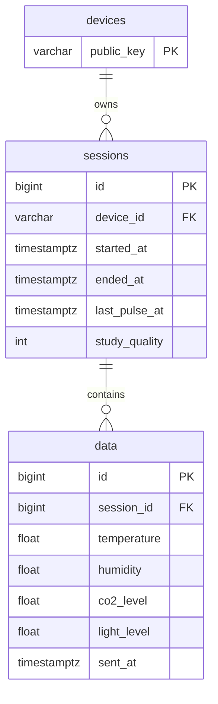
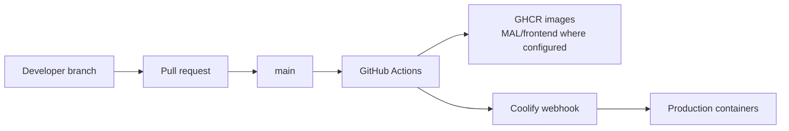

# StudyHelper Architecture

StudyHelper is a distributed study-environment monitoring system. A physical IoT device measures room conditions, a backend stores measurements and sessions, an ML service predicts study suitability, and a React frontend visualizes current and historical conditions.

This document describes the implemented architecture in the repository, not only the intended design.

## System Context

## Container Architecture

The deployed system is described by `docker-compose.yml` and currently consists of four containers:

### Services

| Service      | Technology                                   | Responsibility                                                                | Source                   |
| ------------ | -------------------------------------------- | ----------------------------------------------------------------------------- | ------------------------ |
| `frontend` | React, Vite, Nginx/containerized static site | Dashboard, history, login/register UI                                         | `Frontend/`            |
| `iot-api`  | ASP.NET Core, Entity Framework Core, Npgsql  | Device registration, study sessions, sensor data persistence, database health | `IOT_backend/`         |
| `mal-api`  | FastAPI, scikit-learn, psycopg               | Model prediction, model metadata, database data collection for training       | `MAL/`                 |
| `postgres` | PostgreSQL 16 Alpine                         | Shared persistence for devices, sessions, and sensor data                     | `initdb/01_schema.sql` |
| IoT firmware | PlatformIO C                                 | Reads sensors, registers device/session, posts measurements, sends pulses     | `IOT/`                 |

## Runtime Data Flow

## Database Model

The current persistent model contains three tables:

The schema is initialized both by `initdb/01_schema.sql` and by the ASP.NET Core startup initializer in `IOT_backend/DbConfig/DatabaseInitializer.cs`. This makes the database resilient during development and deployment, but the duplication should eventually be replaced by one migration strategy.

## Deployment View

The current deployment runs on Coolify. GitHub Actions triggers Coolify on pushes to `main` through `.github/workflows/deploy-coolify.yaml`.

