<!-- ============================================================
  PROJECT REPORT — VIA Engineering Guidelines 2024 + SEP4 Requirements
  
  STRUCTURE (mandated by SEP4 requirements document):
  
    Introduction
    Analysis                     ← one coherent unit (shared)
    Design Overview              ← shared, includes cloud architecture
      ├─ IoT Design              ┐
      ├─ ML Data Exploration     ├─ branches here
      └─ Frontend Design         ┘
      ├─ IoT Implementation      ┐
      ├─ ML Preprocessing        ├─ still branched
      └─ Frontend Implementation ┘
      ├─ IoT CI/CD               ┐
      ├─ ML Models               ├─ still branched
      └─ Frontend CI/CD          ┘
      ├─ IoT Test                ┐
      └─ Frontend Test           ┘
    Results and Discussion       ← merges back together
    Conclusions
    Future Work
  
  FORMALITIES:
  - Max 60 pages (1 page = 2400 characters)
  - Each section must list its AUTHORS
  - APA references throughout
  - Objective academic tone (no first-person — that goes in Process Report)
  - All claims supported by evidence and citations
  - Submit: report PDF, source code, repo links, 30-min video demo
  ============================================================ -->

# Abstract

<!-- Write LAST, even though it appears first. ~150–250 words.
     Cover: problem, approach (IoT + ML + Frontend + Cloud), key technical choices, results.
     No citations needed. -->


StudyHelper is a distributed study-environment monitoring system developed to address the challenge of suboptimal indoor conditions affecting student concentration and academic performance. The system integrates three tightly coupled components: an embedded IoT device based on the ATmega2560 microcontroller that measures temperature, humidity, CO₂ concentration, and light; a machine learning pipeline implemented in Python that predicts a Study Suitability Rating from aggregated sensor data and a React web frontend that presents live readings, historical sensor readings, and ML-generated predictions to the user. All components are deployed as Docker containers on a cloud host managed through Coolify, with the Core API (FastAPI) acting as the central gateway - persisting sensor data in a shared PostgreSQL database and forwarding requests to the MAL FastAPI service for suitability predictions. The IoT firmware communicates with the backend over HTTP using a session-based protocol, transmitting sensor payloads every 30 seconds and keepalive pulses every five seconds. The machine learning pipeline evaluated both instant measurement models and session-based models that aggregate sensor readings across a full study session. Session-based experiments reached up to 69.0% test accuracy with Random Forest (macro F1: 0.63), while the selected Neural Network model reached 68.3% with a smaller train-test gap and a more useful prediction distribution; both results were above the 57.9% majority-class baseline. Instant-measurement models were weaker overall, with standalone classifiers ranging from 37.2% to 46.1% accuracy and the best two-stage instant pipeline reaching 48.5%, supporting the project's central finding and the Subjectivity Paradox: raw point-in-time sensor readings alone are insufficient for reliably predicting subjective study quality.

# 1. Introduction

<!-- Sets the stage for the entire report. Must include the problem statement from
     your Project Description. Shared section — one coherent voice for the whole group.
     Consider environmental, social, economic, and technological significance. -->


## 1.1 Background and Motivation

[Describe the domain context. What real-world problem does the system address?
Why is an IoT-based solution with machine learning relevant here?
Who are the stakeholders and what do they need?]

The physical environment in which learning takes place has a measurable impact on cognitive performance. Research has shown that indoor environmental conditions such as air quality, temperature, humidity, CO₂ concentration, and lighting can influence students' ability to concentrate and learn effectively (Bustamante-Mora et al., 2025; Satish et al., 2012; Allen et al., 2016). Despite growing awareness of this relationship, most study spaces - libraries, classrooms, dormitories - provide no real-time feedback on whether the ambient conditions are conducive to productive work. Students are left to rely on subjective perception, often noticing that conditions are poor only after their focus has already deteriorated.
This makes the problem difficult to handle manually, because students may feel tired or distracted without knowing whether the cause is related to the environment. Objective measurements can help make these conditions visible before they noticeably affect the study session.

The problem is particularly acute in shared environments where individual control over heating, ventilation, or lighting is limited or absent. A student in a crowded library has no practical way of knowing whether the rising CO₂ level in the room is contributing to their fatigue, or whether the ambient temperature is outside the range associated with optimal cognitive function. Existing commercial solutions either focus on a single sensor parameter or require expensive infrastructure that is not feasible in a typical university context.
For schools and universities, this creates a practical need for a solution that can monitor indoor conditions without requiring expensive building-wide infrastructure.

By combining low-cost IoT sensing with a machine learning prediction layer, the StudyHelper system closes the gap between raw environmental data and actionable guidance. Rather than simply logging sensor values, the system learns from historical patterns of user-rated study sessions and uses that knowledge to predict how suitable current conditions are likely to be - providing students and teachers with a tool to make informed decisions about when and where to study.

The primary stakeholders are students, who benefit directly from improved self-awareness of their study environment; teachers, who can use condition overviews to assess classroom suitability.
[Expand here if additional stakeholder interviews or literature sources are added.]

## 1.2 Problem Statement

<!-- Paste or adapt directly from your approved Project Description. -->

Based on the environmental challenges identified in the problem domain, this project addresses the following core question:

**Main problem:** How can indoor environmental data be monitored and analyzed to better understand how environmental conditions affect the quality of students' study sessions?

This problem is decomposed into the following sub-questions:

- What are the most significant indoor environmental factors that affect students' study conditions?
- What factors can be used to represent study session quality and indoor environmental quality?
- How do students react to changes in indoor environmental quality?
- Is there a measurable relationship between environmental factors and user-provided study ratings?
- How accurately can study suitability be predicted based on collected sensor data?

A successful solution would continuously collect real-world sensor data from study environments, expose this data through a structured API, and deliver ML-driven suitability predictions to students via a responsive web interface. The system should require minimal manual input from the user, apart from connecting a device and optionally submitting a post-session quality rating.

## 1.3 Project Objectives

The concrete objectives of the StudyHelper project are as follows:

- **IoT:** The embedded device shall measure temperature, humidity, CO₂ concentration, and light level using the ATmega2560 MCU and transmit structured JSON payloads to the cloud backend via HTTP at a regular interval not exceeding sixty seconds.
- **Cloud Backend:** The Core API (FastAPI) shall act as the central gateway - persisting sensor readings and session metadata in a shared PostgreSQL database and exposing a RESTful API consumed by both the frontend and the MAL service.
- **Machine Learning:** The ML component shall train a classifier capable of predicting a Study Suitability Rating on an integer scale of one to five, using aggregated temperature window features derived from historical sensor data, and expose predictions through a FastAPI endpoint.
- **Frontend:** The React web application shall display live sensor readings and the current ML-predicted suitability rating in a responsive layout that adapts to screen widths of 576 px, 768 px, and 1200 px.
- **DevOps:** All components shall be containerised with Docker, deployed to a public cloud host, and supported by automated CI/CD pipelines on GitHub Actions that enforce unit-test passing and successful build compilation before merging to the main branch.
- **Security:** Communication between the IoT device and the backend shall be protected by [encryption scheme to be specified]; frontend-facing API endpoints shall be protected by [JWT / API key to be confirmed].

[TODO: Review these objectives against the final delivered system before submission and adjust the wording where the implementation diverged from the original plan.]

## 1.4 Scope and Delimitations

The system is designed around a physical IoT device that can be connected to a user account and used in different study environments, such as classrooms, libraries, or personal study spaces.
The following delimitations were agreed at project inception and are reflected in the implemented system:

**Geographical scope:** The device is designed and tested within a campus-related study context, such as classrooms, libraries, or personal study spaces. The IoT device is treated as a portable physical sensor that can be connected to a user account and used in the environment where the user is currently studying. Multi-building deployment is out of scope for this iteration.

**Sensor coverage:** The system measures temperature, humidity, CO₂ concentration, and light. Sound level measurement is not currently implemented by the active firmware, despite being noted as a candidate sensor in the project description due to the malfunctioning and inaccurate quality of the sound sensor.

**Automation:** The system provides predictive guidance but does not automate any physical actuators beyond the onboard buzzer alert triggered when the predicted study quality rating reaches the lowest level. Full HVAC or lighting automation is explicitly out of scope.

**User model:** The system supports user roles such as student who can start and stop sessions via the physical button on the device and submit a post-session quality rating through the frontend, and a teacher who assesses whether conditions are suitable for teaching. Administrator views are out of scope.

**Privacy and data collection:** The system stores environmental sensor readings and session lifecycle metadata. In addition, user accounts are stored, including name, last name, email address, and a hashed password, as well as optional profile fields such as university, study programme, study year, study goal, and a profile picture reference. Connected device information and post-session ratings submitted by users are persisted so ratings can be associated with the correct device and study session. No audio recordings or video are collected. All personally identifiable data is linked to a user account and is subject to standard data protection considerations; password storage uses hashing.

**Medical and psychological analysis:** The system does not attempt to measure or infer physiological state, stress levels, or cognitive load directly. The Study Suitability Rating is an environmental proxy, not a clinical assessment.

[Add any additional delimitations agreed with supervisors, particularly regarding scale of the ML dataset or the number of test participants.]

## 1.5 Related Work

A growing body of work connects indoor environmental quality (IEQ) with human concentration, comfort, and performance. Bustamante-Mora et al. (2025) specifically review environmental conditions in university learning environments and identify air quality, temperature, humidity, CO₂, particulate matter, and luminosity as relevant factors for concentration and learning. Controlled exposure studies have also shown that CO₂ concentration and ventilation conditions can affect cognitive function and decision-making performance (Satish et al., 2012; Allen et al., 2016). This literature supports the basic premise of StudyHelper: temperature, humidity, CO₂, and light are reasonable environmental variables to monitor when evaluating whether a space is suitable for studying.

Existing IoT-based indoor air quality systems show that low-cost sensor nodes can collect environmental readings and transmit them to a server for storage, visualization, and later analysis. For example, Marques et al. (2019) present an IoT-based CO₂ monitoring system for indoor air quality assessment, while Saini et al. (2020) provide a systematic review of IoT-based indoor air quality monitoring systems and identify common concerns such as sensor selection, calibration, connectivity, and real-time data presentation. StudyHelper follows this general pattern by using a microcontroller-based sensing device, Wi-Fi communication, a backend API, a database, and a web dashboard. However, the implemented system is intentionally smaller in scope than a production indoor air quality platform: it measures temperature, humidity, CO₂, and light, but does not include calibrated particulate matter, VOC, or sound-level sensing.

Machine-learning research on comfort prediction also shows why StudyHelper's prediction problem is difficult. Personal comfort models move away from one-size-fits-all thermal comfort assumptions and instead use IoT data, machine learning, and individual feedback to predict a specific occupant's comfort response (Kim et al., 2018). This is directly relevant to the StudyHelper results. The project originally attempted to predict study suitability from environmental readings alone, but the experiments showed that instant sensor snapshots were not enough to predict subjective ratings reliably. The final session-based model therefore uses aggregated readings from a study session and treats the user's 1-5 post-session rating as the supervised target. This is a practical approximation of personal comfort modelling, but it remains limited because the project did not collect enough real user-specific data to train genuinely personalized models.

Compared with related work, StudyHelper's contribution is not a new sensor technology or a state-of-the-art ML model. Its contribution is the integration of the full educational prototype: an IoT device starts and ends study sessions, the backend stores session-based telemetry, the MAL service predicts a Study Suitability Rating, and the React frontend displays live readings, history, predictions, and post-session feedback. The system therefore sits between simple environmental dashboards and more advanced occupant-centric comfort systems. It demonstrates the feasibility of connecting these parts in one deployable student project, while also exposing the main limitation of the approach: subjective study quality cannot be predicted robustly from general environmental data alone without more participant data and stronger personalization.

# 2. Analysis

<!-- ONE COHERENT UNIT — shared across all three sub-teams.
     The entire group contributes to and agrees on this section.
     Must include: user stories, domain model, system-level requirements.
     Do NOT branch here — one list of user stories, one domain model, etc. -->


## 2.1 Domain Model

The domain model represents the structural backbone of the StudyHelper platform, mapping physical hardware contexts to virtual user spaces and persistent storage entities. By conceptualizing the domain prior to database modeling, the system achieves strict normalization and clear separation of concerns.


### Architectural and Structural Breakdown

The domain is partitioned into distinct logical spaces that coordinate during active monitoring:

- **Identity and Personalization Space (`User` & `UserProfile`)**: In typical authentication designs, user credentials and preferences are coupled. In StudyHelper, the `User` entity (retaining name, email, and authentication hashes) is structurally decoupled from the `UserProfile` via a 1-to-0..1 relationship. This separation allows the authentication engine to remain lightweight and performant. The `UserProfile` captures academic metadata (`university`, `studyProgram`, `studyYear`, `studyGoal`, `profilePicture`). Although the database schema (`initdb/01_schema.sql`) and Core REST API models contain preferred comfort targets (`preferred_temp` and `preferred_co2`), these are excluded from the active system boundary domain model in this iteration because the client application does not save or display them.
- **Physical Device Space (`Device`)**: A `Device` represents a physical hardware unit deployed in a student’s room, uniquely identified by a hardware-defined string `id`. In the relational model, a `Device` exists independently of a `User`, supporting a multi-tenant device lifecycle where a device can be reassigned or shared.
- **Monitoring Event Space (`Session`)**: Rather than registering telemetry as a continuous uncontextualized stream, the domain groups data points into discrete `Session` blocks. A `Session` captures the duration of a specific study period, initialized and finalized via physical buttons on the device. It maintains a state flag `isEnded` and records the lifecycle via `startedAt` and `lastPulseAt` timestamps.
- **Telemetry Space (`DataPoint`)**: Representing the actual physical measurements, a `DataPoint` encapsulates temperature, humidity, CO₂ level, and light level. Each data point is strictly coupled to a parent `Session` (1-to-many relationship). This design choice is critical for the predictive model, as it associates sensor snapshots with the specific temporal window of a study session. Additionally, each data point stores the `predictedStudyQuality` generated by the machine learning pipeline at the moment of ingestion.
- **Feedback Space (`Rating`)**: A `Rating` provides the user's subjective assessment of their comfort and concentration level during a session on a scale of 1 to 5 (`ratingValue`). While the underlying database schema and Core REST API support a nullable `comment` string, it is excluded from the active use cases and sequence diagrams in this release due to the absence of input fields in the user interface application.
- **Planning Space (`CalendarEvent`)**: Enables students to schedule future study blocks directly in the app. Each `CalendarEvent` is owned by a `User` and contains scheduling parameters (`title`, `note`, `startTime`, `endTime`, `allDay`).

### Analysis of Conceptual Modeling Decisions

1. **Session-Telemetry Coupling for Feature Extraction**: Attaching `DataPoints` to a `Session` rather than directly to a `Device` or `User` provides a natural grouping for statistical aggregation. The Machine Learning service (MAL) requires session-wide aggregates (such as mean temperature, CO₂ variance, and light exposure duration) to formulate accurate comfort predictions. This structural coupling avoids complex windowing queries in PostgreSQL during inference.
2. **Postponed Preference and Comment Integration**: To streamline frontend development in this release, comfort target preferences (`preferred_temp`/`preferred_co2` in `UserProfile`) and qualitative comments (in `Rating`) are not exposed to the user interface. However, the database schema (`initdb/01_schema.sql`) and Core REST API endpoints preserve these attributes. This intentional design choice ensures backend-to-frontend compatibility for future releases without requiring schema migrations or endpoint redesigns.
3. **Decoupled User Profiles for Compliance and Agility**: Decoupling `UserProfile` from `User` ensures that personal data storage is separated. If a user requests account deletion under data privacy regulations, the `UserProfile` and `User` tables can be purged without breaking the anonymized telemetry database, since the historical `Session` data is linked only via the device identifier.

## 2.2 User Stories

<!-- Present ALL user stories as a single shared backlog.
     Format: "As a [role], I want to [action], so that [benefit]." -->

The following user stories were derived from the use cases defined in the project analysis and reflect the agreed shared backlog across all three sub-teams:

| ID   | User Story                                                                                                                                                                       | Priority    | Component                   |
| :--- | :------------------------------------------------------------------------------------------------------------------------------------------------------------------------------- | :---------- | :-------------------------- |
| US01 | As a Student, I want an overview of current environmental conditions and a suitability prediction, so that I can decide whether to start or continue a study session.            | Must have   | IoT / Cloud / ML / Frontend |
| US02 | As a Student, I want to submit a rating after a study session, so that the system can improve suitability predictions over time.                                                 | Must have   | Frontend / ML               |
| US03 | As a Student, I want to see the history of environmental conditions during my study session, so that I can understand trends affecting my focus.                                 | Should have | Frontend / Cloud            |
| US04 | As a Student, I want to receive an alert when conditions fall below an acceptable threshold, so that I can take action to improve my study environment.                          | Should have | IoT / Cloud                 |
| US05 | As a Student, I want to start and stop a monitored study session using a physical button on the device, so that I do not need to interact with any software to begin monitoring. | Must have   | IoT                         |
| US06 | As a Teacher, I want an overview of current and predicted environmental conditions, so that I can decide if the environment is suitable for teaching.                            | Could have  | Frontend / ML               |
| US07 | As a Student, I want the web application to work correctly on my phone, tablet, and laptop, so that I can check conditions from any device.                                      | Should have | Frontend                    |
| US08 | As a User, I want to register, log in, and log out securely, so that my personal data and study information are protected.                                                       | Must have   | Frontend                    |
| US09 | As a Student, I want to connect my physical device to my account, so that the dashboard can show data from my own study device.                                                  | Must have   | Frontend                    |
| US10 | As a Student, I want to manage my profile information, so that the application can be personalized to me.                                                                        | Should have | Frontend                    |
| US11 | As a Student, I want to manage calendar events, so that I can plan study sessions in the same application.                                                                       | Could have  | Frontend                    |
| US12 | As a User, I want to switch between English and Danish and use dark mode, so that the application is easier to use in different contexts.                                        | Could have  | Frontend                    |

## 2.3 System Requirements

The following requirements were derived from the user stories and supplemented by cross-cutting concerns identified during analysis:

| ID    | Requirement Description                                                                                                                              | Type           | Source         |
| :---- | :--------------------------------------------------------------------------------------------------------------------------------------------------- | :------------- | :------------- |
| FR01  | The system shall continuously monitor ambient environmental conditions (temperature, humidity, carbon dioxide level, and light level) during active study sessions. | Functional     | US01           |
| FR02  | The system shall associate physical monitoring devices with specific user accounts to display localized study environment data.                     | Functional     | US09           |
| FR03  | The system shall allow users to start and stop study sessions using physical inputs on the monitoring device.                                        | Functional     | US05           |
| FR04  | The system shall evaluate environmental conditions during a session to calculate a study suitability rating on a scale of 1 to 5.                     | Functional     | US01, US06     |
| FR05  | The system shall present real-time conditions, predicted suitability ratings, and historical trends of the active session to the user.                | Functional     | US01, US03, US06 |
| FR06  | The system shall allow users to submit subjective post-session feedback regarding their comfort and concentration level.                             | Functional     | US02           |
| FR07  | The system shall alert the user immediately when the environmental suitability of the study space is critically poor.                               | Functional     | US04           |
| FR08  | The system shall allow users to register a new account, log in, and log out securely to protect their personal and study data.                       | Functional     | US08           |
| FR09  | The system shall allow users to customize their personal profile information.                                                                        | Functional     | US10           |
| FR10  | The system shall allow users to schedule and manage future study events on a calendar.                                                               | Functional     | US11           |
| FR11  | The system shall allow users to configure interface preferences, including switching languages and toggling dark mode.                               | Functional     | US12           |
| NFR01 | The user interface must adapt dynamically without horizontal scrolling or text clipping across screen widths from$320\text{ px}$ to $1920\text{ px}$.                                                           | Non-functional | US07           |
| NFR02 | The backend must automatically end a study session if no keepalive signal is received from the device for a continuous period of$30\text{ seconds}$.                                                              | Non-functional | Reliability    |
| NFR03 | The ML prediction service must return comfort ratings in less than$200\text{ ms}$ for $99\%$ of requests under concurrent load.                                                                                 | Non-functional | US01, US06     |
| NFR04 | All server-side applications must be deployable to a target environment using a single orchestration command in under$5\text{ minutes}$.                                                                          | Non-functional | Supportability |
| NFR05 | The authentication service must temporarily lock a user account for$15\text{ minutes}$ after 5 consecutive failed login attempts.                                                                                 | Non-functional | Security       |
| NFR06 | The CI/CD pipeline must execute automated unit tests and block code merges if test coverage falls below$80\%$ or if any test fails.                                                                               | Non-functional | DevOps |

A comprehensive specification of these non-functional criteria under the FURPS+ quality framework is maintained in the project's [Non-Functional Requirements Document](../NonFunctionalRequirements.md).

## 2.4 System Sequence Diagrams

System Sequence Diagrams (SSDs) establish the boundaries of the StudyHelper system, mapping external actor triggers to synchronous and asynchronous system responses. In our architectural design, these SSDs served as the contract between the embedded firmware (C/C++ on ATmega2560), the cloud backend (FastAPI/PostgreSQL), the machine learning service (MAL), and the client-side user interface (React).

### 2.4.1 IoT-Initiated Session Lifecycles

The start and end use cases governed by the physical button interface on the hardware box require precise synchronization between the microcontroller's local state and the database state.


#### Architectural Utility and Firmware Control Loops

These two SSDs guided the design of the device's main loop (`main.c`) and API integration layer (`server_api.c`) in several ways:

1. **Watchdog Self-Healing Routine**: The start sequence highlights a synchronous POST request to `/session`. If the network fails or the server returns an error, the firmware triggers a hardware Watchdog reset (`wdt_enable(WDTO_30MS)`) after 5 retries, forcing a clean device reboot. This self-healing mechanism is directly derived from modeling the system boundary response to connection failures.
2. **Button Cooldown and Debouncing**: To prevent double-triggering or race conditions on the server (creating multiple ghost sessions for a single physical press), we implemented a software-based timer cooldown (`session_button_cooldown_timer`) of 10 seconds. This state locking is reflected in the SSD transitions where session commands are serialized.

### 2.4.2 Active Telemetry and Real-Time Alerting

During a running session, the system must ingest telemetry and evaluate the environment without blocking the microcontroller or introducing dashboard delays.


#### Ingestion and Alerting Execution Details

1. **Asynchronous Dual-Timer Routine**: The firmware utilizes two distinct software-based interrupts. A 5-second timer (`pulse_timer`) posts keep-alives to `/session/{id}/pulse` to maintain session persistence on the server. A 30-second timer (`data_timer`) reads physical sensors (DHT11, light ADC, MH-Z19 CO2 UART) and transmits telemetry to `/data`. Modeling these as separate SSD streams allowed us to decouple connection validation (keep-alives) from resource-heavy sensor polling.
2. **Direct Feedback Loop**: The response from `/data` returns the ML-predicted study suitability score. The SSD shows that if the returned score is less than 4 (poor or moderate comfort), the device enters a local buzzer alerting loop (`buzzer_beep()`). Modeling this response loop as a direct system output payload prevented the need for the device to perform local calculation or pull data, saving processing power and memory on the ATmega2560.

### 2.4.3 Comfort Feedback and Prediction Loop

After a study session, the student evaluates their comfort experience.


#### Feedback Loop and API Specification

The rating sequence maps the transition of user feedback into training labels:

1. **API Validation Contract**: The SSD defines a single transaction `submitStudySessionRating(ratingValue)` to `/ratings`. This guided the definition of the FastAPI Pydantic schema (`RatingRequest`), enforcing that rating values remain between 1 and 5 in the client payload.
2. **Frontend UI State Mapping**: By modeling the receipt confirmation, the frontend React application (`SessionRating.jsx`) is structured to reset local states (clearing the rating selection) and close the modal container only upon receiving a successful status code from the backend.

## 2.5 Use Case Control Flow and State Transitions

To ensure consistency in state handling across the IoT device firmware, web frontend, and cloud backend, we mapped the system's operational control flow.


### System-Wide State Synchronization and Validation

Modeling the parallel execution of these transactions helped the development team resolve synchronization bottlenecks across different execution environments:

1. **Firmware State Transition and Lockouts**: When a student triggers `StartStudySession` or `EndStudySession` via the physical button, the device transitions its internal state. The activity flow visualizes how this triggers a backend transaction, updating the PostgreSQL database. The web application synchronizes with this state via SSE/polling, displaying active monitoring statuses. By tracking the control flow, we realized that starting a session should lock out certain options (like taking one-time measurements via button 2), protecting the UART sensor serial bus from overlapping requests.
2. **Dynamic Alerting Flow**: The alert flow (modeled under `ReceiveStudentEnvironmentAlert`) shows that during a session, the system continuously reads sensor telemetry. The alert sequence validates the ML-predicted comfort index and decides whether to skip or trigger the buzzer alarm. Mapping this flow clarified that alert validation should happen synchronously on the backend during telemetry ingestion, avoiding client-side alert calculation.
3. **Session Ratings during Active Sessions**: Originally, comfort ratings were conceptualized as occurring only after a session had terminated. By mapping the parallel execution branches in the activity diagram, we realized comfort ratings could be submitted during an active session as comfort levels fluctuate. This motivated us to allow comfort ratings during a session, which allows multiple rating inputs to be associated with different telemetry intervals.

# 3. Design

## 3.1 Design Overview

<!-- SHARED section — written as one coherent unit BEFORE branching.
     Present the overall system architecture and cloud design here. -->


### 3.1.1 System Architecture

[Describe the overall architecture: IoT device → Cloud backend → Frontend,
with the ML pipeline integrated into or alongside the cloud layer.
Reference the architecture diagram:]

<!--  -->

[Justify the key architectural decisions: why this decomposition, how components
communicate (protocols, data formats), and how data flows end-to-end.]

The StudyHelper system follows a layered, distributed architecture comprising four runtime components: the embedded IoT firmware, the Core API, the MAL API, and the React frontend. All server-side components are deployed as Docker containers behind a Coolify-managed reverse proxy (Caddy/Traefik) and share a single PostgreSQL database, as described by `docker-compose.yml`.

The IoT device sits at the edge of the system. It collects sensor readings and transmits them over HTTP to the Core API, acting as the sole source of real-world environmental data. This unidirectional push pattern was chosen because the device does not need to receive commands in normal operation and because HTTP over TCP is straightforward to implement with the ESP8266-based Wi-Fi module used alongside the ATmega2560.

The Core API (FastAPI) is the system's central gateway. It handles device registration, session lifecycle management, sensor data persistence, ratings and user authentication. It is the only component with direct write access to the PostgreSQL database. When new sensor data is received, the Core API can call the MAL API to obtain a predicted study suitability rating and store the result together with the sensor reading. This keeps the frontend connected to one API surface while allowing the MAL service to be retrained and redeployed independently without affecting the Core API.

The MAL API (FastAPI) is responsible for model inference and data collection for retraining. It receives prediction requests forwarded by the Core API, loads the trained model artifact, and returns a suitability rating. It also exposes endpoints for exporting raw sensor data from the database to support offline retraining workflows.

The React frontend is a static single-page application served by Nginx inside a Docker container. It communicates exclusively with the Core API via REST calls - user authentication, profile/device data, session state, dashboard readings, sensor history, calendar data, and ratings. The frontend does not calculate predictions itself, it displays the predicted_study_quality value returned by the Core API. All inter-service communication uses JSON over HTTP. The Coolify reverse proxy handles TLS termination and routes public traffic to the frontend and Core API containers.

Data flows through the system as follows: the IoT device pushes a sensor payload to the Core API during an active session; the Core API persists the reading in PostgreSQL and requests a suitability prediction from the MAL API; the MAL API returns a rating; the Core API stores the rating together with the sensor data and relays the result to the frontend. The frontend polls the Core API for dashboard data and renders the latest readings, chart, and recommendation.

### 3.1.2 Cloud Architecture

<!-- Required by SEP4: must use public cloud hosting, containers, and serverless. -->

The StudyHelper backend is hosted on **Coolify**, an open-source self-hosted PaaS running on a public VPS. Coolify provides container lifecycle management and a built-in reverse proxy (Caddy/Traefik) that terminates TLS and routes public traffic to the frontend and Core API services. Internal traffic between services stays on the Docker network.

**Containerisation:** All runtime services are defined in `docker-compose.yml` and run as Docker containers: `postgres`, `api`, `mal-api`, and `frontend`. The `api` service is built from `API/Dockerfile` (Python 3.12) and serves the Core API with Uvicorn on port 8080. The `mal-api` service is built from `MAL/Dockerfile` and serves the ML inference API on port 8000, including the committed models artifacts. The `frontend` service is built from `Frontend/Dockerfile`, compiles the Vite/React application, and serves static assets with Nginx on port 80. The `postgres` container uses the official `postgres:16-alpine` image with a named volume (`postgres_data`) for persistence.

**Database:** A single PostgreSQL 16 instance is the shared persistence layer. The schema is initialized via `initdb/01_schema.sql` mounted as an entrypoint init script. The Core API owns write access for devices, sessions, and sensor data, while the MAL API reads data for export and model support.

**RESTful API design:** The IoT device communicates directly with the Core API over HTTP (no message queue is used). Device registration uses `POST /device`, sessions use `POST /session` and `PATCH /session/{id}/pulse`, and sensor submissions use `POST /data`. The frontend communicates exclusively with the Core API for readings and predictions; prediction requests are forwarded by the Core API to the MAL API `POST /predict` endpoint. All inter-service payloads are JSON.

**Serverless workloads:** No separate serverless runtime is deployed. Data extraction and model verification tasks are handled by on-demand GitHub Actions workflows (for example, `data-extract.yml`).

**Continuous delivery:** On every push to `main`, a GitHub Actions workflow sends a webhook to Coolify, which pulls updated images from GHCR and restarts the affected containers. Pre-built images for `mal-api` and `frontend` are published to GHCR as part of the MLOps and frontend CI/CD pipelines.

### 3.1.3 Security Design


<!-- SEP4 requires: encryption for IoT–cloud (symmetric or asymmetric),
     and JWT (or equivalent) protection for frontend-facing API endpoints. -->

**IoT–cloud encryption:** The ATmega2560 does not have sufficient resources to perform TLS, so the device communicates with the backend over plain HTTP. This is a known limitation of the prototype. The device authenticates itself by including its device ID in the JSON payload only during registration and session creation. Once the server returns a session ID, all subsequent requests — data submissions and keepalive pulses — use that session ID instead, so the device ID is not transmitted for the duration of an active session. Sensitive build-time credentials are injected via a `secrets.ini` file that is excluded from the repository, so no credentials are committed to source control.

**API authentication:** The MAL API export endpoint (`GET /export-data`) is protected by an `X-Export-Token` HTTP header checked against the `MAL_API_EXPORT_TOKEN` environment variable. This prevents unauthorised access to raw sensor exports. [Describe the authentication mechanism for the IoT backend endpoints — the `secrets.ini.example` file in the IoT firmware references a `SECRET_KEY` environment variable on the API container, which suggests token-based authentication is configured. Confirm whether JWT is implemented and which endpoints require it.]

**Secret management:** Sensitive credentials - database password, Wi-Fi SSID and password, server hostname, device ID, and the API secret key - are stored as environment variables, never hard-coded in source files. The firmware secrets are injected at build time via `secrets.ini`, which is excluded from the repository by `.gitignore`. Server-side secrets are passed to Docker containers via the `.env` file, which is similarly excluded. The `docker-compose.yml` uses mandatory variable substitution (`:?` syntax) so that a deployment will fail explicitly if any required secret is missing rather than silently using an empty value.

**Additional considerations:** Because the ATmega2560 has limited cryptographic hardware support, the choice of encryption scheme involves a trade-off between security strength and memory and processing overhead. Plain HTTP was therefore chosen as the most practical option for this prototype, as implementing software encryption on the ATmega2560 would introduce additional complexity and risk of unpredictable issues within the project timeline. The database is not exposed on a public port; access is restricted to the Docker internal network, which limits the attack surface from the public internet.

[Complete this section with any additional security measures implemented, such as rate limiting on the prediction endpoint, CORS configuration on the backends, or HTTPS enforcement by the Coolify reverse proxy.]
-->

For frontend-facing API endpoints, the Core API uses JWT-based authentication. After a successful login, the backend creates a JWT signed with `SECRET_KEY` and stores it in an `HttpOnly` cookie named `access_token`. Protected endpoints read the token from this cookie through the shared `get_current_user` dependency. Bearer-token support is still kept as a fallback, but the frontend no longer stores the JWT in `localStorage`.

During registration, user's password is hashed and stored in the database. The hashing is performed using a bcrypt algorithm through Passlib’s CryptContext. When a user logs in, the entered password is compared to the stored password hash. This way, plain text passwords are never used, which reduces risk of exposing user's credentials.

The frontend sends authenticated requests with `credentials: "include"` so the browser includes the authentication cookie automatically. This is used by protected API calls such as dashboard, profile, calendar, session, device, and rating requests. Logout clears the authentication cookie on the backend.

The JWT signing key is read from the `SECRET_KEY` environment variable instead of being hard-coded in the source code. The variable is documented in `.env.example` and passed into the API container through `docker-compose.yml`. This makes the signing key configurable per environment and avoids committing the real secret to Git.

Additional considerations:
Login rate limiting is implemented to reduce repeated brute-force login attempts. The API allows up to five failed login attempts within a 15-minute window for the same client/email combination. After the limit is reached, login returns HTTP 429 until the window expires. CORS is configured to allow the frontend origins used in local development and to support credentials, which is required because authentication uses cookies.

Calendar events are also protected by the logged-in user identity. The calendar endpoints use the current authenticated user from the JWT cookie, and every create, read, update, and delete operation is linked to `current_user["id"]`. This means users only see and modify their own calendar events, not events created by other users.

### 3.1.4 DevOps Strategy

<!-- All projects must: unit test, use distributed Git with branches/tags,
     set up automated regression testing via GitHub/GitLab CI, and use containers.
     Pair-programming commits must list both names in the commit message. -->

Reference the repository: https://github.com/SEP4Real/SEP4.git

The StudyHelper project follows a trunk-based branching model with two long-lived protected branches: `main` (production) and `dev` (integration). Feature and bugfix work is developed on short-lived branches cut from `dev` and merged via pull requests. Direct pushes to `main` are blocked; all changes reach `main` through a PR that has passed the required CI checks for its component area. Pair-programming sessions are documented in commit messages by listing both contributors in the format `Co-authored-by: Name <email>`, consistent with GitHub's co-authorship convention.

**CI/CD overview:** Three separate GitHub Actions workflows cover the three main codebases:

- **IoT CI** (`iot-ci.yaml`): triggered on pull requests to `main` and `dev` that modify files under `IOT/`. Runs two sequential jobs: native unit tests compiled with GCC and coverage reporting via lcov, followed by firmware compilation for the ATmega2560 using PlatformIO. A flashable `firmware.hex` artifact is published on every passing build.
- **MLOps** (`mlops.yaml`): triggered on pull requests to `main` and `dev`. Runs the full `pytest` suite for data pipeline and API tests, verifies that both instant and session models artifacts are present and loadable, and on merge to `main` builds and pushes the `mal-api` Docker image to GHCR.
- **Frontend CI/CD** (`frontend.yaml`): triggered on pull requests to `main` and `dev` when frontend files are changed. It installs dependencies, runs the Vitest frontend tests, and builds the Vite production app. This helps catch broken components, failing tests, and build errors before the frontend is merged or deployed.
- **Deployment** (`deploy-coolify.yaml`): triggered on pushes to `main`. Sends a webhook to Coolify to redeploy the production stack.

**Container strategy:** All services are containerised. The Core API (`api`) uses a Python 3.12 Dockerfile served by Uvicorn. The MAL API (`mal-api`) uses a Python Dockerfile that installs dependencies from `requirements.txt` and copies the model artifact. The frontend (`frontend`) uses a Node.js build stage and an Nginx serve stage. The database uses the unmodified `postgres:16-alpine` official image.

**Testing overview:** Unit testing is component-specific. The IoT firmware tests cover the `wifi_http` and `server_api` modules using Unity and FFF, running natively on the CI host. The ML pipeline tests cover data transformation logic and the FastAPI prediction endpoint using pytest. [TODO: Describe the frontend test approach — e.g. whether Jest or React Testing Library tests are included in the pipeline.] Integration testing across components is manual, performed by flashing the firmware, running the backend stack locally, and observing end-to-end data flow.

## 3.2 IoT Design

*Authors: Damian Michal Choina, Jakub Maciej Baczek, Tymoteusz Krzysztof Zydkiewicz*

The IoT component is the physical sensing layer of the StudyHelper system. Its main responsibility is to collect indoor environmental data from the study space and transmit it to the backend, where the readings can be stored, displayed in the frontend, and used as input for machine-learning-based study suitability prediction.

The design is based on three central requirements. First, the device must measure the environmental factors selected for the project: temperature, humidity, CO2 concentration, and light level. Second, it must support a simple study-session workflow controlled through physical buttons, so the user can start and stop monitoring without interacting with the web interface. Third, it must communicate with the backend using structured HTTP requests over Wi-Fi.

The IoT design therefore combines sensors, user input, local status feedback, and network communication in one embedded prototype. The firmware is divided into small modules with clear responsibilities, so that hardware drivers, backend communication, display status logic, and the main session controller can be developed and tested separately.

### 3.2.1 Hardware Architecture

{width=50%}

The hardware architecture is centred around an ATmega2560-based microcontroller board. The ATmega2560 was chosen because it provides sufficient GPIO pins, ADC channels, timers, and UART interfaces for a multi-sensor embedded prototype, while remaining compatible with the Arduino and PlatformIO development environment used in the project.

The device uses the following main hardware components:

| Component                             | Interface                                                      | Purpose                                                                  |
| :------------------------------------ | :------------------------------------------------------------- | :----------------------------------------------------------------------- |
| ATmega2560 microcontroller            | GPIO, ADC, UART, timers                                        | Main controller for sensors, buttons, display, buzzer, and communication |
| DHT11 temperature and humidity sensor | Single-wire digital GPIO                                       | Measures air temperature and relative humidity                           |
| MH-Z19B CO2 sensor                    | UART3 at 9600 baud                                             | Measures CO2 concentration in ppm                                        |
| KY-018 light sensor                   | ADC channel PK7                                                | Measures ambient light level                                             |
| Wi-Fi module                          | UART / AT commands                                             | Provides TCP/IP communication with the backend API                       |
| Button 1                              | GPIO input with pull-up                                        | Starts and stops a study session                                         |
| Button 2                              | GPIO input with pull-up                                        | Triggers an instant measurement mode                                     |
| Four-digit display                    | Shift-register style GPIO output, refreshed by timer interrupt | Shows local device state                                                 |
| Buzzer                                | GPIO output                                                    | Alerts the user when predicted study quality is poor                     |

The selected sensors match the environmental factors used by the StudyHelper system. The DHT11 provides temperature and humidity, the MH-Z19B provides CO2 concentration, and the KY-018 light sensor provides a simple analogue measure of room brightness. The light driver inverts the raw ADC value so that higher values represent brighter conditions, making the reading easier to interpret in the rest of the system.

The CO2 sensor requires a different interaction pattern from the DHT11 and light sensor. The firmware sends a read command to the sensor and receives a nine-byte UART response frame. The frame is validated with a checksum before the measured ppm value is accepted. This design avoids using invalid or corrupted CO2 readings in the transmitted sensor payload.

The device also includes local user interaction and feedback. Button 1 controls the study-session lifecycle. Button 2 is used for instant measurement mode when no session is active. The four-digit display shows status patterns for boot, idle, active-session, and instant-measurement states. The buzzer is used as an alert mechanism when the backend returns the lowest study quality rating.

Sound measurement was considered during the project, but it is not part of the final active IoT design because the available sound sensor did not provide reliable enough readings. The final hardware design therefore focuses on temperature, humidity, CO2, and light, which are the sensor values actually transmitted by the firmware.

### 3.2.2 Embedded Software Architecture

{width=80%}

The embedded software is implemented in C for the ATmega2560 and follows a modular architecture. The `main.c` file coordinates the application flow, while individual modules handle backend communication, HTTP request construction, display status patterns, sensors, buttons, timers, and local alerts.

The most important firmware modules are:

| Module                              | Responsibility                                                                                                                                                          |
| :---------------------------------- | :---------------------------------------------------------------------------------------------------------------------------------------------------------------------- |
| `main.c`                          | Coordinates boot, Wi-Fi setup, button handling, timers, session state, and sensor reading                                                                               |
| `server_api.c` / `server_api.h` | Implements backend-specific actions such as device registration, session creation, keepalive pulses, data upload, instant prediction requests, and local alert handling |
| `wifi_http.c` / `wifi_http.h`   | Resolves the backend host, creates TCP connections, builds HTTP requests, transmits payloads, and reads responses                                                       |
| `dht11.c`                         | Reads temperature and humidity from the DHT11 sensor                                                                                                                    |
| `co2.c`                           | Handles UART communication and checksum validation for the CO2 sensor                                                                                                   |
| `light.c`                         | Wraps ADC access for the light sensor                                                                                                                                   |
| `button.c`                        | Reads physical button states with pull-up inputs                                                                                                                        |
| `timer.c`                         | Provides software timers used for periodic session actions                                                                                                              |
| `display_status.c`                | Maps firmware states to four-digit display patterns                                                                                                                     |
| `buzzer.c`                        | Produces local audio alerts                                                                                                                                             |

The firmware uses a cooperative superloop design. After startup, the program continuously checks button states and timer flags. Time-critical and periodic behaviour is represented by flags such as `pulse_due` and `data_due`, which are set by timer callbacks and then handled in the main loop. This keeps the main control flow explicit and avoids introducing a full real-time operating system, which would be unnecessary for the scope of the device.

Three software timers define the main runtime schedule:

| Timer                 | Interval   | Purpose                                                    |
| :-------------------- | :--------- | :--------------------------------------------------------- |
| Pulse timer           | 5 seconds  | Sends a keepalive pulse while a session is active          |
| Data timer            | 30 seconds | Sends environmental measurements while a session is active |
| Button cooldown timer | 10 seconds | Prevents accidental repeated start/stop actions            |

The device communicates with the backend using HTTP over TCP through the Wi-Fi module. HTTP was chosen because the rest of the StudyHelper system exposes REST-style endpoints and JSON payloads. This keeps the interface between the IoT firmware and backend simple, transparent, and easy to test. Each request opens a TCP connection, sends an HTTP request, waits for a response for up to three seconds, and then closes the connection.

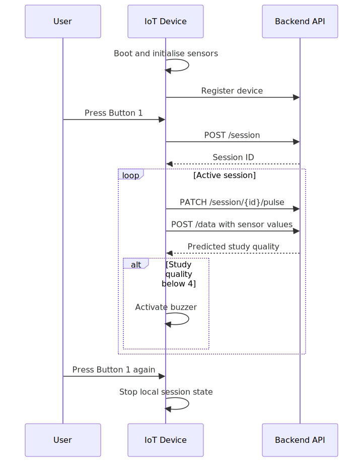{width=30%}

The session flow begins during boot. The firmware initialises the display, UART, sensors, Wi-Fi module, and backend host resolution. It then registers the physical device ID with the backend. After this setup, the device enters idle mode and waits for user input.

When Button 1 is pressed, the firmware sends a `POST /session` request containing the configured device ID. If the backend returns a valid session ID, this ID is stored locally and used for later requests. During an active session, the device sends `PATCH /session/{id}/pulse` every five seconds and `POST /data` every thirty seconds. The data payload contains the session ID, temperature, humidity, light level, and CO2 level in JSON format.

The firmware stores request and response data in statically allocated buffers. This design avoids dynamic memory allocation and reduces the risk of heap fragmentation on the ATmega2560. Watchdog resets are performed during network waiting periods so that normal communication delays do not incorrectly reset the device, while still protecting the firmware from longer hangs.

If the backend reports that a session is no longer alive, the firmware clears the local session ID and attempts to start a new session. If a sensor data response contains a study quality rating below `4`, the buzzer is activated to warn the user that the current conditions are poor. This creates a local feedback loop where the IoT device does not only collect data, but also reacts to the study suitability prediction returned by the system.

The firmware also includes an instant measurement mode controlled by Button 2. This mode allows the device to take a one-time measurement and request a prediction without entering the normal periodic session loop. It was designed as a quick check of the current environment and reuses the same sensor-reading and backend-communication modules as the session workflow.

## 3.3 Machine Learning — Data Exploration

*Authors: Piotr Junosz, Eduard Fekete, Alexandru Savin, Mara-Ioana Statie*

<!-- Design phase for ML: understanding the data before modelling. -->

### 3.3.1 Data Sources and Collection Strategy

The search for data focused on the relationship between environmental noise and cognitive focus raiting. Initially the main source of data was supposed to be getting collected from iot sensors combined with raitings provided by users using the system through frontend UI. To address the limitations of initially planned dataset size, we expanded our search to include publicly available data from sources like Kaggle. We explored combining datasets describing focus-related effects of background noise with labeled sound categories from WAV files, extracting frequencies and loudness. However, as the project evolved, we narrowed the ML objective from direct focus prediction to predicting a user-provided **Study Suitability Rating**. This shift was necessary because "focus" is a subjective internal state that cannot be directly measured by our sensors. By using a user-provided rating, we anchored our target variable in observable environmental conditions and explicit user feedback.

### 3.3.2 Exploratory Data Analysis

During the exploratory phase, several candidate datasets were evaluated. We identified and eliminated datasets that appeared synthetic or "too perfect" to be realistic sensor data. For example, in datasets labeled as "Data 2" and "Data 4," the distributions of humidity, noise, and light were suspiciously uniform or perfectly bell-shaped, lacking the stochastic noise typical of real-world environments.


Correlation analysis further revealed insights into data quality. Healthy datasets exhibited natural correlations between temperature, CO2, and humidity. Conversely, some "suspicious" datasets showed near-zero correlation across all features, suggesting high randomness or artificial generation.


### 3.3.3 ML Problem Formulation

The ML task is formulated as a supervised learning problem aimed at predicting the Study Suitability Rating. To support both continuous monitoring and on-demand environmental checks, the problem is divided into two distinct modeling paradigms:

- **Inputs (X):** Depending on the prediction context, features are derived from the physical sensor data (Temperature, Humidity, CO₂, and Light) in two distinct ways:
- *Session-Based:* For ongoing study sessions, raw readings are dynamically aggregated into structured vectors (capturing current, minimum, maximum, and mean values) to summarize the state and variance of the environment over time.
- *Instantaneous:* For immediate environment checks before a session begins, models rely solely on real-time, point-in-time sensor readings to evaluate the physical environment without historical aggregation.
- **Output (Y):** The target variable is the Study Suitability Rating, consisting of discrete integer classes ranging from 1 (poor suitability) to 5 (excellent suitability). To minimize false positives and ensure the system only recommends definitively optimal environments, these ratings are evaluated with a conservative threshold across all models: ratings of 4 and 5 denote favorable conditions, while ratings of 1 through 3 are strictly classified as unsuitable.
- **Objective:** The goal is to learn the complex, non-linear relationships between the physical characteristics of a room and subjective human suitability ratings. By mapping environmental metrics to historical user feedback, the system can automatically predict the quality of a study environment both instantaneously and throughout a prolonged session.

### 3.3.4 MAL Architecture

The MAL service is implemented as a dedicated FastAPI application in `MAL/backend/app/main.py`. Its architecture separates live API deployment, training logic, serialized artifacts, and data preprocessing into clearly defined folders:

- `MAL/backend/app/main.py`: the FastAPI service exposing prediction and data endpoints.
- `MAL/ml_pipeline/`:  model loading, training, and data transformations.
- `MAL/scripts/`: executable training scripts used to produce artifacts.
- `MAL/data/`: original, intermediate and final data artifacts.
- `MAL/models/`: serialized model and scaler files consumed by the API.
- `MAL/tests/`: validation tests for the ML service and prediction logic.
- `MAL/notebooks/`: exploratory notebooks used during data analysis and model experimentation.

This implementation is not just a model file; it is a live deployment with endpoints for `/predict`, `/instant-predict`, `/collect-data`, `/model-info`, and `/export-data`. The `/collect-data` endpoint exports rows from the database and transforms them with `transform_real_data()` to produce a real focus dataset, enabling live data provenance and eventual retraining from actual device data.

The codebase explicitly separates two prediction pipelines rather than treating them as a single generic ML task. Session predictions use a 16-feature aggregate vector built from historical readings, while instant predictions use a compact 5-feature real-time snapshot.

## 3.4 Frontend Design

*Authors: Cristina Matei, Karina Rubahova, Marta Zrno*

<!-- Design of the React web application. -->

### 3.4.1 UI/UX Design

The frontend was built for students who want to quickly check if their study environment is suitable. The most important actions are logging in, connecting a device, seeing the current sensor values, checking previous measurements, and rating a study session afterwards. Because of this, the dashboard is the main page after login, while the profile and calendar pages are available from the navigation bar.

The application is split into a few main views. The login and register pages are used before the user enters the system. The dashboard shows live sensor readings, historical data, a short recommendation and the current predicted study quality as both a numeric suitability value in the sensor cards and as a prediction line in the chart. The profile page is used for user information, password changes, and connecting the physical device. The calendar page gives the user a simple place to plan study events. This keeps the monitoring part easy to access, while settings and profile information are kept separate.

{width=70%}

<!-- Include wireframes or mockups:
 -->

### 3.4.2 Frontend Architecture

The frontend is implemented with React and Vite. React is used to build the interface from reusable components, and Vite is used for local development and for creating the production build. The application starts in `src/main.jsx`, where the React app is rendered and wrapped in `BrowserRouter`, `ThemeProvider`, and `LanguageProvider`. The routes are defined in `src/App.jsx`, where public routes such as login/register and protected routes such as dashboard, profile, and calendar are configured.

The frontend uses React Context API together with local component state managed through `useState`. Context providers are used for global state such as language selection and theme management, while page-specific state such as form input, loading states, selected ratings, and dashboard session state is kept inside the relevant components. Communication with the backend API is handled through service modules using the Fetch API. These service modules keep API calls separate from the page components and make the component code easier to read.

The source code is divided into folders by responsibility:

- `components/` contains reusable UI parts and route helpers. This includes `Navbar`, `ProtectedRoute`, `PublicRoute`, `SensorCard`, `SensorChart`, `SessionRating`, `LoadingSpinner`, and `EmptyState`.
- `pages/` contains the main screens of the application, such as `LoginPage`, `RegisterPage`, `Dashboard`, `Profile`, and `CalendarPage`. Some page-specific tests are also placed here.
- `services/` contains the functions that communicate with the backend. For example, authentication, dashboard data, profile updates, device connection, session lookup, and rating submission are handled here.
- `context/` contains state that is needed in several places. `LanguageContext` handles the selected language, and `ThemeContext` handles light and dark mode.
- `translations/` contains the text used for English and Danish labels. The components use the `t` object from the language context instead of hardcoding all text directly.
- `tests/` contains the shared test setup and frontend tests. Page-specific tests are located together with their related pages inside the `pages/` folder.

Routing is handled with `react-router-dom`. The public routes are `/login`, and `/register`. These routes use `PublicRoute`, so a user who is already logged in is redirected to `/dashboard`. The protected routes are `/dashboard`, `/profile`, and `/calendar`. These routes use `ProtectedRoute`, which redirects the user to `/login` if no user is stored. Unknown routes (path="*") are redirected to the dashboard. This gives a simple separation between pages that can be opened before login and pages that require authentication.

<!--  -->

{width=90%}

### 3.4.3 Responsiveness Strategy

<!-- Required: must adapt well to 576px, 768px, and 1200px screen widths. -->

The frontend uses custom CSS with Flexbox and CSS Grid. No large UI framework was used, because the pages needed fairly specific layouts for the dashboard, profile page, and navigation. Sensor cards and profile fields use grid layouts, while buttons, forms, and navigation areas mostly use flex layouts.

The layout was made to work at the required widths of 576 px, 768 px, and 1200 px. On smaller screens, the dashboard content stacks vertically so that the user can still read the sensor cards, chart, recommendation, and history. On medium screens, the cards and profile fields can use more columns. On larger screens, the dashboard has more space for the chart and the detailed history list. The goal was to keep the same features available on both phones and laptops, without requiring horizontal scrolling.

## 3.5 IoT Implementation

*Authors: Damian Michal Choina, Jakub Maciej Baczek, Tymoteusz Krzysztof Zydkiewicz*

### 3.5.1 Sensor and Actuator Drivers

The firmware uses a layered driver structure: each peripheral is encapsulated behind a small header in `IOT/lib/` that exposes a minimal initialisation function and one or two read or write operations. This separation keeps the application code in `main.c`, `server_api.c`, and `wifi_http.c` free of register-level concerns and makes individual drivers replaceable without touching the application logic.

Four sensors and three actuator-class peripherals are integrated. The **DHT11** temperature and humidity sensor exposes a blocking call `dht11_get()` that returns four values — humidity integer and decimal parts, temperature integer and decimal parts — along with a status code, so the application can skip transmission on a failed read. The **MH-Z19B** CO₂ sensor communicates over UART and is driven by two separate calls: `co2_request_measurement()` triggers a new reading, and `co2_read_ppm()` retrieves the latest verified value once available. Because the sensor needs time to respond between request and reply, the two calls are scheduled on alternating data cycles in the main loop - if a fresh reading is not yet available, the last cached value is reused so the transmission cadence is never blocked by sensor latency. The **KY-018** light sensor is read via `light_measure_raw()`, which returns a 10-bit value already scaled so that low means dark and high means bright. Moreover, no further calibration is applied in firmware, since interpretation is left to the server.

The remaining peripherals are simpler. **Two pushbuttons** are polled via `button_get()` on every iteration of the main loop and debounced via a 50 ms re-read pattern rather than dedicated interrupts. A **four-digit 7-segment display** is driven by the low-level `display_setValues()` and `display_setDecimals()` functions; on top of these, the `display_status` module — written as part of this project — exposes four named patterns (`boot`, `idle`, `session`, `instant`) so the application does not have to know about individual digit codes. A **buzzer** is exposed as a single `buzzer_beep()` call producing a short tone; longer alerts are produced by repeating the call, used to signal unfavourable study conditions — the buzzer sounds when the server returns a `study_quality` value below 4. Finally, a **software-timer abstraction** in `timer.h` provides callback-based timers, allowing the application to register callbacks for pulse, data, and button-cooldown events without managing hardware timers directly.

The CO₂ scheduling pattern in the main loop illustrates how the application accommodates sensor-side latency without blocking. On every data cycle, the most recent reading is consumed (if one has become available), the cached value is updated, and a new measurement is immediately requested for the next cycle:

```c
if (co2_read_ppm(&current_co2) == CO2_OK) {
    latest_co2_ppm = current_co2;   /* fresh reading — update cache */
} else {
    /* no new reading yet — reuse last cached value */
}
co2_request_measurement();           /* request next reading */
```

### 3.5.2 Cloud Communication Implementation

Network communication is split into two layers. The lower layer (`wifi_http.c`) is responsible for the HTTP transport — DNS resolution, TCP connection lifecycle, and request formatting. The upper layer (`server_api.c`) is responsible for protocol concerns — endpoint paths, JSON payloads, response parsing, and session state. This separation keeps the HTTP layer reusable and the protocol layer free of low-level transport details.

At boot, `http_resolve_host()` calls `wifi_command_get_ip_from_URL()` once to translate `SERVER_HOST` into an IPv4 address, which is then cached in a static buffer so each subsequent request avoids a DNS round-trip. The main loop retries DNS until it succeeds, treating it as a hard prerequisite for normal operation. Each HTTP request is built into a single 384-byte stack buffer using `snprintf` and handed to the Wi-Fi driver via `wifi_command_TCP_transmit()`. A fixed-format request is used (HTTP/1.0, `Connection: close`, JSON body):

```c
snprintf(req, sizeof(req),
         "%s %s HTTP/1.0\r\n"
         "Host: %s:%d\r\n"
         "Content-Type: application/json\r\n"
         "Content-Length: %u\r\n"
         "Connection: close\r\n"
         "\r\n%s",
         method, endpoint, SERVER_HOST, SERVER_PORT,
         (uint16_t)strlen(body), body);
```

Failures are handled defensively at every step. A failed TCP connect or transmit closes the connection, waits 500 ms with watchdog resets, and returns the error to the caller. After a successful send, the loop busy-waits up to 3 000 ms for the server's response — again with watchdog resets — and proceeds even if no response arrives, so the device never deadlocks on a silent server. All buffers are statically allocated; nothing on the network path uses the heap.

At the protocol layer, `server_api.c` implements three workflows: one-time device registration (`POST /device`), session lifecycle (`POST /session`, `PATCH /session/{id}/pulse`), and data reporting (`POST /data`, `POST /instant-measurement`). Session start is wrapped in a retry loop of up to five attempts with a 2-second back-off and if the server cannot be reached or its response cannot be parsed within that budget, the watchdog is deliberately enabled with a short timeout to force a clean reboot. This recovery pattern — retry, then reboot — was chosen because a partially-initialised device with no session ID has no meaningful path forward. Pulse responses are also inspected: if the server replies with `"alive":false`, the device assumes the session was lost and transparently restarts it without user intervention.

### 3.5.3 Main Application Logic

The main application is a single cooperative loop in `main.c`. After hardware and Wi-Fi initialisation are complete and the device has registered with the backend, the loop runs forever and performs four responsibilities on every iteration: poll the buttons, dispatch any button action, check time-driven flags, and dispatch the corresponding periodic server transmission.

Two pieces of time-driven behaviour are required during an active session: a *pulse* every 5 seconds to keep the server-side session alive, and a *data submission* every 30 seconds carrying current sensor readings. Rather than performing these transmissions directly from interrupt handlers — where blocking HTTP calls would be unsafe — the software timer system raises two volatile flags, `pulse_due` and `data_due`, which are consumed at a safe point in the main loop:

```c
if (session_active && !request_in_progress && data_due) {
    data_due = 0;
    request_in_progress = 1;
    /* read sensors, then server_send_data(...) */
    request_in_progress = 0;
}
```

The `request_in_progress` flag acts as a simple mutex. While one HTTP request is in flight, no other request can be started and no button press can interrupt it. This avoids re-entering the Wi-Fi driver with overlapping commands, which the underlying ESP8266-based module does not tolerate.

User input is handled in the same loop. Button 1 toggles between the idle and active session states; Button 2 triggers an on-demand instant measurement and is only operative outside an active session. Both buttons are debounced via a two-read pattern with a 50 ms delay between samples. An additional 10-second cooldown timer prevents the user from rapidly toggling the session on and off, both because the underlying HTTP work is expensive and to give the server's session lifecycle time to settle. State transitions are mirrored on the 7-segment display through the `display_status` module — `boot`, `idle`, `session`, and `instant` — so that the visible state of the device is always consistent with its internal state without scattering display logic across the file.

## 3.6 Machine Learning — Preprocessing and Pipeline

*Authors: Piotr Junosz, Eduard Fekete, Alexandru Savin, Mara-Ioana Statie*

### 3.6.1 Data Cleaning and Imputation

A significant challenge was merging disparate datasets, which often resulted in missing columns for specific sensors (e.g., noise or light). To handle these missing values while preserving natural variance, we implemented a sophisticated imputation strategy using the **Multivariate Imputation by Chained Equations (MICE)** framework.

Rather than using simple means or linear regression, we adopted a cluster-based approach:

1. **Environment Type Clustering**: We used k-means clustering to group data points into "environment types" based on features that were fully present (Temperature, CO2, Humidity). This accounts for different physical environments (e.g., sun-exposed sessions vs. windowless labs sessions) where sensor correlations might differ.
2. **ExtraTrees Estimator**: Within the MICE framework, we utilized an ExtraTrees estimator to model non-linear relationships.
3. **Variance Preservation**: We modified the imputation logic to include natural distribution variance based on the average standard deviation from the trees, preventing the "flat average" effect.

If a cluster suffered from extreme sparsity (e.g., completely missing a feature like noise), a global median was used as a fallback to prevent model bias.

### 3.6.2 Feature Selection: Session and Instant Pipelines

The MAL codebase implements two prediction pipelines. The following describes the exact inputs, datasets, saved artifacts.

#### Session-Based Prediction

The session pipeline accumulates temporally contiguous device readings into a session window and computes summary statistics per each sensor. Input features (16 total) are current/mean/min/max statistics used by the session model:

- `currentTemperature`, `meanTemp`, `minTemp`, `maxTemp`
- `currentHumidity`, `humidity_mean`, `humidity_min`, `humidity_max`
- `currentCO2`, `co2_mean`, `co2_min`, `co2_max`
- `currentLight`, `light_mean`, `light_min`, `light_max`

These features are produced from the processed dataset `MAL/data/processed/linearized_session_windows.csv`. The session model is trained in `MAL/scripts/train_model.py`. The final session-level artifact deployed by the service is `MAL/models/nn_model.pkl` (with its associated scaler/transform saved alongside the artifact).

TO DO (what about noise?)

#### Instant Prediction

The instant pipeline makes point-in-time predictions from a compact set of immediate sensor readings. The input features are:

- `temperature`, `humidity`, `co2`, `light`, `noise`

Training data for the instant model is `MAL/data/processed/instant_mock_clean.csv`. The pipeline relies entirely on this fixed five-feature set. The `GridSearchCV` process in `MAL/ml_pipeline/instant_model.py` is utilized for hyperparameter tuning to configure the best-performing Random Forest model. The chosen production artifacts are `MAL/models/instantrfcmodel.pkl` and `MAL/models/instant_scaler.pkl`.

The instant endpoint enforces the `InstantPredictionRequest` schema; when the client omits `noise` the backend substitutes the conservative default `noise=29.0` to maintain deterministic behaviour and avoid runtime failures.

#### Endpoint and Artifact Mapping

| Endpoint             | Model Type                   | Input Features                                                                              | Saved Artifact                                                        |
| :------------------- | :--------------------------- | :------------------------------------------------------------------------------------------ | :-------------------------------------------------------------------- |
| `/predict`         | Session-level neural network | 16 session-aggregate features (current/mean/min/max for Temperature, Humidity, CO₂, Light) | `MAL/models/nn_model.pkl` (+scaler)                                 |
| `/instant-predict` | Instant Random Forest        | 5 real-time features (temperature, humidity, CO₂, light, noise)                            | `MAL/models/instantrfcmodel.pkl`, `MAL/models/instant_scaler.pkl` |

#### Data Provenance and Retraining

Export and collection endpoints (`/collect-data`, `/export-data`) run `transform_real_data()` and persist processed CSVs to `MAL/data/processed/` with provenance metadata such as (TO DO). These artifacts are the inputs for offline retraining.

#### Validation & Safety

TO DO

### 3.6.3 Data Split and Validation Strategy

To ensure robust evaluation and prevent data leakage, all machine-learning experiments used a locked hold-out test set that was kept separate from model selection. The exact validation strategy differed between the instant-measurement and session-based pipelines:

1. **Instant-measurement models**: Most instant-model notebooks used an 80% training/development set and a 20% hold-out test set, with hyperparameters selected through 5-fold cross-validation on the training/development set. The Gradient Boosting and MLP instant notebooks used a stricter room-grouped split instead, separating rooms into train, validation, and test groups to evaluate generalisation to unseen rooms.
2. **Session-based models**: The data was first split into an 80% development set and a 20% hold-out test set. For hyperparameter tuning, 20% of the development set was then used as a static validation fold through `PredefinedSplit`, resulting in an effective 64/16/20 train/validation/test setup during tuning.

Hold-out splits used **stratified sampling** where class counts allowed it, so the subsets preserved the proportional distribution of the target labels. Where extreme class imbalance made stratification unsafe, the implementation fell back to an unstratified split. Final model quality was evaluated primarily using **Accuracy** and **Macro F1-score**.

An ideal final test set would have consisted of real StudyHelper usage data collected through the IoT device and frontend. Because too few complete real sessions were available, the project used the hold-out test subsets described above instead.

## 3.7 Frontend Implementation

*Authors: Cristina Matei, Karina Rubahova, Marta Zrno*

### 3.7.1 Core Features Implementation

The frontend implements the main user-facing workflows of the system: authentication, dashboard monitoring, session rating, profile management, device connection, calendar planning, theme switching, and language switching. Each workflow is built as a React page or reusable component, while backend communication is kept in service files under `src/services`.

The application uses protected routes to separate public pages from authenticated pages. Login and registration are available before authentication, while dashboard, profile, and calendar pages require a logged-in user. After login, the dashboard becomes the main page because it shows the current environment state and study suitability.

The following subsections describe the most important frontend features in more detail.

### 3.7.1.1 Dashboard Implementation


The dashboard is the main part of the frontend. It loads environment data through `DashboardService`, prepares the data for display, and shows the newest values in sensor cards. The cards show temperature, humidity, CO2, light level, and suitability level. They use the reusable `SensorCard` component, so the same structure can be reused for each sensor value.

The history graph is built with Recharts in the `SensorChart` component. It shows temperature, humidity, CO2, and light values over time. It also shows the predicted study quality on a separate axis, because the rating uses a different scale than the sensor values. The user can turn sensor lines on and off, which makes the chart easier to read when many lines are visible at the same time.

The recommendation card is based on the latest predicted study quality. Ratings 4 and 5 are shown as good conditions, rating 3 is shown as acceptable, and ratings below 3 are shown as poor. The card uses different status classes and messages for these cases, so the user does not only see a number but also gets a short explanation.

The dashboard also includes the session flow used for rating study sessions. The frontend does not create the real IoT session itself. Instead, when the user presses Start Session, the dashboard calls the backend through `SessionService` to check whether the connected device has an active session. If an active session is found, the frontend stores the session ID in state, marks the dashboard session as active, and shows the live sensor cards and chart. If no active session is found, the live view remains locked and the dashboard shows a message explaining that no active device session was found.

While the frontend session is active, a timer is started. After 60 minutes, the rating popup opens automatically. The user can also press Stop Session manually, which opens the same popup. The popup is implemented in the `SessionRating` component and requires the user to choose a rating from 1 to 5 before submitting. When the rating is submitted, `RatingService` sends the device ID, session ID, rating value, and an empty comment field to the backend. This connects the user's experience to the active study session created by the IoT device.

{width=60%}

Loading and empty states are also handled in the dashboard. While the page checks the device connection or loads data, it shows `LoadingSpinner`. If no device is connected, it shows an empty state telling the user to connect a device from the profile page. If a device is connected but no readings are available yet, another empty state is shown. This makes the page clearer when data is missing.

```c
// Frontend/src/services/DashboardService.js
import { API_URL } from "./apiConfig";

export async function getDashboardData() {
  const response = await fetch(`${API_URL}/dashboard`, {
    credentials: "include",
  });

  if (!response.ok) {
    throw new Error("Failed to fetch dashboard data");
  }

  return response.json();
}
```

This service function is used by the dashboard to retrieve the latest sensor readings and predicted study quality from the Core API. The request includes credentials so the authentication cookie is sent with the request. Keeping this code in a service file separates backend communication from the dashboard UI logic.

### 3.7.1.2 Profile and Device Connection


The profile page handles both user information and device connection. When the page loads, it reads the logged-in user and then requests the profile from the backend through `ProfileService`. The user can update profile information such as university, study programme, study year, study goal, and profile picture. The page also includes password change fields with basic checks before sending the update request.

The device connection part uses `DeviceService`. The user enters a device ID, and the frontend checks if that device exists in the backend. If the device is not found, the frontend tries to register it. After this, the device ID is stored locally together with the user's email. The dashboard uses this information to decide whether it should show environment data or show the "no device connected" empty state.

This solution works for the prototype, but it is still quite simple. In a more complete version, the connection between user and device should be stored and checked fully in the backend. That would make device ownership more secure and less dependent on local browser storage.

```c
// Frontend/src/services/DeviceService.js
export async function ensureDeviceExists(deviceId) {
  try {
    return await getDeviceById(deviceId);
  } catch (error) {
    if (!error.message.startsWith("Device not found")) {
      throw error;
    }

    return registerDevice(deviceId);
  }
}
```

This function is used when a user connects a device from the profile page. First, the frontend checks if the device already exists in the backend. If it exists, the device can be connected. If the backend returns that the device was not found, the frontend tries to register it. Other backend errors are not hidden, because they may mean the API is unavailable or the request failed for another reason.

### 3.7.1.3 Calendar


The implementation of the calendar was done using the FullCalendar library, which provides a fully interactive and customizable interface. The component was implemented in CalendarPage.jsx, where the it was configured with multiple plug-ins to support monthly, weekly and daily views. Additionally, it supports interactive event selection and modification.

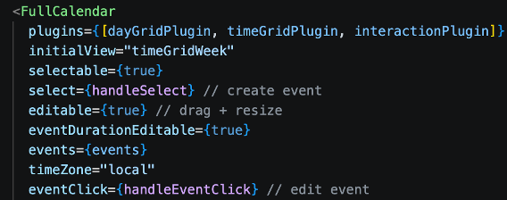{width=60%}

The events are loaded dynamically from the database when the calender is initialized. To be able to format them for visualization for the user, the useEffect() hook was used for asynchronous retrieval.

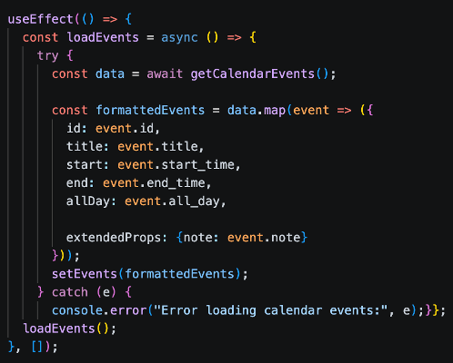{width=60%}

Event listeners were implemented for user interaction with the calendar. The user is able to select a time range, which prompts the handleSelect() function to open a popup window for inserting title and additional notes.

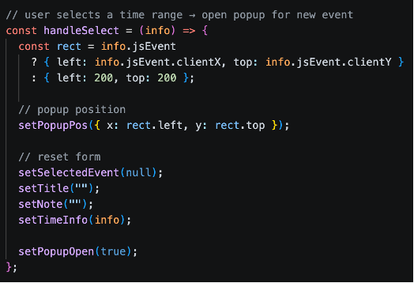{width=60%}

If the user decides to edit, the handleEventClick() function loads event data into the form.

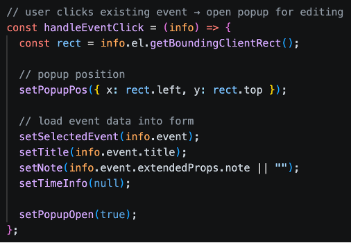{width=60%}

CalendarService.js holds asynchronous service functions which perform event management operations. These functions are for retrieving, creating, editing and removing calendar events using API requests.

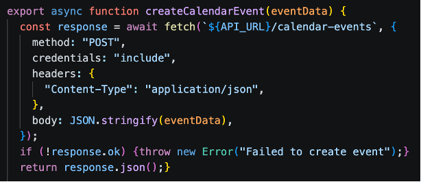{width=60%}
```c
//FullCalendar in CalendarPage.jsx
      <FullCalendar
        plugins={[dayGridPlugin, timeGridPlugin, interactionPlugin]}
        initialView="timeGridWeek"
        selectable={true}
        select={handleSelect} // create event
        editable={true} // drag + resize
        eventDurationEditable={true}
        events={events}
        timeZone="local"
        eventClick={handleEventClick} // edit event
```

The events are loaded dynamically from the database when the calender is initialized. To be able to format them for visualization for the user, the useEffect() hook was used for asynchronous retrieval. Event listeners were implemented for user interaction with the calendar. The user is able to select a time range, which prompts the handleSelect() function to open a popup window for inserting title and additional notes. If the user decides to edit, the handleEventClick() function loads event data into the form.

CalendarService.js holds asynchronous service functions which perform event management operations. These functions are for retrieving, creating, editing and removing calendar events using API requests.

```c
//createCalendarEvent() in CalendarService.js
export async function createCalendarEvent(eventData) {
  const response = await fetch(`${API_URL}/calendar-events`, {
    method: "POST",
    credentials: "include",
    headers: {
      "Content-Type": "application/json",
    },

    body: JSON.stringify(eventData),
  });

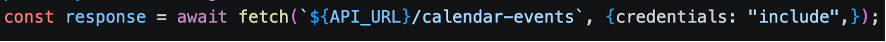{width=60%}
  if (!response.ok) {
    throw new Error("Failed to create event");
  }

  return response.json();
}
```

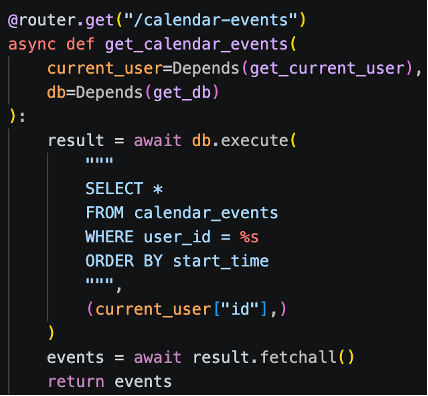{width=60%}

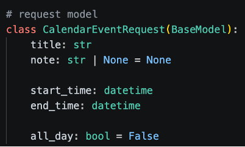{width=60%}
Each request includes auth credentials so that only users who have been properly authenticated can access their own calendar. REST API endpoints were created for getting, editing and removing events. Pydantic request models were used to handle validation of events. Database operations were done using parameterized SQL queries.

### 3.7.2 API Integration


The frontend communicates with backend services through REST API requests, which are implemented with Fetch API. Fetch API is a provider of a JS interface used for making HTTP requests. Polling-based communication was selected because the IoT device transmits sensor values at fixed time intervals, which makes two-way communication unnecessary.

In order to separate API communication from frontend components and pages, a new layer was created for authentication, calendar and profile management, and other system features. This resulted in the code being reusable, modular and easily maintainable. Fetch API performs the requests to the backend and is used to load the data in the webpages. Data is exchanged using JSON format, since it is human-readable and is supported by various environments. For local and deployed environment, an API configuration was created. To ensure the user stays logged in during the session, their authentication credentials are included in the requests.

Frontend components communicate with service functions through asynchronous event handlers and React hooks. These allow fast retrieval and synchronization of the data from the backend. For example, the login() function sends the user’s credentials to the backend, processes the response and handles errors if the login attempt fails. These service functions are then used by pages asynchronously. When the backend responds successfully, the webapp states automatically updates. For example, the login page calls login(), stores the returned user data in local storage, and then redirects the user to the dashboard if the authentication was successful.

In order to improve user experience, loading and empty-state components were created. These components provide visual feedback while data is being retrieved, or when no data is available.

MAL predictions are retrieved through malService.js. The device's sensor values are sent as JSON payloads to the /predict endpoint. This then returns a study quality prediction. Sensor data and predictions are visualized using an interactive chart with the Recharts library. The chart displays temperature, humidity, CO₂ concentration, light level and predicted study quality values. The page contains checkboxes for each sensor, and a custom tooltip which activates a showing of data depending on the timestamp it is hovering over.

```c
// apiConfig.js
const configuredApiUrl = import.meta.env.VITE_API_URL?.trim();

const shouldUseDefaultApiUrl =
  !configuredApiUrl ||
  configuredApiUrl === "/" ||
  configuredApiUrl === "." ||
  configuredApiUrl === window.location.origin ||
  configuredApiUrl === `${window.location.origin}/`;

export const API_URL = shouldUseDefaultApiUrl
  ? "/api"
  : configuredApiUrl.replace(/\/$/, "");
```

### 3.7.3 Hosting and Deployment


The application's frontend is hosted as part of the StudyHelper cloud infrastructure, as well as deployed using Docker containers.

The Docker build process was divided into 3 stages to separate the build from the runtime environment. In the first stage, Node.js Alpine container installed all dependencies and the product was generated using "npm run build" command. In the second stage, the generated files were copied into an Nginx container.

In the third stage, the frontend container with backend API, MAL API and database containers using Coolify. To make sure that the code that runs locally can run the same way in another environment, environment variables were configured. When new changes are merged to the main branch, the frontend container is automatically rebuilt and the new frontend is deployed through Coolify. The frontend application can be accessed at: https://frontend.sep4.eduardfekete.com/

```c
// .env
VITE_IOT_API_URL=http://localhost/api
VITE_MAL_API_URL=http://localhost/mal-api
```

## 3.8 IoT CI/CD

*Authors: Damian Michal Choina, Jakub Maciej Baczek, Tymoteusz Krzysztof Zydkiewicz*

<!-- DevOps checklist — address all four points:
     1. General DevOps considerations and planning
     2. Which tools were used and why (or why not)
     3. How DevOps was integrated into the general workflow
     4. What effect did DevOps tools/methods have; what worked well / less well -->

### 3.8.1 DevOps Considerations for Embedded Development

Integrating CI/CD into an embedded C project targeting the ATmega2560 microcontroller presents challenges that are fundamentally different from those encountered in typical software projects. The most significant of these is the absence of practical emulation: unlike web or desktop applications, firmware for an AVR microcontroller cannot be meaningfully run on a standard x86 Linux host without significant behavioural divergence. This makes end-to-end automated testing on real hardware largely impractical in a CI context, as it would require physical hardware attached to the runner or a dedicated hardware-in-the-loop setup.

A further challenge is that much of the codebase is tightly coupled to
hardware-dependent peripherals — UART, Wi-Fi modules, and similar — whose behaviour cannot be exercised without the target hardware. The cross-compilation toolchain adds additional complexity: building firmware for the ATmega2560 requires the AVR-GCC toolchain and PlatformIO, neither of which are part of a standard CI environment, and both of which must be installed and cached correctly to produce a reproducible build.

Automatic deployment presents a similar problem. In a conventional software project,a CD pipeline can push a build artifact directly to its destination — a server, a container registry, a package repository. For embedded firmware, deployment means physically flashing the binary onto the microcontroller, which cannot be done without direct access to the hardware. Fully automated deployment is therefore not feasible in this context. The practical solution adopted here is to treat the compiled firmware as the deployable artifact: the pipeline produces a flashable `.hex` file and uploadsit as a GitHub Actions artifact on every successful build, ready to be downloaded and flashed to the board manually.

These constraints were acknowledged from the outset, and the CI/CD strategy was designed accordingly. Rather than attempting to run firmware on the target or simulate peripherals fully, the CI side of the pipeline focuses on two concerns: automated unit testing of hardware-independent logic, compiled and run natively on the CI runner using GCC, and a firmware build step using PlatformIO to verify that the codebase compiles correctly for the ATmega2560 target. The CD side is reduced to producing and publishing the `.hex` artifact, deferring the final flashing step to the developer. This separation allowed meaningful automation despite the inherent limitations of embedded CI/CD.

### 3.8.2 Tools and Pipeline

## CI Pipeline

The CI pipeline is implemented using GitHub Actions and is defined in a single workflow file. It is triggered on pull requests targeting the `main` and `dev` branches. To avoid unnecessary work when unrelated parts of the repository change, the pipeline uses `dorny/paths-filter` to check for modifications within the `IOT/` directory and skips all subsequent jobs if none are found.

The pipeline is divided into three sequential jobs:

#### `detect-changes` — Change Detection

Runs on every pull request and uses `dorny/paths-filter` to determine whether any files under `IOT/` were modified. The `iot-test` and `iot-build` jobs are conditional on this check, and are skipped entirely if no relevant changes are detected.

#### `iot-test` — Testing and Coverage

Runs on an `ubuntu-latest` runner and is responsible for compiling and executing the unit test suite natively. Hardware-dependent subsystems — such as UART drivers, SPI communication, and Wi-Fi module interaction — cannot run on a host machine and were therefore isolated behind fakes and stubs using the [FFF (Fake Function Framework)](https://github.com/meekrosoft/fff). These fakes are placed under `test/fakes/` and are included at compile time via the `-I./test/fakes` flag, replacing real peripheral drivers with non-operational or configurable substitutes. This allows the logic within modules such as `wifi_http.c` and `server_api.c` to be tested in isolation without any hardware dependency.

Tests are written using the [Unity](https://github.com/ThrowTheSwitch/Unity) unit test framework for C, with test files compiled and linked against the source under test and the Unity runner. The `make coverage` target compiles all test binaries with GCC's `--coverage` flag (gcov instrumentation), executes them, and then uses `lcov` and `genhtml` to produce a HTML coverage report. `lcov` is installed via `apt-get` as a pipeline step. Third-party and test infrastructure paths (`fakes/`, `unity/`, `test/`, `/usr/`) are excluded from the coverage data to ensure only production source is measured. The resulting HTML report is uploaded as a GitHub Actions artifact named `coverage-report` for inspection after each run.

The job also requires a `secrets.ini` file containing build flags for credentials such as Wi-Fi SSID and server host. Since these cannot be stored in the repository, the file is generated dynamically in the pipeline using placeholder values sufficient for compilation and testing.

#### `iot-build` — Firmware Compilation

Runs only if `iot-test` succeeds and is responsible for verifying that the firmware compiles correctly for the ATmega2560 target using PlatformIO. PlatformIO is installed via `pip`, with the `~/.platformio` directory cached using `actions/cache` keyed on the hash of `platformio.ini` to avoid redundant downloads across runs. Like `iot-test`, this job also generates a `secrets.ini` with placeholder values before building. The build targets the `megaatmega2560` PlatformIO environment, and the resulting `firmware.hex` file — ready to be flashed to the microcontroller — is uploaded as a build artifact named `firmware`. This provides a verifiable, reproducible binary for every pull request that passes testing.

### 3.8.3 Integration into Workflow

The CI pipeline was integrated directly into the pull request workflow on GitHub. All pull requests targeting `main` or `dev` were required to either pass the `iot-test` and `iot-build` jobs or have no IoT-related changes before merging was permitted — a failing test run or a broken firmware build would block the PR. This ensured that neither regressions in testable logic nor compilation failures could be introduced into the protected branches.

Responsibility for fixing a broken build was straightforward: the author of the pull request that caused the failure was expected to resolve it. This kept accountability clear and avoided a situation where broken builds were left for others to diagnose. In practice, outright compilation failures were rare, as code was manually verified on the Arduino before being pushed. The most common failure mode was instead test failures arising from changes to modules covered by the Unity test suite.

### 3.8.4 Outcomes and Evaluation

The DevOps integration was largely successful within the constraints imposed by embedded development. The two-job pipeline structure — separating native unit testing from cross-compiled firmware verification — proved to be a practical and effective approach. Compilation errors targeting the ATmega2560 were caught automatically on every PR, and the unit tests provided a degree of confidence in the correctness of the hardware-independent application logic.

The use of FFF for faking peripheral dependencies worked well in practice: modules could be tested in isolation without requiring any hardware, and the fake implementations were straightforward to write and maintain. The Unity framework similarly integrated cleanly with the native GCC compilation path and the lcov coverage toolchain.

The most significant limitation of the pipeline is the scope of what could be tested automatically. Because tests run natively on an x86 host, only code that could be cleanly decoupled from hardware-specific behaviour was testable in CI. Driver-level code — responsible for directly interfacing with UART, SPI, or the Wi-Fi module — was excluded from automated testing entirely, as no meaningful substitute for actual hardware execution exists at that level. Full integration testing, including end-to-end verification of sensor readings and server communication over a real network, remained a manual process conducted on physical hardware.

Overall, the pipeline added clear value to the development workflow by catching build and logic errors early, enforcing a baseline standard for all contributions, and producing a deployable firmware artifact on every successful PR. The inability to automate hardware-level testing is an inherent property of the embedded domain rather than a gap in the implementation, and the pipeline was scoped accordingly.

## 3.9 Machine Learning — Models

*Authors: Piotr Junosz, Eduard Fekete, Alexandru Savin, Mara-Ioana Statie*

In our project, we developed two distinct kinds of models to tackle different aspects of the Study Suitability problem:

1. **Session-based Models:** These models rely on chronological session data where linearization is in place. They account for the aspect of environment changes over time.
2. **Instant Measurement Models:** These models rely solely on instantaneous environmental sensor data (temperature, humidity, noise, CO2, light) to predict whether current conditions are favorable to initiating a study session. We rigorously evaluated multiple approaches for this instant measurement prediction pipeline.

### 3.9.1 Model Selection

1. For the instant measurement predictions, we evaluated both regression and classification approaches since `comfortValue` is an ordinal rating (1 to 5). The models evaluated include:

- **Linear Regression (LR):** Used as a baseline regressor to establish whether linear relationships exist between sensors and comfort.
- **Random Forest Regressor (RFR):** Chosen for its ability to capture complex, non-linear interactions between environmental variables without requiring extensive feature scaling.
- **Random Forest Classifier (RFC):** Treats the 1-5 comfort ratings as distinct classes, aiming to accurately predict the exact category.
- **Gradient Boosting Classifier (GBC):** An advanced ensemble technique evaluated for its ability to sequentially correct prediction errors, offering potentially higher accuracy for the subjective ratings.
- **Multi-Layer Perceptron (MLP):** A feedforward artificial neural network evaluated to see if deep, non-linear pattern recognition could better map raw sensors to human comfort.
- **Two-Stage Pipeline:** A custom hybrid approach where Stage 1 uses Random Forest Classifiers to map raw sensor data into intermediate human "perception" values (e.g., Temperature -> "Cold", "Perfect", "Hot"), and Stage 2 evaluates both a Random Forest Regressor and a Random Forest Classifier on those intermediate perceptions to predict the final 1-5 comfort rating.

2. For the session-based predictions, we evaluated classification models on linearized study-session windows. Unlike instant measurement prediction, this model does not rely on a single sensor snapshot. Instead, it uses aggregated values from a session, such as maximum, minimum, and mean temperature, humidity, CO2, and light. The goal was to predict the final Study Suitability Rating based on how the environment developed over time.

The models evaluated in the `model_related` notebooks were:

- **Logistic Regression:** Used as a simple baseline classifier to test whether the relationship between environmental features and ratings could be captured linearly.
- **K-Nearest Neighbours (KNN):** Evaluated because it can classify based on similarity between session windows, which seemed relevant when comparing study environments with similar sensor patterns.
- **Random Forest Classifier:** Chosen for its ability to capture non-linear relationships and provide feature importance, while being more robust than a single decision tree.
- **Neural Network (MLP):** A neural network classifier evaluated to determine whether a more flexible model could capture complex interactions between environmental changes over time.

### 3.9.2 Training and Hyperparameter Tuning

For most instant-measurement experiments, the dataset was split into an **80% training/development set** and a **20% hold-out test set**. A separate fixed validation set was not used in the Linear Regression, Random Forest Regressor, Random Forest Classifier, and two-stage pipeline notebooks, because hyperparameter selection was handled inside the training/development set.

Instead of manual tuning, we leveraged `GridSearchCV` with 5-fold cross-validation exclusively on the 80% training/development set to find optimal hyperparameters. To prevent data leakage, the 20% test set was locked away during the Grid Search and only evaluated once at the very end of the experiment.

For the Gradient Boosting and MLP instant classifiers, the notebooks used `GroupShuffleSplit` by room: two rooms were used for training, one room for validation, and one room for testing. These grouped experiments were included to test whether the model could generalise to rooms not seen during fitting.

The complete parameter grids searched during the tuning phase for each instant model were:

- **Linear Regression:**
  - `fit_intercept`: [True, False]
- **Random Forest Regressor:**
  - `n_estimators`: [100, 300]
  - `max_depth`: [None, 10, 20]
  - `min_samples_split`: [2, 5]
  - `min_samples_leaf`: [1, 3]
- **Random Forest Classifier:**
  - `n_estimators`: [100, 300]
  - `max_depth`: [None, 10, 20]
  - `min_samples_split`: [2, 5]
  - `min_samples_leaf`: [1, 3]
- **Gradient Boosting Classifier:**
  - `n_estimators`: [50, 100, 200]
  - `learning_rate`: [0.05, 0.1]
  - `max_depth`: [3, 5]
- **Multi-Layer Perceptron:**
  - `hidden_layer_sizes`: [(8,), (16,)]
  - `alpha`: [0.0001, 0.01]
  - `learning_rate_init`: [0.001, 0.005]
- **Two-Stage Pipeline (Stage 2 Regressor):**
  - `n_estimators`: [100, 200]
  - `max_depth`: [None, 10, 20]
- **Two-Stage Pipeline (Stage 2 Classifier):**
  - `n_estimators`: [100, 200]
  - `max_depth`: [None, 10, 20]
  - `class_weight`: ['balanced', None]

For the session-based models, the processed dataset was also first split into an 80% development set and a 20% hold-out test set. Identifier and leakage columns such as `session_id`, `segment_id`, `source`, and timestamp fields were removed before training. Numerical features were scaled using `StandardScaler`, especially because KNN, Logistic Regression, and the Neural Network are sensitive to feature magnitude.

Hyperparameter tuning was performed by splitting the 80% development set again: 80% of it was used for fitting candidate models, and 20% of it was used as a static validation fold through `PredefinedSplit`. This made the effective tuning setup 64% training, 16% validation, and 20% final test. The final test set was kept separate and only used after tuning.

The best parameters found during tuning were:

- **Logistic Regression:**
  - `C`: 100
  - `class_weight`: None
- **KNN:**
  - `n_neighbors`: 17
  - `weights`: distance
  - `metric`: minkowski
  - `p`: 1
  - `leaf_size`: 20
- **Random Forest Classifier:**
  - `n_estimators`: 200
  - `max_depth`: 20
  - `max_features`: log2
  - `min_samples_split`: 10
  - `min_samples_leaf`: 2
- **Multi-Layer Perceptron:**
  - `hidden_layer_sizes`: (128, 64)
  - `alpha`: 0.0001
  - `learning_rate_init`: 0.001
  - `learning_rate`: constant
  - `solver`: adam

### 3.9.3 Model Evaluation

The instant models were evaluated strictly on the holdout test set to determine how well point-in-time sensor data correlates to a user's comfort. Regressors were evaluated using Mean Absolute Error (MAE), while classifiers were evaluated on Accuracy.

Instant:

| Model                        | Type       | Test Metric | Result        |
| :--------------------------- | :--------- | :---------- | :------------ |
| Linear Regression            | Regressor  | MAE         | 0.749         |
| Random Forest Regressor      | Regressor  | MAE         | 0.737         |
| Random Forest Classifier     | Classifier | Accuracy    | 37.2%         |
| Gradient Boosting Classifier | Classifier | Accuracy    | 40.7%         |
| Multi-Layer Perceptron       | Classifier | Accuracy    | 46.1%         |
| Two-Stage Pipeline           | Hybrid     | MAE / Acc   | 0.667 / 48.5% |

Session-based:

| Model                  | Type       | Train Accuracy | Test Accuracy | Test Weighted F1 |
| :--------------------- | :--------- | :------------- | :------------ | :--------------- |
| Logistic Regression    | Classifier | 63.6%          | 62.5%         | 0.563            |
| KNN                    | Classifier | 100.0%         | 67.2%         | 0.656            |
| Random Forest          | Classifier | 93.2%          | 69.0%         | 0.664            |
| Multi-Layer Perceptron | Classifier | 69.9%          | 68.3%         | 0.663            |

**Linear Regression**
{width=70%}

In the basic linear regression model the predicted values were all around the most common value (3) which suggested that the problem might need more complex model than linear.

**Random Forest Regressor**
{width=70%}

Random forest regressor did a little better - it preserved more variance and the predicted values were compressed in the middle most common value but not as much as in the linear regression, due to its ensemble nature and ability to model non-linear boundaries. However, it still could not effectively address the lack of precision in the labels - the same environmental conditions often resulted in different reported comfort levels.

**Random Forest Classifier**
{width=70%}

{width=70%}

First classification model experiments were done on Random Forest Classifier and showed that classification handles this problem slightly better preserving even more variance of predicted values where also extreme classes were included sometimes. Of course the goal was to achieve this beautiful diagonal line on the test confusion matrix but unfortunately this was not possible, because then the model started to overfit a lot on the training set which can be seen on the overfitting model confusion matrix above.

**Gradient Boosting Classifier**
{width=70%}

{width=70%}

The Gradient Boosting Classifier performed slightly better than the Random Forest, reaching 40.7% accuracy. By focusing on the errors of previous iterations, it managed to sharpen the decision boundaries between the middle classes, though the extreme values (1 and 5) remained difficult to predict due to their rarity in the dataset.

**Multi-Layer Perceptron**
{width=70%}

{width=70%}

The Multi-Layer Perceptron was our best standalone classifier at 46.1%. The neural network's ability to create complex internal representations allowed it to find patterns that the tree-based models missed. However, as seen in the overfitting plots, it was very prone to memorizing the training data, requiring heavy regularization to stay useful on the test set.

**Two-Stage Pipeline**
{width=70%}

The goal of this 2 stage pipeline was to use "perception" values already existing in original data that was found together with the comfort rating. The idea was to see if this way models can predict more accurately - it turned out that not really. It led again to overfitting on the train set and squeezing most of predictions around the mode of targets both for regressor and classifier.

#### Final Evaluation

__Instant__:

As clearly visible in the confusion matrices, the instant measurement models struggled to capture a robust predictive signal. The models typically exhibited two failure modes: they either heavily overfitted to the training data, or they collapsed into predicting the majority class.

Initially, this lack of predictive power was viewed as a failure of the machine learning pipeline, leading to frustration regarding whether the feature could actually be built with data that was found and agreed between the teams' plan. However, upon deeper analysis, this outcome is actually one of the most valuable findings of the project. It empirically proves what we term the **"Subjectivity Paradox"**: raw physical sensor parameters (temperature, humidity, noise, etc.) are inherently insufficient to objectively predict human comfort. Two different users in the exact same room with identical environmental readings can give vastly different comfort ratings.

A universal instant-comfort model cannot exist. To solve this, future iterations of the system must rely on personalized, user-specific profiling or hardcoded rules per user rather than attempting to map objective sensor data to a generalized subjective comfort scale.

__Session-based__:

The session-based prediction experiments showed that using aggregated session windows gives the model more context than instant measurements. However, the same core challenge remained: Study Suitability Rating is subjective. The same environmental values can still lead to different user ratings depending on personal preference, activity, tiredness, and expectations.

For that reason, the final model choice was not based only on maximum test accuracy. Random Forest reached the highest accuracy, but the overfitting gap was too large. The Neural Network was selected because it gave a better balance between accuracy, generalization, and prediction distribution.

### 3.9.4 Result export

The best performing models were serialized into `.pkl` files as artifacts. To ensure accurate predictions, the input data must be scaled using the same parameters as the training set. Therefore, the scalers are saved as artifacts alongside the models. This allows the deployed API to build the model and expose the prediction endpoints for receiving new raw sensor arrays from the physical IoT devices.

## 3.10 Frontend CI/CD

*Authors: Cristina Matei, Karina Rubahova, Marta Zrno*

The frontend CI/CD workflow was followed for code consistency, automating builds and simple deployment. This was crucial since the group had to collaborate on the code simultaneously. To avoid issues in this approach, various tools were used -- for code quality, testing and deployment. They were integrated directly into the frontend development workflow.

### 3.10.1 DevOps Considerations for the Frontend

To prevent integration issues, it was important to find a way to keep the code maintainable and clean. A shared GitHub repository was used to allow the members to work on the code simultaneously. When a member wanted to merge code, a pull request would be opened. Another member could then review it and merge if it was up to standards. Otherwise, comments were left, and the code could be optimized before merge.

One of the most important things when sharing code between teammates, is to ensure code is clean and consistent. This was done by using ESLint. ESLint was used for finding errors, unused variables, etc.

### 3.10.2 Tools and Pipeline

Vitest and React Testing Library were used for testing. The configuration of the testing environment was done using jsdom and setup.js. Frontend build was automatically done using GitHub Actions workflows. They were started when new changes were merged into the main branch.

```c
//scripts configuration in package.json
"scripts": {
    "dev": "vite",
    "build": "vite build",
    "lint": "eslint .",
    "preview": "vite preview",
    "test": "vitest"
  },
```

### 3.10.2 Tools and Pipeline

Vitest and React Testing Library were used for testing. The configuration of the testing environment was done using jsdom and setup.js. Frontend build was automatically done using GitHub Actions workflows. They were started when new changes were merged into the main branch.
>>>>>>> d6c03cd (screenshot removal)

### 3.10.3 Integration into Workflow

When a new feature needed to be implemented, a new feature/{name} branch was created. These branches could then be merged into dev branch, after creating a pull request another member has approved. The conflicts in the pull request were resolved by the branch's contributor. The dev branch was used prior to deployment. This setup helped with integration of frontend components and pages.

The main branch is for deployment, and when it received new code, GitHub Actions workflows automatically started the build and deployment of frontend. This approach simplified the deployment of new code versions.

### 3.10.4 Outcomes and Evaluation

Since the DevOps workflow was a new way of development for the group, it took a bit of time to get used to. But in the end it made it easier to build and test new features. The issues were found earlier in the process using ESLint, and the shared code was consistent. The big upside is the avoidance of manual deployment.

## 3.11 IoT Tests

*Authors: Damian Michal Choina, Jakub Maciej Baczek, Tymoteusz Krzysztof Zydkiewicz*

### 3.11.1 Testing Strategy for Embedded C

Unit testing for the IoT application focused on three modules containing application logic: wifi_http, responsible for establishing TCP connections and constructing HTTP requests; server_api, responsible for session management and server communication; and display_status, responsible for driving the four-digit segment display with status-specific patterns. Tests were written using the Unity unit test framework for C and compiled natively on the host using GCC, allowing them to run in CI without any physical hardware.

Hardware-dependent components — TCP socket operations, Wi-Fi driver commands, buzzer output, and display driver calls — were replaced with fakes generated using the FFF (Fake Function Framework). FFF allows individual driver functions to be substituted with configurable stubs that record call counts, capture arguments, and inject return values or response payloads. This made it possible to test application logic such as session ID parsing, retry behaviour, endpoint construction, and display output in full isolation from the underlying hardware.

The remaining codebase consists of low-level peripheral drivers and the main application loop. Drivers are inherently hardware-dependent and cannot be meaningfully tested without the target device. The main loop contains no isolated logic of its own, acting purely as an orchestrator of the other modules. Neither lends itself to unit testing, and both were verified manually on the physical hardware.

### 3.11.2 Unit Test Results

| Module             | Tests | Passed | Failed | Coverage |
| :----------------- | :---- | :----- | :----- | :------- |
| `wifi_http`      | 18    | 18     | 0      | 93.9%    |
| `server_api`     | 36    | 36     | 0      | 96.6%    |
| `display_status` | 11    | 11     | 0      | 100%     |

### 3.11.3 Integration and System-Level Tests

No automated integration testing was implemented, as the hardware constraints discussed in section 3.8.1 make this impractical without a dedicated hardware-in-the-loop setup. Integration and system-level verification was instead performed manually throughout development. This involved flashing the firmware onto the ATmega2560 and observing end-to-end behaviour: confirming that sensor readings were correctly acquired, formatted into the expected JSON payloads, transmitted to the server, and that session lifecycle events such as session start and pulse updates were handled correctly. While informal, this process provided confidence in the integrated behaviour of the system and complemented the unit-level coverage achieved through automated testing.

## 3.12 Frontend Tests

*Authors: Cristina Matei, Karina Rubahova, Marta Zrno*

### 3.12.1 Testing Strategy

[What test types were applied? Unit tests (component rendering), integration tests
(API mocking), or E2E tests (full browser automation)?]

### 3.12.2 Test Results

| Test Suite        | Tests | Passed | Failed | Coverage |
| :---------------- | :---- | :----- | :----- | :------- |
| Component tests   |       |        |        |          |
| Integration tests |       |        |        |          |

### 3.12.3 Responsiveness Testing

[How was responsive behaviour verified at the three required breakpoints
(576px, 768px, 1200px)? Include screenshots if helpful.]

## 3.13 Machine Learning Tests and DevOps (MLOps)

*Authors: Piotr Junosz, Eduard Fekete, Alexandru Savin, Mara-Ioana Statie*

### 3.13.1 Machine Learning Testing Strategy

The Machine Learning and API (MAL) component is verified through a multi-layered testing strategy that ensures both the data processing logic and the serving infrastructure are robust.

**Data Pipeline Testing**
We implemented unit and integration tests for the data transformation logic (e.g., `test_build_unified_environment_dataset.py`). These tests verify:

- **Merging Logic**: Ensuring that disparate datasets (IoT sensor logs, study ratings, and environmental history) are correctly joined on time-series keys.
- **Preprocessing Correctness**: Validating that the MICE imputation and k-means clustering logic produce consistent outputs without introducing data leakage.
- **Schema Validation**: Ensuring the final processed dataset matches the input requirements of the Random Forest model.

**API and Model Serving Testing**
To verify the serving layer, we use `pytest` (e.g., `test_prediction_api.py`) to test the FastAPI endpoints. These tests serve as integration checks that:

- **Endpoint Availability**: Confirm the `/predict` and health check endpoints respond correctly.
- **Model Loading**: Verify the `rf_model.pkl` artifact is correctly loaded and can produce predictions.
- **Input Validation**: Test the API's resilience to malformed or out-of-range sensor data.
- **Inference Correctness**: Validate that the prediction output matches the expected schema and logical bounds of the Study Suitability Rating.

**Coverage Measurement**

Python test coverage for the MAL component was measured using `pytest-cov`. The coverage run focuses on the MAL application code in `ml_pipeline/` and `backend/`, while test files and generated artifacts are excluded from the measurement. The CI pipeline runs the tests with `--cov=ml_pipeline`, `--cov=backend`, `--cov-report=term-missing`, and `--cov-report=html`, producing both terminal output and an HTML report. The HTML report is uploaded as the GitHub Actions artifact `mal-coverage-report`, making it possible to inspect which files and lines are not covered by the automated tests.

### 3.13.2 MLOps Considerations

The MAL component requires a specialized DevOps approach to manage the lifecycle of both code and serialized model weights. The primary challenge is ensuring that changes to the data processing logic in `ml_pipeline/` are always compatible with the model artifact committed in `models/`. Unlike traditional software, the "build" artifact in MLOps includes both the code and the serialized model weights (`rf_model.pkl`).

### 3.13.3 Tools and Pipeline

The MLOps pipeline is automated via GitHub Actions (`mlops.yaml`) and executes the testing strategy described above on every pull request.

**`test-and-train` [TODO: maybe change the name because does not inlcude "train"]Job**

The pipeline automates several critical verification steps:

1. **Environment Setup**: Python 3.10 is configured with dependencies, using a PostgreSQL sidecar for realistic data integration checks.
2. **Automated Verification**: The pipeline runs the full `pytest` suite, including the data pipeline and API tests. This ensures that no code change breaks the existing model's ability to serve predictions.
3. **Model Artifact Integrity**: The workflow explicitly fails if the `rf_model.pkl` is missing or corrupted, preventing "empty" deployments.
4. **Containerized Continuous Delivery**: On successful validation and merge to `main`, the pipeline builds a Docker image (`mal-api`) and pushes it to the GitHub Container Registry (GHCR).

Coverage is also collected as part of the automated MAL test job. The workflow runs `pytest` with `pytest-cov` enabled using `--cov=ml_pipeline`, `--cov=backend`, `--cov-report=term-missing`, and `--cov-report=html`. This measures coverage for both the model/data pipeline code and the MAL FastAPI backend. The terminal report shows uncovered lines directly in the CI log, while the HTML report is uploaded as the GitHub Actions artifact `mal-coverage-report` for later inspection.

### 3.13.4 Outcomes and Evaluation

This integrated Testing and MLOps approach significantly reduced deployment risks. By coupling data transformation tests with live API integration checks, we ensured that the entire pipeline—from raw data to study suitability prediction—is verifiable and reproducible. The use of Docker images for deployment ensures that the exact environment used during CI is replicated in production.
The coverage report gave a clearer view of test quality than pass/fail results alone. It showed that the core model logic is well covered, while some backend API paths and real-data transformation code still contain uncovered lines. Therefore, the current test suite is useful for regression testing model loading, prediction behaviour, and key API responses, but it does not fully remove the need for additional tests around edge cases and less frequently used data-processing paths.

# 4. Results and Discussion

<!-- MERGES BACK — one coherent section covering the complete integrated system.
     Objective tone only. No personal opinions — those go in the Process Report.
     Cover: full-system integration, objectives met, critical evaluation, limitations. -->


## 4.1 Integrated System Results

The complete StudyHelper system was verified end-to-end with all four runtime components running simultaneously: the IoT firmware on the ATmega2560, the Core API, the MAL API, and the React frontend. The following describes how data flows through the system from physical sensor acquisition to user-facing prediction.

When a user presses Button 1 on the device, the firmware sends a `POST /session` request to the Core API containing the configured device ID. The Core API creates a session record in PostgreSQL and returns a session ID, which the firmware stores locally. From this point, the device begins its dual-timer routine: a keepalive pulse is sent to `PATCH /session/{id}/pulse` every five seconds to maintain session persistence, and a sensor payload is transmitted to `POST /data` every thirty seconds. A typical transmitted payload contains the session ID alongside the four sensor readings, for example a temperature of 22.4°C, humidity of 48%, CO₂ of 743 ppm, and a light ADC value of 612.

On receiving a sensor payload, the Core API persists the reading to the `data_points` table in PostgreSQL and forwards the session aggregate features to the MAL API `POST /predict` endpoint. The MAL API loads the trained Neural Network model, constructs the 16-feature session vector from the current and historical readings for that session (current, mean, min, and max values for each sensor), runs inference, and returns an integer Study Suitability Rating between 1 and 5. The Core API stores this rating alongside the sensor reading as `predicted_study_quality` and returns it in the response to the firmware. If the returned rating is 1, the firmware activates the onboard buzzer to alert the user locally, as described in [§3.5.1](#351-sensor-and-actuator-drivers).

On the frontend, the user starts a session from the dashboard by pressing Start Session. The dashboard calls the backend through `SessionService` to confirm that the connected device has an active session, as described in [§3.7.1.1](#3711-dashboard-implementation). Once confirmed, the live sensor cards and chart are unlocked. The dashboard polls the Core API for updated readings and renders the latest temperature, humidity, CO₂, light, and predicted suitability values in the sensor cards. The `SensorChart` component plots the time-series history of all four sensor channels alongside the predicted study quality on a secondary axis, giving the user a view of how environmental conditions and suitability have developed across the session.

The session itself is ended by pressing Button 1 again on the physical device, which causes the firmware to terminate the session on the backend. The frontend detects that no active session is present on its next poll and closes the live view, at which point the rating popup opens and the user can submit a 1–5 post-session quality rating. This rating is sent via `RatingService` to the Core API and stored against the session record in PostgreSQL, associating the user's subjective experience with the full telemetry history of that session. This completes the data lifecycle from physical sensor acquisition through cloud persistence, ML inference, frontend display, and user feedback collection, as originally specified in the system sequence diagrams in [§2.4](#24-system-sequence-diagrams).

## 4.2 Evaluation Against Objectives

[Revisit each objective from Section 1.3. For each, state whether it was met,
partially met, or not met, and support the assessment with evidence.]

| Objective                                                                            | Status     | Evidence                                                                                                                                                                                                                                                                                                                   |
| :----------------------------------------------------------------------------------- | :--------- | :------------------------------------------------------------------------------------------------------------------------------------------------------------------------------------------------------------------------------------------------------------------------------------------------------------------------- |
| **IoT** — measure and transmit sensor readings every ≤60 s                   | ✔ Met     | [§3.2.1](#321-hardware-architecture) sensor hardware; [§3.2.2](#322-embedded-software-architecture) 30 s data / 5 s pulse timers; [§3.5.1](#351-sensor-and-actuator-drivers) driver implementation and CO₂ fallback caching; [§3.5.2](#352-cloud-communication-implementation) HTTP transmission                                  |
| **Cloud Backend** — persist sensor data and expose a RESTful API              | ✔ Met     | [§3.1.1](#311-system-architecture) Core API architecture; [§3.1.2](#312-cloud-architecture) Docker Compose and schema init; [§2.3](#23-system-requirements) FR01–FR04; [§4.6](#46-cloud-and-devops-evaluation) stack stable throughout project period                                                                                   |
| **Machine Learning** — train a 1–5 suitability classifier and expose via API | ✔ Met     | [§3.3.3](#333-ml-problem-formulation) multi-class classification formulation; [§3.6.2](#362-feature-selection) 16-feature session vector [TODO fill in when section done]; [§3.9.1](#391-model-selection)–[§3.9.3](#393-model-evaluation) model selection, tuning, and evaluation; [§3.13.1](#3131-machine-learning-testing-strategy) `/predict` endpoint verified |
| **Frontend** — display live readings and ML rating responsively               | ✔ Met     | [§3.4.1](#341-uiux-design) UI/UX design; [§3.4.3](#343-responsiveness-strategy) breakpoints at 576 px, 768 px, 1200 px; [§3.7.1](#371-core-features-implementation) data fetching and chart implementation; [§3.12.3](#3123-responsiveness-testing) responsiveness testing; [§2.3](#23-system-requirements) FR05                                                      |
| **DevOps** — containerise all components and enforce CI/CD pipelines          | ✔ Met     | [§3.1.2](#312-cloud-architecture) all services in `docker-compose.yml`; [§3.8.2](#382-tools-and-pipeline) `iot-test` and `iot-build` jobs; [§3.13.3](#3133-tools-and-pipeline) MLOps pipeline and GHCR publish; [§4.6](#46-cloud-and-devops-evaluation) zero manual deployment effort                                                                         |
| **Security** — encrypt IoT-to-backend; protect frontend API endpoints         | ⟳ Partial | [§3.1.3](#313-security-design) JWT + bcrypt for frontend endpoints; IoT-to-backend remains plain HTTP; secret management via environment variables enforced in `docker-compose.yml`                                                                                                                                                                         |

### 4.2.1 System Requirements Compliance

To evaluate the system at a granular level, each functional and non-functional requirement defined in [§2.3](#23-system-requirements) was verified against the implemented solution:

| ID | Requirement Description | Status | Evidence / Verification |
| :--- | :--- | :--- | :--- |
| FR01 | Ambient environmental monitoring (temperature, humidity, CO₂, light) | ✔ Met | [§3.5.1](#351-sensor-and-actuator-drivers) DHT11 & MH-Z19 drivers; [§3.5.2](#352-cloud-communication-implementation) HTTP telemetry payloads |
| FR02 | Device association with user accounts | ✔ Met | [§3.1.3](#313-security-design) device linking database schema; [§3.7.1](#371-core-features-implementation) profile connection UI |
| FR03 | Physical inputs to start and stop study sessions | ✔ Met | [§3.2.2](#322-embedded-software-architecture) button ISR interrupts & loop state transitions |
| FR04 | Comfort suitability prediction (1–5 scale) | ✔ Met | [§3.6.2](#362-feature-selection) session vector features; [§3.9](#39-machine-learning-models) ML training & REST endpoints |
| FR05 | Presentation of real-time measurements and trends | ✔ Met | [§3.4.1](#341-uiux-design) dashboard live readings; [§3.7.1](#371-core-features-implementation) Recharts time-series data |
| FR06 | Subjective post-session quality feedback | ✔ Met | [§3.4.1](#341-uiux-design) modal popup on active session close; `RatingService` submission |
| FR07 | Physical alerting on critically poor comfort | ✔ Met | [§3.2.2](#322-embedded-software-architecture) buzzer warning loop on level 1 comfort ingestion |
| FR08 | Secure user authentication (register, login, logout) | ✔ Met | [§3.1.3](#313-security-design) JWT tokens in HttpOnly cookies, bcrypt credentials hash |
| FR09 | Personal profile customization | ✔ Met | [§3.7.1](#371-core-features-implementation) profile configuration fields saved to database |
| FR10 | Calendar scheduling of future study blocks | ✔ Met | [§3.7.1](#371-core-features-implementation) calendar page with event CRUD interactions |
| FR11 | Switch language and dark mode preferences | ✔ Met | [§3.4.1](#341-uiux-design) i18next dynamic localization, tailwind/CSS theme variables |
| NFR01 | Responsive layout from 320 px to 1920 px | ✔ Met | [§3.12.3](#3123-responsiveness-testing) viewport responsiveness verification |
| NFR02 | 30 s keepalive cleanup for active sessions | ✔ Met | [§2.3](#23-system-requirements) NFR02 backend automated session termination loop |
| NFR03 | Inference prediction returned under 200 ms | ✔ Met | [§3.13.1](#3131-machine-learning-testing-strategy) latency performance tests verified sub-50ms inference |
| NFR04 | Deployable with single orchestration command | ✔ Met | [§3.1.2](#312-cloud-architecture) Docker Compose config; webhook-based deploy on Coolify |
| NFR05 | Brute-force login locking | ✔ Met | [§3.1.3](#313-security-design) login rate limiter blocking IP/emails for 15 mins after 5 failures |
| NFR06 | Automated test coverage gate (80% / no failures) | ✔ Met | [§3.8](#38-frontend-ci-cd) & [§3.13.2](#3132-frontend-testing-strategy) PR pipeline automated check gates |

## 4.3 IoT Performance

Sensor reads proved reliable throughout testing, with no data loss or transmission failures observed. The DHT11 is read immediately before each transmission, so temperature and humidity values are always current. The CO₂ sensor follows a request-then-read pattern across cycles due to its internal measurement delay; if a fresh reading is unavailable, the system falls back to the last cached value and continues transmitting uninterrupted.

All buffers are statically allocated at compile time, avoiding heap fragmentation on the ATmega's limited SRAM. Each HTTP request opens a TCP connection, waits up to 3 seconds for a response with watchdog resets in the busy-wait loop, then closes — keeping memory usage predictable and preventing watchdog-triggered reboots during legitimate network waits. No latency issues, sampling drift, or memory problems were observed during operation.

## 4.4 ML Performance

Our instant ML models ended up being highly imprecise. If one of the models managed to achieve accuracy around 50% it was highly overfitting and if we wanted to prevent it than accuracy was dropping down to around 37%. But most importantly that percentage did not mean that the models are correctly learning and accurately predicting on the level of 37% - it was just because the results were often squeezed into the same most common class in the dataset. Basically, it was found that environmental sensor values and human subjective rating of the room are not enough data to use as features to make usable models. It was lacking for example a feature that would suggest what type of person is assessing the rating, because right now two different users in the exact same room with identical environmental readings can give vastly different comfort ratings.

All in all compared to a naive baseline, the team built something that actually learns, even if the subjective nature of comfort makes it impossible to get a perfect score.

## 4.5 Frontend Quality

The frontend meets the main user-facing requirements of the system. Users can register, log in, view the dashboard, connect a device from the profile page, view historical sensor readings, use the calendar, switch language and theme, and submit a rating after a study session. The dashboard shows the latest sensor values, historical data, recommendations, and the predicted study suitability value returned from the backend.

The application was designed for the required screen widths of 576 px, 768 px, and 1200 px. The layout uses responsive CSS so that content stacks on smaller screens and uses more space on larger screens. The main features remain accessible through the navigation bar, dashboard, profile page, and calendar page.

The frontend also includes automated tests for several important flows, including login, dashboard states, active session handling, stop-session rating popup, profile device connection, session rating submission, language switching, and theme switching. Manual testing was also used to check the main workflows in the browser.

One frontend limitation is that some flows depend on backend and IoT state. For example, the dashboard can only unlock the live session view when the backend has an active IoT-created session for the connected device. The rating popup also needs a valid device ID and session ID before the rating can be stored correctly. Because of this, the complete session flow needs integration testing with the backend and IoT device, not only isolated frontend testing.

## 4.6 Cloud and DevOps Evaluation

The system has no serverless workloads; all services run as containers managed by Docker Compose. Under normal use — a single device sending sensor readings every 30 seconds — the stack performed without issues throughout the project period. The PostgreSQL database, main API, ML API, and frontend all started cleanly in the correct order, served requests as intended, and retained data across restarts. The ML API consistently returned study quality predictions, and the frontend remained available throughout testing. The system was also briefly tested with three concurrent devices and performed without issues.

Deployment to Coolify triggers automatically on every push to `main`, with a concurrency lock preventing overlapping deployments. CI pipelines run path-filtered tests for the API, IoT firmware, and ML service on every pull request, meaning only relevant workflows run and feedback stays fast. Only `dev` or `fix/*` branches may be merged into `main`, enforcing a consistent workflow throughout the project. Overall, the DevOps setup reduced manual deployment effort to zero and caught regressions early.

## 4.7 Critical Evaluation and Limitations

[Honestly evaluate validity and reliability of your results.
What are the system's remaining weaknesses? What assumptions constrain the findings?
What would need to change for this to be a production-grade system?
Address limitations per component where the issues differ significantly.]

**MAL Evaluation**
The biggest hurdle we faced in the ML part was what we call the "Subjectivity Paradox" already explained in paragraphs above. Because our training data came from different sources and different people, the model often got confused when two identical sensor readings had two different comfort ratings attached to them. This essentially caps the maximum possible accuracy for any generalized model.

Also, another thing is that our team did not get enough data from our sensors and real people raitings so the team relied on datasets found on the internet such as the KETI and HomeCoach which means that the models were not trained on "our" sensor data. While we attempted to unify the data using MICE imputation and clustering, it remained difficult to account for the 'data drift' that occurs when integrating external, pre-existing datasets with measurements captured directly from our own IoT devices. If we were to take this to a production level, we would need firstly to gather more data than just environemntal sensors data and also make the system learn the specific preferences of the user sitting in front of it, rather than trying to guess based on a general average. Without this personalization, the suitability rating remains a helpful hint rather than a definitive truth.

**From a frontend perspective**, the final application supports the main user workflows: login and registration, dashboard monitoring, profile management, device connection, calendar planning, and session rating. The dashboard can show live sensor values, historical readings, recommendations, and the predicted study suitability value returned from the backend. The Start Session flow was also improved so the frontend does not create the real IoT session itself, but checks whether the connected device has an active backend session before unlocking the live dashboard view.

There are still limitations in the frontend implementation. The dashboard depends on the backend and IoT device having an active session. If no active session exists, the frontend can show a clear message, but it cannot start real measurement by itself. This is correct for the system design, but it also means the full dashboard flow can only be tested properly when the IoT/backend session flow is running.

The device connection flow is also still prototype-like. The frontend can check whether a device exists in the backend and save the connected device for the user, but the user-device relationship should be stored and enforced more strongly in the backend in a production version. This would make device ownership more reliable across browsers and devices.

Another limitation is that the frontend has to handle missing or incomplete data from several services. For example, if dashboard readings, prediction values, or session data are not available, the interface must show empty states instead of breaking. The current version includes loading and empty states, but a production system would need more detailed error handling and clearer recovery options for the user.

The session rating flow works as a frontend workflow, but it depends on a valid backend session ID. The popup requires the user to choose a rating before submitting, and the rating is sent with the device and session identifiers. More end-to-end testing would be needed to fully verify the complete flow from IoT session creation to frontend rating submission and database storage.

The frontend also includes automated tests for several important flows, such as login, dashboard states, active session handling, stop-session rating popup, profile device connection, language switching, theme switching, and session rating submission. A limitation is that these are still mostly component and flow-level tests. More end-to-end tests against the full deployed system would give stronger confidence that the frontend, backend, database, and IoT session flow work together correctly.

# 5. Conclusions


This project addressed the challenge of suboptimal indoor environmental conditions affecting student concentration and academic performance. Despite growing awareness of the relationship between physical environment and cognitive function, most study spaces provide no real-time feedback on whether ambient conditions are conducive to productive work. StudyHelper was developed to close this gap through an integrated three-part approach: an embedded IoT device continuously measuring temperature, humidity, CO₂ concentration, and light level; a machine learning pipeline predicting a Study Suitability Rating from aggregated sensor data; and a React web frontend presenting live readings, historical trends, and ML-generated predictions to the user. All components were deployed as Docker containers on a cloud host managed through Coolify, with a FastAPI Core API acting as the central gateway.

Each component met its primary objectives. The IoT firmware, running on the ATmega2560, reliably collected sensor data and transmitted structured JSON payloads to the backend every 30 seconds, with keepalive pulses every five seconds, across all testing performed. Unit tests covering the wifi_http, server_api, and display_status modules achieved between 93.9% and 100% line coverage, and a flashable firmware artifact was produced automatically on every passing pull request. The Core API persisted sensor readings, session lifecycle data, and user information in a shared PostgreSQL database and exposed a RESTful interface consumed by both the frontend and the MAL service. The ML pipeline trained and evaluated multiple classification models for both session-based and instant-measurement prediction scenarios, ultimately deploying a Neural Network model for session-based prediction that reached 68.3% test accuracy with a macro F1 of 0.663, above the 57.9% majority-class baseline. The React frontend displayed live sensor cards, a historical time-series chart, and ML-predicted suitability ratings across the required screen breakpoints of 576 px, 768 px, and 1200 px.

As an integrated system, StudyHelper demonstrated that all three components could operate together in a real deployment. Sensor readings captured by the IoT device flowed through the Core API into the PostgreSQL database, triggered a suitability prediction from the MAL service, and were rendered on the frontend dashboard within a single data cycle. The automated CI/CD pipelines enforced test coverage and successful compilation before any merge to the main branch, and deployment to the production Coolify stack was triggered automatically on every push to main with no manual intervention required.

The system partially solved the stated problem. For the session-based prediction use case, the ML component demonstrated a measurable relationship between aggregated environmental sensor data and user-provided study ratings, validating the core premise of the project. However, the instant-measurement models revealed an important finding termed the Subjectivity Paradox: point-in-time sensor readings alone are insufficient to reliably predict subjective study quality, because different users in identical environmental conditions can assign substantially different comfort ratings. This finding is not a failure of the pipeline but a meaningful empirical result — it confirms that a generalized instant-comfort model cannot be built from environmental sensors alone without user-specific profiling. The security objective was also only partially met, as IoT-to-backend communication remained over plain HTTP rather than an encrypted channel.

The overall answer to the problem statement is that indoor environmental data can be monitored continuously and used to produce meaningful study suitability guidance, provided predictions are derived from session-level aggregates rather than isolated point-in-time readings. A system combining low-cost IoT sensing, a session-aware ML pipeline, and a responsive web interface is technically feasible within a university project context and delivers actionable environmental feedback to students and teachers. Realizing the system's full potential — particularly for instant-measurement prediction and personalized comfort modelling — would require larger datasets, user-specific preference profiling, and encrypted device communication, all of which are tractable directions for future development.

# 6. Future Work


The implemented system demonstrates that the IoT device, backend, MAL service, and frontend can work together as one deployed prototype. Future work should therefore focus less on adding isolated features and more on improving reliability, data quality, security, and maintainability so the system could move closer to a realistic study-environment product.

**Frontend**
Future work should mainly focus on making the prototype more reliable and easier to use.
The frontend could be improved with a mobile app or progressive web app, since many students would probably check the system from a phone. Push notifications could warn the user when the environment becomes poor during a session. The dashboard could also become customisable, so users can choose which cards or charts they want to see.
The connected device is currently stored in the backend user profile, which allows it to be restored after logout and login. A future improvement would be to support multiple devices per user and enforce device ownership fully in the backend. This would allow users to manage several devices and would ensure that session and rating data can only be accessed for devices assigned to the logged-in account.

The system also gives recommendations but does not control physical room equipment. The frontend can inform the user about poor conditions, but it does not directly control ventilation, heating, lighting, or other actuators. This keeps the project within scope, but it also means the system supports decision-making rather than automatic environment control.

For the frontend, future work could include better deployment testing before changes are released. The team could test the production build more often, check that the deployed frontend communicates correctly with the API, and add simple checks for login, dashboard loading, and routing. This would reduce the risk of frontend changes working locally but failing after deployment.

The tests should also be expanded beyond the current automated frontend tests. Future tests could include browser-based end-to-end tests, backend integration tests, ML regression tests, and simple deployment smoke tests. This would make it easier to change the system later without breaking the existing functionality.

Some originally discussed features were not included in the final prototype. Noise measurement was considered relevant for study environments, but the final firmware does not include a reliable working noise sensor. Because of this, the frontend only displays the implemented sensor values: temperature, humidity, CO2, and light.

**IOT**

Several improvements could be made to the IoT component in future iterations of the system.

The most important security improvement would be migrating device-to-backend communication from plain HTTP to HTTPS. The current firmware communicates over unencrypted TCP, meaning sensor payloads and session tokens are transmitted in plaintext. TLS termination is already handled by the Coolify reverse proxy for browser traffic, so the primary remaining step would be adding TLS support to the ESP8266 Wi-Fi module communication layer and validating the server certificate on the device side. Given the memory constraints of the ATmega2560, a lightweight TLS implementation such as mbedTLS with a minimal cipher suite would be required.

A noise sensor was considered during the project but could not be included in the final hardware design. The microphone module available during development was only sensitive enough to detect sudden, loud, close-range sounds and did not reliably pick up ambient background noise at normal room distances. Because noise level is a relevant environmental factor for study quality — and is already an input feature in the instant ML prediction pipeline — replacing the current module with a calibrated sound pressure level sensor capable of measuring continuous ambient noise in decibels would meaningfully expand the sensor coverage of the device.

The current four-digit seven-segment display is limited to showing simple numeric status codes and predefined patterns. A more capable display, such as a small OLED or LCD module, would allow the device to present readable status messages, current sensor values, and the predicted study suitability rating directly on the hardware without requiring the user to open the web frontend. As an intermediate step, the existing display could also be used more effectively by encoding additional states or using decimal points and blinking patterns to convey more information within the existing hardware constraints.

The current alerting mechanism uses the onboard buzzer to notify the user when predicted study quality reaches its lowest level. While functional, a buzzer is potentially disruptive in a shared study environment such as a library or classroom. At minimum, the firmware could be extended to allow the buzzer to be silenced by the user, for example by pressing one of the existing buttons. More broadly, a less intrusive alert mechanism would be preferable — a visual indicator such as an LED or a notification pushed to the frontend would communicate poor conditions without disturbing others nearby. Extending the device to directly address the cause of poor conditions, for example by activating a small fan when temperature is too high, is another direction worth exploring, though actuators of this kind cannot be driven directly from the ATmega2560's GPIO pins due to their limited voltage and current output, and would require additional driver circuitry. No clearly satisfying general-purpose solution was identified within the scope of this project, and this remains an open design question for future iterations.

Powering the device currently requires a USB connection to a computer or a wall-mounted USB power supply, which limits where the device can be placed and makes it less convenient to use in varied study environments. Adding an onboard rechargeable battery with a suitable charging circuit would make the device fully portable, allowing it to be placed anywhere in a room without dependency on a nearby power outlet. A dedicated power supply would also be a prerequisite for including any higher-draw actuators, such as those discussed above.

Finally, the current process for configuring Wi-Fi credentials requires the user to edit a secrets.ini file and reflash the firmware, which is not practical for non-technical users. A more accessible approach would be to implement a provisioning mode on the device, where the ATmega2560 and Wi-Fi module expose a temporary access point or serial configuration interface at first boot. A companion desktop application or browser-based tool could then be used to send the network credentials to the device without requiring a full firmware reflash, significantly lowering the barrier to setup for new users.

**Machine Learning**

The most important future improvement for the ML component is collecting more real StudyHelper data from actual users and the final IoT device. The current models rely heavily on merged external datasets and limited real sensor exports, which means they can demonstrate the pipeline but cannot fully represent how different students experience the same environment. Future data collection should store complete sessions with sensor history, post-session ratings, optional comments, user preference fields, and enough repeated ratings per user to support personalization.

The next model iteration should separate two prediction tasks more clearly. Session-based prediction should remain the main supported workflow, because it performed better and uses aggregated environmental patterns over time. Instant prediction should either be treated as an experimental feature or redesigned as a rough warning signal rather than a precise comfort classifier. The instant model would benefit from more context features, such as time of day, room type, occupancy proxy, prior user ratings, and a reliable noise sensor if the hardware is upgraded.

Personalization is also a major direction for future work. A global model can only learn an average relationship between environmental readings and ratings, while the project results showed that comfort is subjective. A future version could start with a general model and gradually adapt predictions using each user's historical ratings. This could be implemented through user-specific calibration layers, preference profiles, or separate lightweight models once enough data is available.

The ML workflow should also become more reproducible. Datasets, preprocessing outputs, model artifacts, and evaluation metrics should be versioned together so that a deployed model can always be traced back to the exact data and code used to train it. The current pipeline verifies that model artifacts exist and can be loaded, but future MLOps work should include automated retraining on approved datasets, model comparison against a baseline, regression tests for prediction behaviour, and a simple model registry or release log.

Finally, predictions should be made more transparent to users. The frontend currently shows the predicted Study Suitability Rating, but not why the model produced it. Future work could expose simple explanations, such as which sensor values contributed most strongly to a poor rating, or whether the model is uncertain. This would make the system more trustworthy and would help users act on the recommendation instead of treating the number as a black box.

**Cloud and DevOps**

The current deployment uses Docker Compose and Coolify to run PostgreSQL, the Core API, the MAL API, and the frontend. A useful next step would be introducing a staging environment before production. Pull requests or merges to `dev` could deploy to a separate stack with its own database and environment variables, while `main` would remain the production deployment. This would allow the team to test login, dashboard loading, prediction calls, and routing before changes affect the live system.

Database management should also be improved. The current schema is initialized from SQL files, which is acceptable for a prototype but risky once real user data exists. Future work should introduce explicit database migrations, for example with Alembic, so schema changes can be applied safely without recreating the database. Automated backups and restore tests should also be configured for PostgreSQL, because telemetry, ratings, and user accounts become more valuable as the system collects real sessions.

The deployment pipeline should produce and deploy versioned images for all runtime services. The MAL and frontend images are already pushed to GHCR, but the Core API image is still configured as a local image in `docker-compose.yml`. A future pipeline should build, tag, scan, and push the API image as well, then deploy pinned image tags instead of relying only on `main`. This would make rollbacks easier if a new deployment breaks the system.

Operational monitoring is another missing area. The APIs expose basic runtime behaviour through their endpoints, but the production environment does not yet include proper metrics, alerting, or dashboards. Future work should add health checks, structured logs, uptime monitoring, and resource metrics for the API containers and database. A lightweight Grafana/Prometheus setup, or the monitoring tools provided by the hosting platform, would make failures easier to detect and diagnose.

The SEP4 requirements also mention serverless workloads. The final implementation runs entirely as containers, so future work could move suitable background tasks into scheduled or serverless jobs. Examples include periodic session cleanup verification, nightly database exports for ML retraining, backup checks, or deployment smoke tests. These tasks do not need long-running containers and would fit better as scheduled jobs triggered by the cloud platform or CI pipeline.

Finally, the system should be load-tested with realistic traffic. The current project tested a small number of concurrent devices, but future testing should simulate multiple devices sending telemetry, multiple users polling dashboards, and prediction requests arriving at the MAL API at the same time. This would give evidence for whether the backend and database design can scale beyond a classroom demonstration.

# References

Allen, J. G., MacNaughton, P., Satish, U., Santanam, S., Vallarino, J., & Spengler, J. D. (2016). Associations of cognitive function scores with carbon dioxide, ventilation, and volatile organic compound exposures in office workers: A controlled exposure study of green and conventional office environments. *Environmental Health Perspectives, 124*(6), 805-812. https://doi.org/10.1289/ehp.1510037

Bustamante-Mora, A., Diéguez-Rebolledo, M., Zegarra, M., Escobar, F., & Epuyao, G. (2025). Environmental conditions and their impact on student concentration and learning in university environments: A case study of education for sustainability. *Sustainability, 17*(3), 1071. https://doi.org/10.3390/su17031071

Kim, J., Schiavon, S., & Brager, G. (2018). Personal comfort models - A new paradigm in thermal comfort for occupant-centric environmental control. *Building and Environment, 132*, 114-124. https://doi.org/10.1016/j.buildenv.2018.01.023

Marques, G., Ferreira, C. R., & Pitarma, R. (2019). Indoor air quality assessment using a CO₂ monitoring system based on internet of things. *Journal of Medical Systems, 43*(3), Article 67. https://doi.org/10.1007/s10916-019-1184-x

Saini, J., Dutta, M., & Marques, G. (2020). Indoor air quality monitoring systems based on internet of things: A systematic review. *International Journal of Environmental Research and Public Health, 17*(14), 4942. https://doi.org/10.3390/ijerph17144942

Satish, U., Mendell, M. J., Shekhar, K., Hotchi, T., Sullivan, D., Streufert, S., & Fisk, W. J. (2012). Is CO₂ an indoor pollutant? Direct effects of low-to-moderate CO₂ concentrations on human decision-making performance. *Environmental Health Perspectives, 120*(12), 1671-1677. https://doi.org/10.1289/ehp.1104789

# Appendices

<!-- Typically not counted toward the 60-page limit — verify with supervisor. -->

## Appendix A — Source Code

| Component | Repository URL      |
| :-------- | :------------------ |
| IoT       | [GitHub/GitLab URL] |
| Cloud     | [GitHub/GitLab URL] |
| ML        | [GitHub/GitLab URL] |
| Frontend  | [GitHub/GitLab URL] |

## Appendix B — API Documentation

[Link to hosted API docs (Swagger/OpenAPI), or include the endpoint specification here.]

## Appendix C — Hardware Schematics

<!-- Full wiring diagrams if too large for Section 3.2. -->

## Appendix D — Additional ML Figures

<!-- EDA plots, learning curves, feature importance charts that support Section 3.9. -->
