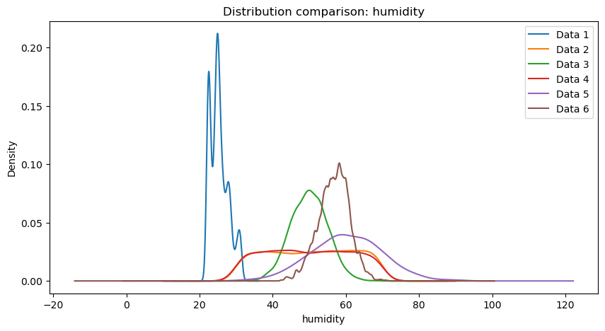

<!-- ============================================================
  PROJECT REPORT — VIA Engineering Guidelines 2024 + SEP4 Requirements
  
  STRUCTURE (mandated by SEP4 requirements document):
  
    Introduction
    Analysis                     ← one coherent unit (shared)
    Design Overview              ← shared, includes cloud architecture
      ├─ IoT Design              ┐
      ├─ ML Data Exploration     ├─ branches here
      └─ Frontend Design         ┘
      ├─ IoT Implementation      ┐
      ├─ ML Preprocessing        ├─ still branched
      └─ Frontend Implementation ┘
      ├─ IoT CI/CD               ┐
      ├─ ML Models               ├─ still branched
      └─ Frontend CI/CD          ┘
      ├─ IoT Test                ┐
      └─ Frontend Test           ┘
    Results and Discussion       ← merges back together
    Conclusions
    Future Work
  
  FORMALITIES:
  - Max 60 pages (1 page = 2400 characters)
  - Each section must list its AUTHORS
  - APA references throughout
  - Objective academic tone (no first-person — that goes in Process Report)
  - All claims supported by evidence and citations
  - Submit: report PDF, source code, repo links, 30-min video demo
  ============================================================ -->

# Abstract

<!-- Write LAST, even though it appears first. ~150–250 words.
     Cover: problem, approach (IoT + ML + Frontend + Cloud), key technical choices, results.
     No citations needed. -->

*Authors: [Name, Name, Name]*

[Concise summary of the entire project. State the problem being solved, the three-part
technical approach (embedded IoT on ATmega2560, machine learning pipeline, React web
frontend), the cloud infrastructure, and the main results. Should stand alone as a
paragraph that lets a reader decide whether to read further.]

[TODO: each team check and adjust sentences about their parts of the system so its 100% correct]

StudyHelper is a distributed study-environment monitoring system developed to address the challenge of suboptimal indoor conditions affecting student concentration and academic performance. The system integrates three tightly coupled components: an embedded IoT device based on the ATmega2560 microcontroller that measures temperature, humidity, CO₂ concentration, and light; a machine learning pipeline implemented in Python that predicts a Study Suitability Rating from aggregated sensor data and a React web frontend that presents live readings, historical trends, and ML-generated predictions to the user. All components are deployed as Docker containers on a cloud host managed through Coolify, with the Core API (FastAPI) acting as the central gateway - persisting sensor data in a shared PostgreSQL database and forwarding requests to the MAL FastAPI service for suitability predictions. The IoT firmware communicates with the backend over HTTP using a session-based protocol, transmitting sensor payloads every minute and keepalive pulses every five seconds. The machine learning model [TODO: update after making the final model] - a Random Forest classifier trained on environmental datasets with MICE imputation - produces both instant and trend based sustainability ratings on a scale of one to five, which are shown to users through the web interface. [Summarise the main quantitative results here, e.g. model accuracy, test coverage, and system uptime, once final figures are available.]

# 1. Introduction

<!-- Sets the stage for the entire report. Must include the problem statement from
     your Project Description. Shared section — one coherent voice for the whole group.
     Consider environmental, social, economic, and technological significance. -->

*Authors: [Name, Name, Name]*

## 1.1 Background and Motivation

[Describe the domain context. What real-world problem does the system address?
Why is an IoT-based solution with machine learning relevant here?
Who are the stakeholders and what do they need?]

The physical environment in which learning takes place has a measurable impact on cognitive performance. Research has shown that environmental conditions such as temperature, humidity, CO₂ concentration, and lighting directly influence students' ability to concentrate and retain information (Bustamante-Mora et al., 2025) [TODO: add reference in references]. Despite growing awareness of this relationship, most study spaces - libraries, classrooms, dormitories - provide no real-time feedback on whether the ambient conditions are conducive to productive work. Students are left to rely on subjective perception, often noticing that conditions are poor only after their focus has already deteriorated.

The problem is particularly acute in shared environments where individual control over heating, ventilation, or lighting is limited or absent. A student in a crowded library has no practical way of knowing whether the rising CO₂ level in the room is contributing to their fatigue, or whether the ambient temperature is outside the range associated with optimal cognitive function. Existing commercial solutions either focus on a single sensor parameter or require expensive infrastructure that is not feasible in a typical university context.

By combining low-cost IoT sensing with a machine learning prediction layer, the StudyHelper system closes the gap between raw environmental data and actionable guidance. Rather than simply logging sensor values, the system learns from historical patterns of user-rated study sessions and uses that knowledge to predict how suitable current conditions are likely to be - providing students and teachers with a tool to make informed decisions about when and where to study.

The primary stakeholders are students, who benefit directly from improved self-awareness of their study environment; teachers, who can use condition overviews to assess classroom suitability; and study-space administrators, who could use aggregated data to inform ventilation or room management decisions. [Expand here if additional stakeholder interviews or literature sources are added.]

## 1.2 Problem Statement

<!-- Paste or adapt directly from your approved Project Description. -->

[State the specific problem the project addresses. Be precise about what is currently
missing or suboptimal, and what a successful solution would look like.]

Based on the environmental challenges identified in the problem domain, this project addresses the following core question:

**Main problem:** How can indoor environmental data be monitored and analyzed to understand the relationship between environmental conditions and students' focus during study sessions?

This problem is decomposed into the following sub-questions:

- What are the most significant indoor environmental factors that affect the efficiency of students' studies?
- What factors can be used to represent students' study efficiency and atmospheric quality?
- How do students react to changes in atmospheric quality?
- Is there a measurable relationship between environmental factors and study efficiency?
- How accurately can future suitability levels be predicted based on collected sensor data?

A successful solution would continuously collect real-world sensor data from study environments, expose this data through a structured API, and deliver ML-driven suitability predictions to students via a responsive web interface - all without requiring any manual data entry beyond an optional post-session quality rating.

## 1.3 Project Objectives

[Enumerate concrete, verifiable goals. These will be evaluated against in Results
and Discussion. Tie them to the three system components where relevant.

The concrete objectives of the StudyHelper project are as follows:

- **IoT:** The embedded device shall measure temperature, humidity, CO₂ concentration, and light level using the ATmega2560 MCU and transmit structured JSON payloads to the cloud backend via HTTP at a regular interval not exceeding sixty seconds.
- **Cloud Backend:** The Core API (FastAPI) shall act as the central gateway - persisting sensor readings and session metadata in a shared PostgreSQL database and exposing a RESTful API consumed by both the frontend and the MAL service.
- **Machine Learning:** The ML component shall train a classifier capable of predicting a Study Suitability Rating on an integer scale of one to five, using aggregated temperature window features derived from historical sensor data, and expose predictions through a FastAPI endpoint.
- **Frontend:** The React web application shall display live sensor readings, historical trends, and the current ML-predicted suitability rating in a responsive layout that adapts to screen widths of 576 px, 768 px, and 1200 px.
- **DevOps:** All components shall be containerised with Docker, deployed to a public cloud host, and supported by automated CI/CD pipelines on GitHub Actions that enforce unit-test passing and successful build compilation before merging to the main branch.
- **Security:** Communication between the IoT device and the backend shall be protected by [encryption scheme to be specified]; frontend-facing API endpoints shall be protected by [JWT / API key to be confirmed].

[TODO: Review these objectives against the final delivered system before submission and adjust the wording where the implementation diverged from the original plan.]

## 1.4 Scope and Delimitations

[Define the boundaries. What is explicitly in scope for each component?
What has been consciously left out, and why? Important given the 60-page limit.]

The StudyHelper system is scoped to a single physical IoT device deployed within one or more campus study environments for the duration of the project semester. The following delimitations were agreed at project inception and are reflected in the implemented system:

**Geographical scope:** The device is designed and tested within a single campus environment. Multi-building deployment is out of scope for this iteration.

**Sensor coverage:** The system measures temperature, humidity, CO₂ concentration, and light. Sound level measurement is not currently implemented by the active firmware, despite being noted as a candidate sensor in the project description due to the malfunctioning and inaccurate quality of the sound sensor.

**Automation:** The system provides predictive guidance but does not automate any physical actuators beyond the onboard buzzer alert triggered when the predicted study quality rating reaches the lowest level. Full HVAC or lighting automation is explicitly out of scope.

**User model:** The system supports a user roles such as student who can start and stop sessions via the physical button on the device and submit a post-session quality rating through the frontend, and a teacher who assesses whether conditions are suitable for teaching. Administrator views are out of scope.

**Privacy and data collection:** The system stores environmental sensor readings and session lifecycle metadata. In addition, user accounts are stored, including name, last name, email address, and a hashed password, as well as optional profile fields such as university, study programme, study year, study goal, preferred environmental thresholds, and a profile picture reference. Post-session ratings submitted by users are also persisted, along with an optional free-text comment. No audio recordings or video are collected. All personally identifiable data is linked to a user account and is subject to standard data protection considerations; password storage uses hashing via the `pgcrypto` extension.

**Medical and psychological analysis:** The system does not attempt to measure or infer physiological state, stress levels, or cognitive load directly. The Study Suitability Rating is an environmental proxy, not a clinical assessment.

[Add any additional delimitations agreed with supervisors, particularly regarding scale of the ML dataset or the number of test participants.]

## 1.5 Related Work

[Survey existing IoT, ML, and web solutions relevant to your domain. Cite with APA.
How does your system differ from or build on existing approaches?]

A growing body of research has examined the relationship between indoor environmental quality (IEQ) and cognitive performance. Bustamante-Mora et al. (2025)[TODO: add reference] conducted a case study in university environments demonstrating that temperature and CO₂ levels correlate with measurable changes in student concentration and learning outcomes. Their findings motivate the sensor selection in this project, specifically the inclusion of CO₂ as a key environmental indicator alongside temperature and humidity.

IoT-based classroom monitoring systems have been explored in several contexts. [Cite one or two relevant prior IoT classroom studies here, e.g. systems based on Raspberry Pi or Arduino platforms.] These systems typically focus on data logging and threshold-based alerting rather than predictive modelling, which is the distinguishing contribution of the StudyHelper approach.

In the domain of machine learning for indoor environment prediction, [cite relevant ML papers on predicting thermal comfort or cognitive performance from environmental data]. The use of ensemble methods such as Random Forest[TODO: update after final model choice] for environmental classification has been validated in comparable contexts and supports the model choice made in this project.

On the frontend side, React-based dashboards for IoT data visualisation are a well-established pattern. [Reference any relevant existing open-source dashboards or comparable student-facing tools.]

StudyHelper differs from prior work in its end-to-end integration: rather than treating sensing, prediction, and presentation as separate research artefacts, the project combines all three within a single deployable system. The use of a user-provided post-session rating as the supervised learning target - rather than a physiologically measured focus indicator - is a pragmatic design choice that makes the system trainable without invasive data collection, and represents a novel framing of the suitability prediction problem.

[This section should be expanded with full APA citations before submission. The references listed here are indicative placeholders.]

# 2. Analysis

<!-- ONE COHERENT UNIT — shared across all three sub-teams.
     The entire group contributes to and agrees on this section.
     Must include: user stories, domain model, system-level requirements.
     Do NOT branch here — one list of user stories, one domain model, etc. -->

*Authors: [Name, Name, Name]*

## 2.1 Domain Model

[Describe the key concepts and relationships in the problem domain.
Reference the domain model diagram:]

<!--  -->

[Walk through the most important entities and associations.
Justify the key modelling decisions.]

The domain model captures the core concepts of the StudyHelper system and the relationships between them. The central entity is the **StudyEnvironment**, which represents the physical room or space being monitored. A StudyEnvironment has measurable attributes - temperature, humidity, CO₂ level, light level, and noise level [TODO: remove noise level or not depending on the choice] - as well as derived attributes: a current suitability level and a predicted suitability level with an associated trend direction.

Two actors interact with the StudyEnvironment: the **Student**, who monitors conditions to decide whether to begin or continue a study session, and the **Teacher**, who assesses whether conditions are suitable for teaching. Both actors share a common monitoring relationship with the StudyEnvironment; however, only the Student can submit a session rating, which feeds back into the ML training pipeline.

The **EnvironmentConditionHistory** entity records time-stamped snapshots of sensor readings. Each snapshot is associated with a session, allowing the system to aggregate readings over the duration of a study session and compute window-level statistics (minimum, maximum, mean) used as ML features. This association is represented as a one-to-many relationship from StudyEnvironment to EnvironmentConditionHistory.

At the persistence layer, the domain model maps to three database tables: `devices`, `sessions`, and `data`. The `devices` table identifies each physical IoT unit by a string ID. The `sessions` table records the lifecycle of a study session, including start time, end time, last-pulse timestamp, and the optional post-session study quality integer. The `data` table stores individual sensor readings linked to a session.

The key modelling decision is the separation of the session concept from the raw data concept. By attaching individual sensor readings to a session rather than to a device directly, the system can compute per-session aggregates for ML feature extraction without requiring complex time-windowing logic in the database. [Describe any domain model revisions made after initial analysis here.]

## 2.2 User Stories

<!-- Present ALL user stories as a single shared backlog.
     Format: "As a [role], I want to [action], so that [benefit]." --


The following user stories were derived from the use cases defined in the project analysis and reflect the agreed shared backlog across all three sub-teams:

| ID   | User Story                                                                                                                                                                       | Priority    | Component                   |
| :--- | :------------------------------------------------------------------------------------------------------------------------------------------------------------------------------- | :---------- | :-------------------------- |
| US01 | As a Student, I want an overview of current environmental conditions and a suitability prediction, so that I can decide whether to start or continue a study session.            | Must have   | IoT / Cloud / ML / Frontend |
| US02 | As a Student, I want to submit a rating after a study session, so that the system can improve suitability predictions over time.                                                 | Must have   | Frontend / ML               |
| US03 | As a Student, I want to see the history of environmental conditions during my study session, so that I can understand trends affecting my focus.                                 | Should have | Frontend / Cloud            |
| US04 | As a Student, I want to receive an alert when conditions fall below an acceptable threshold, so that I can take action to improve my study environment.                          | Should have | IoT / Cloud                 |
| US05 | As a Student, I want to start and stop a monitored study session using a physical button on the device, so that I do not need to interact with any software to begin monitoring. | Must have   | IoT                         |
| US06 | As a Teacher, I want an overview of current and predicted environmental conditions, so that I can decide if the environment is suitable for teaching.                            | Could have  | Frontend / ML               |
| US07 | As a Student, I want the web application to work correctly on my phone, tablet, and laptop, so that I can check conditions from any device.                                      | Should have | Frontend                    |

[Review this table and add any user stories created during sprint planning that are not listed here. Assign MoSCoW priorities consistent with what was actually implemented.]

## 2.3 System Requirements

[Derive functional and non-functional requirements from the user stories.
Cross-cutting requirements (security, DevOps, performance) belong here.]


The following requirements were derived from the user stories and supplemented by cross-cutting concerns identified during analysis:

| ID    | Requirement Description                                                                                                                                                                                             | Type           | Source      |
| :---- | :------------------------------------------------------------------------------------------------------------------------------------------------------------------------------------------------------------------ | :------------- | :---------- |
| FR01  | The IoT device shall measure temperature (°C), humidity (%), CO₂ (ppm), and light level (raw ADC), and transmit a JSON payload to the backend API at intervals not exceeding 60 seconds during an active session. | Functional     | US01, US05  |
| FR02  | The backend shall persist sensor readings, device identities, and session records in a PostgreSQL database.                                                                                                         | Functional     | US01, US03  |
| FR03  | The backend API shall expose endpoints for device registration (`POST /device`), session management (`POST /session`, `PATCH /session/{id}/pulse`), and data submission (`POST /data`).                     | Functional     | US01, US05  |
| FR04  | The ML service shall expose a `POST /predict` endpoint returning an integer Study Suitability Rating between 1 and 5.                                                                                            | Functional     | US01, US06  |
| FR05  | The frontend shall display the current sensor readings, the ML-predicted suitability rating, and a time-series chart of historical readings for the active session.                                                 | Functional     | US01, US03  |
| FR06  | The frontend shall allow a student to submit a post-session quality rating, which is stored against the session record.                                                                                             | Functional     | US02        |
| FR07  | The IoT device shall sound the onboard buzzer when the predicted study quality returned by the server reaches level 1 (lowest).                                                                                     | Functional     | US04        |
| NFR01 | IoT-cloud communication shall be protected against eavesdropping; [specify TLS, AES, or other mechanism].                                                                                                           | Non-functional | Security    |
| NFR02 | The frontend shall render correctly and remain usable at viewport widths of 576 px, 768 px, and 1200 px.                                                                                                            | Non-functional | US07        |
| NFR03 | All backend services and the frontend shall be packaged as Docker containers and deployed via `docker-compose`.                                                                                                   | Non-functional | DevOps      |
| NFR04 | The IoT CI/CD pipeline shall compile the firmware for the ATmega2560 target and execute unit tests on every pull request targeting `main` or `dev`.                                                             | Non-functional | DevOps      |
| NFR05 | The ML service Docker image shall be published to the GitHub Container Registry on every successful merge to `main`.                                                                                              | Non-functional | DevOps      |
| NFR06 | The database schema shall be initialised deterministically via `initdb/01_schema.sql` on first container startup.                                                                                                 | Non-functional | Reliability |

[Complete any requirements that remain as placeholders, and verify that all implemented features are traceable to at least one requirement in this table.]

## 2.4 System Sequence Diagrams

[Include SSDs for the key use cases that span the full system.
Show the messages exchanged between IoT device, cloud, ML pipeline, and frontend.]

<!-- ![SSD: [Use Case Name]](../../Documentation/Analysis/ssds/ssd_use_case.svg) -->

Two system sequence diagrams capture the primary interaction flows in the StudyHelper system.[TODO: create 2 SSD for example those and change the description]

**SSD 1 - Study Session Lifecycle (IoT-initiated)**

*When the student presses Button 1 on the device, the firmware sends `POST /device` to register the device identifier, then `POST /session` to create a new active session. The backend persists both records and returns a session ID, which the firmware stores in memory. During the session, the firmware fires two software timers: a five-second pulse timer and a thirty-second data timer. On each pulse, the firmware sends `PATCH /session/{id}/pulse` so the backend can detect abandoned sessions. On each data tick, the firmware reads all sensors and sends `POST /data` with a JSON payload containing temperature, humidity, light level, and CO₂. The backend stores the reading and may return a `study_quality` field in the response; if the value is 1 (worst), the firmware triggers the buzzer. When Button 1 is pressed again, the session is closed locally by clearing the session ID, and no further pulses or data are sent.*

**SSD 2 - Frontend Condition Overview and Prediction (frontend-initiated)**

*The student opens the web application and the React frontend issues `GET /data` to the IoT backend to retrieve the most recent sensor readings. It then issues `POST /predict` to the MAL FastAPI service, passing the current and windowed temperature values. The MAL service loads the trained Random Forest model and returns a predicted Study Suitability Rating as a JSON integer. The frontend renders the readings and the rating on the dashboard. This cycle repeats at a configurable polling interval, defaulting to once per minute to match the IoT transmission cadence.*

[Reference the SSD diagram files in the `Documentation/Analysis/ssds/` directory once they are exported to SVG. If additional SSDs were created for post-session rating submission or for the Teacher condition overview, add them here.]

# 3. Design

## 3.1 Design Overview

<!-- SHARED section — written as one coherent unit BEFORE branching.
     Present the overall system architecture and cloud design here. -->

*Authors: [Name, Name, Name]*

### 3.1.1 System Architecture

[Describe the overall architecture: IoT device → Cloud backend → Frontend,
with the ML pipeline integrated into or alongside the cloud layer.
Reference the architecture diagram:]

<!--  -->

[Justify the key architectural decisions: why this decomposition, how components
communicate (protocols, data formats), and how data flows end-to-end.]

The StudyHelper system follows a layered, distributed architecture comprising four runtime components: the embedded IoT firmware, the Core API, the MAL API, and the React frontend. All server-side components are deployed as Docker containers behind a Coolify-managed reverse proxy (Caddy/Traefik) and share a single PostgreSQL database, as described by `docker-compose.yml`.

The IoT device sits at the edge of the system. It collects sensor readings and transmits them over HTTP to the Core API, acting as the sole source of real-world environmental data. This unidirectional push pattern was chosen because the device does not need to receive commands in normal operation and because HTTP over TCP is straightforward to implement with the ESP8266-based Wi-Fi module used alongside the ATmega2560.

The Core API (FastAPI) is the system's central gateway. It handles device registration, session lifecycle management, sensor data persistence, and user authentication. It is the only component with direct write access to the PostgreSQL database. The Core API also acts as a proxy to the MAL API for suitability predictions - forwarding prediction requests from the frontend and returning the result - so that the frontend has a single API surface to communicate with. Separating the prediction concern into the MAL service means the ML component can be retrained and redeployed independently without affecting the Core API.

The MAL API (FastAPI) is responsible for model inference and data collection for retraining. It receives prediction requests forwarded by the Core API, loads the trained model artifact, and returns a suitability rating. It also exposes endpoints for exporting raw sensor data from the database to support offline retraining workflows.

The React frontend is a static single-page application served by Nginx inside a Docker container. It communicates exclusively with the Core API via REST calls - for sensor history, user authentication, and suitability predictions. All inter-service communication uses JSON over HTTP. The Coolify reverse proxy handles TLS termination and routes public traffic to the frontend and Core API containers.

Data flows through the system as follows: the IoT device pushes a sensor payload to the Core API every thirty seconds; the Core API persists the reading in PostgreSQL; the frontend polls the Core API for the latest readings and requests a prediction, which the Core API forwards to the MAL API; the MAL API returns a rating; the Core API relays it to the frontend, which renders the result.

[TODO: Insert the architecture diagram reference here once the SVG is exported.]

### 3.1.2 Cloud Architecture

<!-- Required by SEP4: must use public cloud hosting, containers, and serverless. -->

The StudyHelper backend is hosted on **Coolify**, an open-source self-hosted PaaS running on a public VPS. Coolify provides container lifecycle management and a built-in reverse proxy (Caddy/Traefik) that terminates TLS and routes public traffic to the frontend and Core API services. Internal traffic between services stays on the Docker network.

**Containerisation:** All runtime services are defined in `docker-compose.yml` and run as Docker containers: `postgres`, `api`, `mal-api`, and `frontend`. The `api` service is built from `API/Dockerfile` (Python 3.12) and serves the Core API with Uvicorn on port 8080. The `mal-api` service is built from `MAL/Dockerfile` and serves the ML inference API on port 8000, including the committed Random Forest[TODO: update after final model] model artifact (`models/rf_model.pkl`). The `frontend` service is built from `Frontend/Dockerfile`, compiles the Vite/React application, and serves static assets with Nginx on port 80. The `postgres` container uses the official `postgres:16-alpine` image with a named volume (`postgres_data`) for persistence.

**Database:** A single PostgreSQL 16 instance is the shared persistence layer. The schema is initialized via `initdb/01_schema.sql` mounted as an entrypoint init script. The Core API owns write access for devices, sessions, and sensor data, while the MAL API reads data for export and model support.

**RESTful API design:** The IoT device communicates directly with the Core API over HTTP (no message queue is used). Device registration uses `POST /device`, sessions use `POST /session` and `PATCH /session/{id}/pulse`, and sensor submissions use `POST /data`. The frontend communicates exclusively with the Core API for readings and predictions; prediction requests are forwarded by the Core API to the MAL API `POST /predict` endpoint. All inter-service payloads are JSON.

**Serverless workloads:** No separate serverless runtime is deployed. Data extraction and model verification tasks are handled by on-demand GitHub Actions workflows (for example, `data-extract.yml`).

**Continuous delivery:** On every push to `main`, a GitHub Actions workflow sends a webhook to Coolify, which pulls updated images from GHCR and restarts the affected containers. Pre-built images for `mal-api` and `frontend` are published to GHCR as part of the MLOps and frontend CI/CD pipelines.

### 3.1.3 Security Design

<!-- SEP4 requires: encryption for IoT–cloud (symmetric or asymmetric),
     and JWT (or equivalent) protection for frontend-facing API endpoints. --

**IoT–cloud encryption:** [Describe the encryption mechanism used between the ATmega2560 firmware and the IoT backend. Specify whether TLS is terminated at the Coolify reverse proxy, whether a certificate is used, and how the device authenticates itself to the server - e.g. via a pre-shared device ID string in the JSON payload or via a bearer token in the HTTP header.]

**API authentication:** The MAL API export endpoint (`GET /export-data`) is protected by an `X-Export-Token` HTTP header checked against the `MAL_API_EXPORT_TOKEN` environment variable. This prevents unauthorised access to raw sensor exports. [Describe the authentication mechanism for the IoT backend endpoints — the `secrets.ini.example` file in the IoT firmware references a `SECRET_KEY` environment variable on the API container, which suggests token-based authentication is configured. Confirm whether JWT is implemented and which endpoints require it.]

**Secret management:** Sensitive credentials - database password, Wi-Fi SSID and password, server hostname, device ID, and the API secret key - are stored as environment variables, never hard-coded in source files. The firmware secrets are injected at build time via `secrets.ini`, which is excluded from the repository by `.gitignore`. Server-side secrets are passed to Docker containers via the `.env` file, which is similarly excluded. The `docker-compose.yml` uses mandatory variable substitution (`:?` syntax) so that a deployment will fail explicitly if any required secret is missing rather than silently using an empty value.

**Additional considerations:** Because the ATmega2560 has limited cryptographic hardware support, the choice of encryption scheme involves a trade-off between security strength and memory and processing overhead. [Justify the chosen approach in light of these constraints.] The database is not exposed on a public port; access is restricted to the Docker internal network, which limits the attack surface from the public internet.

[Complete this section with any additional security measures implemented, such as rate limiting on the prediction endpoint, CORS configuration on the backends, or HTTPS enforcement by the Coolify reverse proxy.]

### 3.1.4 DevOps Strategy

<!-- All projects must: unit test, use distributed Git with branches/tags,
     set up automated regression testing via GitHub/GitLab CI, and use containers.
     Pair-programming commits must list both names in the commit message. --

Reference the repository: [GitHub/GitLab URL]]

The StudyHelper project follows a trunk-based branching model with two long-lived protected branches: `main` (production) and `dev` (integration). Feature and bugfix work is developed on short-lived branches cut from `dev` and merged via pull requests. Direct pushes to `main` are blocked; all changes reach `main` through a PR that has passed the required CI checks for its component area. Pair-programming sessions are documented in commit messages by listing both contributors in the format `Co-authored-by: Name <email>`, consistent with GitHub's co-authorship convention.

**CI/CD overview:** Three separate GitHub Actions workflows cover the three main codebases:

- **IoT CI** (`iot-ci.yaml`): triggered on pull requests to `main` and `dev` that modify files under `IOT/`. Runs two sequential jobs: native unit tests compiled with GCC and coverage reporting via lcov, followed by firmware compilation for the ATmega2560 using PlatformIO. A flashable `firmware.hex` artifact is published on every passing build.
- **MLOps** (`mlops.yaml`): triggered on pull requests to `main` and `dev`. Runs the full `pytest` suite for data pipeline and API tests, verifies that `rf_model.pkl` [TODO:update]is present and loadable, and on merge to `main` builds and pushes the `mal-api` Docker image to GHCR.
- **Frontend CI/CD** (`frontend.yaml`): [Describe the frontend pipeline — what checks run (lint, tests, build) and whether the frontend image is pushed to GHCR on merge.]
- **Deployment** (`deploy-coolify.yaml`): triggered on pushes to `main`. Sends a webhook to Coolify to redeploy the production stack.

**Container strategy:** All services are containerised. The IoT backend (`api`) uses a multi-stage .NET Dockerfile. The MAL API (`mal-api`) uses a Python Dockerfile that installs dependencies from `requirements.txt` and copies the model artifact. The frontend (`frontend`) uses a Node.js build stage and an Nginx serve stage. The database uses the unmodified `postgres:16-alpine` official image.

**Testing overview:** Unit testing is component-specific. The IoT firmware tests cover the `wifi_http` and `server_api` modules using Unity and FFF, running natively on the CI host. The ML pipeline tests cover data transformation logic and the FastAPI prediction endpoint using pytest. [TODO: Describe the frontend test approach — e.g. whether Jest or React Testing Library tests are included in the pipeline.] Integration testing across components is manual, performed by flashing the firmware, running the backend stack locally, and observing end-to-end data flow.

The repository is hosted at [insert GitHub URL]. [Add any tag naming conventions used for releases, e.g. `v1.0.0` semantic versioning tags on `main`.]

## 3.2 IoT Design

*Authors: [Name, Name]*

<!-- Design of the embedded C application on ATmega2560 + WiFi. -->

### 3.2.1 Hardware Architecture

[Describe the physical setup: ATmega2560 MCU, WiFi module, and all connected sensors
and actuators. Explain interface decisions (I2C, SPI, UART, ADC, GPIO, PWM).
Reference a hardware block diagram:]

<!--  -->

| Component              | Interface | Purpose             |
| :--------------------- | :-------- | :------------------ |
| Air temperature sensor | [I2C/ADC] | [What is measured]  |
| Air humidity sensor    | [I2C/ADC] | [What is measured]  |
| Soil humidity sensor   | [ADC]     | [What is measured]  |
| Light sensor           | [ADC]     | [What is measured]  |
| Proximity sensor       | [...]     | [What is detected]  |
| PIR sensor             | [GPIO]    | [What is detected]  |
| Servo motor            | [PWM]     | [What it controls]  |
| Water pump             | [GPIO]    | [What it controls]  |
| 7-segment display      | [...]     | [What it displays]  |
| LEDs                   | [GPIO]    | [Indicator purpose] |

### 3.2.2 Embedded Software Architecture

[Describe the software architecture of the C application:

- Module/task decomposition
- Communication protocol chosen for cloud uplink (MQTT, HTTP) and justification
- Data serialisation format for sensor payloads
- Scheduling approach (superloop, cooperative, interrupt-driven)]

<!--  -->

## 3.3 Machine Learning — Data Exploration

*Authors: [Name, Name]*

<!-- Design phase for ML: understanding the data before modelling. -->

### 3.3.1 Data Sources and Collection Strategy

The initial search for data focused on the relationship between environmental noise and cognitive focus. We explored combining datasets describing focus-related effects of background noise with labeled sound categories from WAV files, extracting frequencies and loudness. However, as the project evolved, we narrowed the ML objective from direct focus prediction to predicting a user-provided **Study Suitability Rating**. This shift was necessary because "focus" is a subjective internal state that cannot be directly measured by our sensors. By using a user-provided rating, we anchored our target variable in observable environmental conditions and explicit user feedback. [...]

### 3.3.2 Exploratory Data Analysis

During the exploratory phase, several candidate datasets were evaluated. We identified and eliminated datasets that appeared synthetic or "too perfect" to be realistic sensor data. For example, in datasets labeled as "Data 2" and "Data 4," the distributions of humidity, noise, and light were suspiciously uniform or perfectly bell-shaped, lacking the stochastic noise typical of real-world environments.



*Figure 3.x: Suspiciously perfect feature distributions in candidate datasets.*

Correlation analysis further revealed insights into data quality. Healthy datasets exhibited natural correlations between temperature, CO2, and humidity. Conversely, some "suspicious" datasets showed near-zero correlation across all features, suggesting high randomness or artificial generation.


*Figure 3.y: Correlation matrices showing healthy physical relationships (left) vs suspicious randomness (right).*

### 3.3.3 ML Problem Formulation

The ML task is formulated as a supervised learning problem aimed at predicting the Study Suitability Rating. [...]

## 3.4 Frontend Design

*Authors: [Name, Name]*

<!-- Design of the React web application. -->

### 3.4.1 UI/UX Design

[Describe the user interface design:

- Target users and their primary tasks
- Navigation structure and information architecture
- Key screens/views and their purpose]

<!-- Include wireframes or mockups:
 -->

### 3.4.2 Component Architecture

[Describe the React component hierarchy. How is the application decomposed?
What state management approach is used (useState, Context API, Redux, Zustand)?
How does the app communicate with the backend API (fetch, axios, React Query)?]

<!--  -->

### 3.4.3 Responsiveness Strategy

<!-- Required: must adapt well to 576px, 768px, and 1200px screen widths. -->

[Describe the responsive design approach:

- CSS framework or approach (Tailwind, Bootstrap, CSS Grid/Flexbox)
- Breakpoints used and how layouts reflow at each
- Specifically address the three mandatory widths: 576px, 768px, 1200px]

## 3.5 IoT Implementation

*Authors: [Name, Name]*

### 3.5.1 Sensor and Actuator Drivers

[Describe the C driver implementations for each sensor and actuator.
What libraries or register-level access was used?
Highlight non-trivial decisions (interrupt-driven vs polling, calibration logic).]

```c
/* Include a representative driver or communication function.
   Annotate the non-obvious parts. */
```

### 3.5.2 Cloud Communication Implementation

[How is the WiFi/network communication implemented in C?
Describe the connection setup, data serialisation, and transmission logic.
How are network failures, timeouts, and retries handled?]

### 3.5.3 Main Application Logic

[Describe the main loop and how sensor sampling, actuator control, display updates,
and network transmission are orchestrated. How are timing requirements met?]

## 3.6 Machine Learning — Preprocessing and Pipeline

*Authors: [Name, Name]*

### 3.6.1 Data Cleaning and Imputation

A significant challenge was merging disparate datasets, which often resulted in missing columns for specific sensors (e.g., noise or light). To handle these missing values while preserving natural variance, we implemented a sophisticated imputation strategy using the **Multivariate Imputation by Chained Equations (MICE)** framework.

Rather than using simple means or linear regression, we adopted a cluster-based approach:

1. **Environment Type Clustering**: We used k-means clustering to group data points into "environment types" based on features that were fully present (Temperature, CO2, Humidity). This accounts for different physical environments (e.g., sun-exposed sessions vs. windowless labs sessions) where sensor correlations might differ.
2. **ExtraTrees Estimator**: Within the MICE framework, we utilized an ExtraTrees estimator to model non-linear relationships.
3. **Variance Preservation**: We modified the imputation logic to include natural distribution variance based on the average standard deviation from the trees, preventing the "flat average" effect.

If a cluster suffered from extreme sparsity (e.g., completely missing a feature like noise), a global median was used as a fallback to prevent model bias.

### 3.6.2 Feature Selection

[...]

### 3.6.3 Data Split and Validation Strategy

[...]

## 3.7 Frontend Implementation

*Authors: [Name, Name]*

### 3.7.1 Core Features Implementation

[Describe how the key features were built:

- Fetching, parsing, and displaying live sensor data from the REST API
- Historical data visualisation (charts/graphs — which library: Recharts, Chart.js, D3?)
- User interactions and controls for managing the system
- Any state management patterns worth highlighting]

```jsx
/* Include a representative React component illustrating a key implementation
   decision — e.g. a data-fetching hook, a chart component, or an API call. */
```

### 3.7.2 API Integration

[How does the frontend communicate with the backend?
Describe error handling, loading states, polling vs websocket decisions,
and how ML predictions are retrieved and displayed.]

### 3.7.3 Hosting and Deployment

<!-- Required: must be hosted and accessible online. -->

[Describe how the React app is built and hosted. Where is it deployed?
How is the deployment triggered (manual push, CI/CD pipeline)?
Provide the live URL if applicable.]

## 3.8 IoT CI/CD

*Authors: [Jakub Maciej Baczek, Name]*

<!-- DevOps checklist — address all four points:
     1. General DevOps considerations and planning
     2. Which tools were used and why (or why not)
     3. How DevOps was integrated into the general workflow
     4. What effect did DevOps tools/methods have; what worked well / less well -->

### 3.8.1 DevOps Considerations for Embedded Development

Integrating CI/CD into an embedded C project targeting the ATmega2560 microcontroller presents challenges that are fundamentally different from those encountered in typical software projects. The most significant of these is the absence of practical emulation: unlike web or desktop applications, firmware for an AVR microcontroller cannot be meaningfully run on a standard x86 Linux host without significant behavioural divergence. This makes end-to-end automated testing on real hardware largely impractical in a CI context, as it would require physical hardware attached to the runner or a dedicated hardware-in-the-loop setup.

A further challenge is that much of the codebase is tightly coupled to
hardware-dependent peripherals — UART, Wi-Fi modules, and similar — whose behaviour cannot be exercised without the target hardware. The cross-compilation toolchain adds additional complexity: building firmware for the ATmega2560 requires the AVR-GCC toolchain and PlatformIO, neither of which are part of a standard CI environment, and both of which must be installed and cached correctly to produce a reproducible build.

Automatic deployment presents a similar problem. In a conventional software project,a CD pipeline can push a build artifact directly to its destination — a server, a container registry, a package repository. For embedded firmware, deployment means physically flashing the binary onto the microcontroller, which cannot be done without direct access to the hardware. Fully automated deployment is therefore not feasible in this context. The practical solution adopted here is to treat the compiled firmware as the deployable artifact: the pipeline produces a flashable `.hex` file and uploadsit as a GitHub Actions artifact on every successful build, ready to be downloaded and flashed to the board manually.

These constraints were acknowledged from the outset, and the CI/CD strategy was designed accordingly. Rather than attempting to run firmware on the target or simulate peripherals fully, the CI side of the pipeline focuses on two concerns: automated unit testing of hardware-independent logic, compiled and run natively on the CI runner using GCC, and a firmware build step using PlatformIO to verify that the codebase compiles correctly for the ATmega2560 target. The CD side is reduced to producing and publishing the `.hex` artifact, deferring the final flashing step to the developer. This separation allowed meaningful automation despite the inherent limitations of embedded CI/CD.

### 3.8.2 Tools and Pipeline

## CI Pipeline

The CI pipeline is implemented using GitHub Actions and is defined in a single workflow file. It is triggered on pull requests targeting the `main` and `dev` branches. To avoid unnecessary work when unrelated parts of the repository change, the pipeline uses `dorny/paths-filter` to check for modifications within the `IOT/` directory and skips all subsequent jobs if none are found.

The pipeline is divided into three sequential jobs:

#### `detect-changes` — Change Detection

Runs on every pull request and uses `dorny/paths-filter` to determine whether any files under `IOT/` were modified. The `iot-test` and `iot-build` jobs are conditional on this check, and are skipped entirely if no relevant changes are detected.

#### `iot-test` — Testing and Coverage

Runs on an `ubuntu-latest` runner and is responsible for compiling and executing the unit test suite natively. Hardware-dependent subsystems — such as UART drivers, SPI communication, and Wi-Fi module interaction — cannot run on a host machine and were therefore isolated behind fakes and stubs using the [FFF (Fake Function Framework)](https://github.com/meekrosoft/fff). These fakes are placed under `test/fakes/` and are included at compile time via the `-I./test/fakes` flag, replacing real peripheral drivers with non-operational or configurable substitutes. This allows the logic within modules such as `wifi_http.c` and `server_api.c` to be tested in isolation without any hardware dependency.

Tests are written using the [Unity](https://github.com/ThrowTheSwitch/Unity) unit test framework for C, with test files compiled and linked against the source under test and the Unity runner. The `make coverage` target compiles all test binaries with GCC's `--coverage` flag (gcov instrumentation), executes them, and then uses `lcov` and `genhtml` to produce a HTML coverage report. `lcov` is installed via `apt-get` as a pipeline step. Third-party and test infrastructure paths (`fakes/`, `unity/`, `test/`, `/usr/`) are excluded from the coverage data to ensure only production source is measured. The resulting HTML report is uploaded as a GitHub Actions artifact named `coverage-report` for inspection after each run.

The job also requires a `secrets.ini` file containing build flags for credentials such as Wi-Fi SSID and server host. Since these cannot be stored in the repository, the file is generated dynamically in the pipeline using placeholder values sufficient for compilation and testing.

#### `iot-build` — Firmware Compilation

Runs only if `iot-test` succeeds and is responsible for verifying that the firmware compiles correctly for the ATmega2560 target using PlatformIO. PlatformIO is installed via `pip`, with the `~/.platformio` directory cached using `actions/cache` keyed on the hash of `platformio.ini` to avoid redundant downloads across runs. Like `iot-test`, this job also generates a `secrets.ini` with placeholder values before building. The build targets the `megaatmega2560` PlatformIO environment, and the resulting `firmware.hex` file — ready to be flashed to the microcontroller — is uploaded as a build artifact named `firmware`. This provides a verifiable, reproducible binary for every pull request that passes testing.

### 3.8.3 Integration into Workflow

The CI pipeline was integrated directly into the pull request workflow on GitHub. All pull requests targeting `main` or `dev` were required to either pass the `iot-test` and `iot-build` jobs or have no IoT-related changes before merging was permitted — a failing test run or a broken firmware build would block the PR. This ensured that neither regressions in testable logic nor compilation failures could be introduced into the protected branches.

Responsibility for fixing a broken build was straightforward: the author of the pull request that caused the failure was expected to resolve it. This kept accountability clear and avoided a situation where broken builds were left for others to diagnose. In practice, outright compilation failures were rare, as code was manually verified on the Arduino before being pushed. The most common failure mode was instead test failures arising from changes to modules covered by the Unity test suite.

### 3.8.4 Outcomes and Evaluation

The DevOps integration was largely successful within the constraints imposed by embedded development. The two-job pipeline structure — separating native unit testing from cross-compiled firmware verification — proved to be a practical and effective approach. Compilation errors targeting the ATmega2560 were caught automatically on every PR, and the unit tests provided a degree of confidence in the correctness of the hardware-independent application logic.

The use of FFF for faking peripheral dependencies worked well in practice: modules could be tested in isolation without requiring any hardware, and the fake implementations were straightforward to write and maintain. The Unity framework similarly integrated cleanly with the native GCC compilation path and the lcov coverage toolchain.

The most significant limitation of the pipeline is the scope of what could be tested automatically. Because tests run natively on an x86 host, only code that could be cleanly decoupled from hardware-specific behaviour was testable in CI. Driver-level code — responsible for directly interfacing with UART, SPI, or the Wi-Fi module — was excluded from automated testing entirely, as no meaningful substitute for actual hardware execution exists at that level. Full integration testing, including end-to-end verification of sensor readings and server communication over a real network, remained a manual process conducted on physical hardware.

Overall, the pipeline added clear value to the development workflow by catching build and logic errors early, enforcing a baseline standard for all contributions, and producing a deployable firmware artifact on every successful PR. The inability to automate hardware-level testing is an inherent property of the embedded domain rather than a gap in the implementation, and the pipeline was scoped accordingly.

## 3.9 Machine Learning — Models

*Authors: [Name, Name]*

### 3.9.1 Model Selection

[Which ML model(s) were evaluated? Justify the choice for your task type
(classification / regression / clustering). What alternatives were considered?]

### 3.9.2 Training and Hyperparameter Tuning

[Describe the training procedure. How were hyperparameters tuned
(grid search, random search, manual)? What evaluation metric was optimised?]

### 3.9.3 Model Evaluation

[Present performance results on the held-out test set.
Use tables and visualisations (confusion matrix, learning curves, residual plots):]

<!--  -->

| Model          | Metric 1 | Metric 2 | Metric 3 |
| :------------- | :------- | :------- | :------- |
| Baseline       |          |          |          |
| [Chosen model] |          |          |          |

### 3.9.4 Result Export

[How are model predictions or insights exported for the rest of the system?
What format, API endpoint, or file output does the ML component produce?
How does the frontend consume this output?]

## 3.10 Frontend CI/CD

*Authors: [Name, Name]*

<!-- DevOps checklist — same four points as IoT CI/CD (Section 3.8). -->

### 3.10.1 DevOps Considerations for the Frontend

[What DevOps planning was done specifically for the React codebase?
How were code ownership and review responsibilities organised?]

### 3.10.2 Tools and Pipeline

[Describe the CI/CD pipeline for the frontend:

- Linting and formatting (ESLint, Prettier)
- Unit and component tests (Jest, React Testing Library)
- E2E tests if applicable (Cypress, Playwright)
- Automated build and deployment to hosting
- Container usage for frontend (if applicable)]

### 3.10.3 Integration into Workflow

[How was the pipeline used day-to-day? Branch protection rules, required checks?]

### 3.10.4 Outcomes and Evaluation

[What effect did DevOps have on frontend quality and development speed?
What automated checks ran on every PR? What gaps remained?]

## 3.11 IoT Tests

*Authors: [Jakub Maciej Baczek, Name]*

### 3.11.1 Testing Strategy for Embedded C

Unit testing for the IoT application focused on the two modules containing application logic: `wifi_http`, responsible for establishing TCP connections and constructing HTTP requests, and `server_api`, responsible for session management and server communication. Tests were written using the Unity unit test framework for C and compiled natively on the host using GCC, allowing them to run in CI without any physical hardware.

Hardware-dependent components — TCP socket operations, Wi-Fi driver commands, and buzzer output — were replaced with fakes generated using the FFF (Fake Function Framework). FFF allows individual driver functions to be substituted with configurable stubs that record call counts, capture arguments, and inject return values or response payloads. This made it possible to test application logic such as session ID parsing, retry behaviour, and endpoint construction in full isolation from the underlying hardware.

The remaining codebase consists of low-level peripheral drivers and the main application loop. Drivers are inherently hardware-dependent and cannot be meaningfully tested without the target device. The main loop contains no isolated logic of its own, acting purely as an orchestrator of the other modules. Neither lends itself to unit testing, and both were verified manually on the physical hardware.

### 3.11.2 Unit Test Results

| Module         | Tests | Passed | Failed | Coverage |
| :------------- | :---- | :----- | :----- | :------- |
| `wifi_http`  | 14    | 14     | 0      | 93.9%    |
| `server_api` | 24    | 24     | 0      | 95.3%    |

### 3.11.3 Integration and System-Level Tests

No automated integration testing was implemented, as the hardware constraints discussed in section 3.8.1 make this impractical without a dedicated hardware-in-the-loop setup. Integration and system-level verification was instead performed manually throughout development. This involved flashing the firmware onto the ATmega2560 and observing end-to-end behaviour: confirming that sensor readings were correctly acquired, formatted into the expected JSON payloads, transmitted to the server, and that session lifecycle events such as session start and pulse updates were handled correctly. While informal, this process provided confidence in the integrated behaviour of the system and complemented the unit-level coverage achieved through automated testing.

## 3.12 Frontend Tests

*Authors: [Name, Name]*

### 3.12.1 Testing Strategy

[What test types were applied? Unit tests (component rendering), integration tests
(API mocking), or E2E tests (full browser automation)?]

### 3.12.2 Test Results

| Test Suite        | Tests | Passed | Failed | Coverage |
| :---------------- | :---- | :----- | :----- | :------- |
| Component tests   |       |        |        |          |
| Integration tests |       |        |        |          |

### 3.12.3 Responsiveness Testing

[How was responsive behaviour verified at the three required breakpoints
(576px, 768px, 1200px)? Include screenshots if helpful.]

## 3.13 Machine Learning Tests and DevOps (MLOps)

*Authors: [Piotr, Name]*

### 3.13.1 Machine Learning Testing Strategy TODO: update after the py-cov

The Machine Learning and API (MAL) component is verified through a multi-layered testing strategy that ensures both the data processing logic and the serving infrastructure are robust.

**Data Pipeline Testing**
We implemented unit and integration tests for the data transformation logic (e.g., `test_build_unified_environment_dataset.py`). These tests verify:

- **Merging Logic**: Ensuring that disparate datasets (IoT sensor logs, study ratings, and environmental history) are correctly joined on time-series keys.
- **Preprocessing Correctness**: Validating that the MICE imputation and k-means clustering logic produce consistent outputs without introducing data leakage.
- **Schema Validation**: Ensuring the final processed dataset matches the input requirements of the Random Forest model.

**API and Model Serving Testing**
To verify the serving layer, we use `pytest` (e.g., `test_prediction_api.py`) to test the FastAPI endpoints. These tests serve as integration checks that:

- **Endpoint Availability**: Confirm the `/predict` and health check endpoints respond correctly.
- **Model Loading**: Verify the `rf_model.pkl` artifact is correctly loaded and can produce predictions.
- **Input Validation**: Test the API's resilience to malformed or out-of-range sensor data.
- **Inference Correctness**: Validate that the prediction output matches the expected schema and logical bounds of the Study Suitability Rating.

### 3.13.2 MLOps Considerations

The MAL component requires a specialized DevOps approach to manage the lifecycle of both code and serialized model weights. The primary challenge is ensuring that changes to the data processing logic in `ml_pipeline/` are always compatible with the model artifact committed in `models/`. Unlike traditional software, the "build" artifact in MLOps includes both the code and the serialized model weights (`rf_model.pkl`).

### 3.13.3 Tools and Pipeline

The MLOps pipeline is automated via GitHub Actions (`mlops.yaml`) and executes the testing strategy described above on every pull request.

**`test-and-train` [TODO: maybe change the name because does not inlcude "train"]Job**

The pipeline automates several critical verification steps:

1. **Environment Setup**: Python 3.10 is configured with dependencies, using a PostgreSQL sidecar for realistic data integration checks.
2. **Automated Verification**: The pipeline runs the full `pytest` suite, including the data pipeline and API tests. This ensures that no code change breaks the existing model's ability to serve predictions.
3. **Model Artifact Integrity**: The workflow explicitly fails if the `rf_model.pkl` is missing or corrupted, preventing "empty" deployments.
4. **Containerized Continuous Delivery**: On successful validation and merge to `main`, the pipeline builds a Docker image (`mal-api`) and pushes it to the GitHub Container Registry (GHCR).

### 3.13.4 Outcomes and Evaluation

This integrated Testing and MLOps approach significantly reduced deployment risks. By coupling data transformation tests with live API integration checks, we ensured that the entire pipeline—from raw data to study suitability prediction—is verifiable and reproducible. The use of Docker images for deployment ensures that the exact environment used during CI is replicated in production.

# 4. Results and Discussion

<!-- MERGES BACK — one coherent section covering the complete integrated system.
     Objective tone only. No personal opinions — those go in the Process Report.
     Cover: full-system integration, objectives met, critical evaluation, limitations. -->

*Authors: [Name, Name, Name]*

## 4.1 Integrated System Results

[How does the complete system perform end-to-end?
Demonstrate all three parts working together (reference the submitted demo video).
What does actual sensor data look like flowing through to the frontend predictions?]

## 4.2 Evaluation Against Objectives

[Revisit each objective from Section 1.3. For each, state whether it was met,
partially met, or not met, and support the assessment with evidence.]

| Objective     | Status                       | Evidence                    |
| :------------ | :--------------------------- | :-------------------------- |
| [Objective 1] | ✔ Met / ⟳ Partial / ✗ Not | [Test results / screenshot] |

## 4.3 IoT Performance

Sensor reads proved reliable throughout testing, with no data loss or transmission failures observed. The DHT11 is read immediately before each transmission, so temperature and humidity values are always current. The CO₂ sensor follows a request-then-read pattern across cycles due to its internal measurement delay; if a fresh reading is unavailable, the system falls back to the last cached value and continues transmitting uninterrupted.

All buffers are statically allocated at compile time, avoiding heap fragmentation on the ATmega's limited SRAM. Each HTTP request opens a TCP connection, waits up to 3 seconds for a response with watchdog resets in the busy-wait loop, then closes — keeping memory usage predictable and preventing watchdog-triggered reboots during legitimate network waits. No latency issues, sampling drift, or memory problems were observed during operation.

## 4.4 ML Performance

[Summarise the final model performance in context. Are predictions accurate enough
to be useful for the application? How does the model compare to a naive baseline?]

## 4.5 Frontend Quality

[Does the application meet the functional requirements? Does it display data correctly
across all required breakpoints? Are all customer-facing features accessible via the UI?]

## 4.6 Cloud and DevOps Evaluation

[How does the cloud infrastructure perform under normal use?
Are containerised services and serverless workloads functioning as designed?
How successfully was DevOps integrated — what was the actual effect on the project?]

## 4.7 Critical Evaluation and Limitations

[Honestly evaluate validity and reliability of your results.
What are the system's remaining weaknesses? What assumptions constrain the findings?
What would need to change for this to be a production-grade system?
Address limitations per component where the issues differ significantly.]

# 5. Conclusions

*Authors: [Name, Name, Name]*

[Summarise the project in 3–5 paragraphs:

1. Restate the problem and the three-part approach taken
2. What was achieved — per component and as an integrated system
3. Did the system solve the stated problem, and to what degree?
4. What is the overall answer to the problem statement?]

# 6. Future Work

*Authors: [Name, Name, Name]*

[Describe the most important directions for continuing or improving the system.
Be specific and actionable.

- **IoT**: additional sensors, power optimisation, OTA firmware updates, PCB design...
- **ML**: more training data, online/incremental learning, alternative models, explainability...
- **Frontend**: mobile app, push notifications, user authentication, dashboard customisation...
- **Cloud/DevOps**: full CD with staged environments, infrastructure-as-code (Terraform),
  monitoring and alerting (Grafana, Prometheus), load testing...]

# References

<!-- APA 7th edition. Every in-text citation must appear here, and vice versa.
     Typical sources: ATmega datasheets, RFC/standards, ML papers,
     React/framework documentation, cloud provider docs, DevOps tool docs.

     APA examples:
     Author, A. A. (Year). Title of article. Journal, vol(issue), pp. https://doi.org/...
     Organisation. (Year). Title of documentation. Retrieved from https://... -->

::: {#refs}
:::

# Appendices

<!-- Typically not counted toward the 60-page limit — verify with supervisor. -->

## Appendix A — Source Code

| Component | Repository URL      |
| :-------- | :------------------ |
| IoT       | [GitHub/GitLab URL] |
| Cloud     | [GitHub/GitLab URL] |
| ML        | [GitHub/GitLab URL] |
| Frontend  | [GitHub/GitLab URL] |

## Appendix B — API Documentation

[Link to hosted API docs (Swagger/OpenAPI), or include the endpoint specification here.]

## Appendix C — Hardware Schematics

<!-- Full wiring diagrams if too large for Section 3.2. -->

## Appendix D — Additional ML Figures

<!-- EDA plots, learning curves, feature importance charts that support Section 3.9. -->
