<!-- ============================================================
  PROJECT REPORT — VIA Engineering Guidelines 2024 + SEP4 Requirements
  
  STRUCTURE (mandated by SEP4 requirements document):
  
    Introduction
    Analysis                     ← one coherent unit (shared)
    Design Overview              ← shared, includes cloud architecture
      ├─ IoT Design              ┐
      ├─ ML Data Exploration     ├─ branches here
      └─ Frontend Design         ┘
      ├─ IoT Implementation      ┐
      ├─ ML Preprocessing        ├─ still branched
      └─ Frontend Implementation ┘
      ├─ IoT CI/CD               ┐
      ├─ ML Models               ├─ still branched
      └─ Frontend CI/CD          ┘
      ├─ IoT Test                ┐
      └─ Frontend Test           ┘
    Results and Discussion       ← merges back together
    Conclusions
    Future Work
  
  FORMALITIES:
  - Max 60 pages (1 page = 2400 characters)
  - Each section must list its AUTHORS
  - APA references throughout
  - Objective academic tone (no first-person — that goes in Process Report)
  - All claims supported by evidence and citations
  - Submit: report PDF, source code, repo links, 30-min video demo
  ============================================================ -->

# Abstract

StudyHelper is a distributed study-environment monitoring system developed to collect indoor telemetry and evaluate study space suitability. The system integrates an ATmega2560-based IoT device measuring temperature, humidity, CO₂ concentration, and light; a FastAPI Core API persisting telemetry in a PostgreSQL database; a machine learning service (MAL) predicting suitability; and a responsive React web interface. IoT firmware transmits telemetry every 30 seconds and keepalive signals every five seconds over HTTP. Lacking large-scale live deployment data, the machine learning pipeline was evaluated offline using historical validation datasets. In validation, session-based models achieved up to 68.3% validation accuracy using a Multi-Layer Perceptron (and 69.0% using a Random Forest Classifier), exceeding the 57.9% majority-class baseline. Conversely, instant-measurement models yielded lower validation accuracy (37.2% to 48.5%), illustrating the "Subjectivity Paradox": point-in-time environmental sensor metrics are insufficient for predicting subjective human comfort. End-to-end integration was verified, demonstrating successful telemetry routing, database persistence, and dashboard rendering.

# 1. Introduction

## 1.1 Background and Motivation

Indoor environmental conditions—including air quality, temperature, humidity, carbon dioxide (CO₂) concentration, and lighting—significantly influence cognitive performance and learning efficacy (Bustamante-Mora et al., 2025; Satish et al., 2012; Allen et al., 2016). However, typical academic spaces like libraries, classrooms, and dormitories rarely provide real-time feedback on environmental suitability. Consequently, students rely on subjective comfort assessments, often identifying poor conditions only after cognitive deterioration has occurred. Objective environmental monitoring is required to detect and visualize these parameters before focus is affected.

This challenge is pronounced in shared spaces with centralized environmental controls. Individuals cannot easily determine whether elevated CO₂ levels or temperature fluctuations contribute to fatigue. Existing commercial solutions often require expensive building-wide infrastructure or focus on single parameters, making them impractical for standard educational institutions. Thus, a low-cost, multi-parameter environmental monitoring solution is needed.

The StudyHelper system addresses this by integrating edge sensing with a machine learning inference layer. Rather than merely logging raw telemetry, the system leverages historical user feedback from study sessions to predict environmental suitability. This predictive capability equips primary stakeholders, specifically students and teachers, with actionable insights to select optimal study locations and times.

## 1.2 Problem Statement

To address the identified challenges, the project investigates the following primary research question:

**Problem Statement:** How can indoor environmental data be monitored and analyzed to evaluate the impact of ambient conditions on the quality of student study sessions?

This problem is decomposed into five sub-questions:

1. Which indoor environmental factors most significantly impact student study conditions?
2. What metrics can represent study session and indoor environmental quality?
3. How do students react to variations in indoor environmental quality?
4. Is there a measurable correlation between environmental metrics and subjective user ratings?
5. How accurately can study suitability be predicted from collected sensor data?

The proposed solution involves continuous collection of real-world environmental sensor data, exposure of this data via a secure API, and delivery of machine-learning-driven suitability predictions through a responsive web interface. User interaction is minimized, requiring only device connection and optional post-session quality ratings.

## 1.3 Project Objectives

The core project objectives are defined across five areas:

- **IoT Firmware**: Implement an ATmega2560-based device to measure temperature, humidity, CO₂ concentration, and light levels, transmitting JSON payloads to the backend over HTTP every 30 seconds.
- **Cloud Backend**: Deploy a central FastAPI Core API to persist sensor data and session metadata in a PostgreSQL database and expose a RESTful API.
- **Machine Learning**: Train a classifier predicting a 1–5 Study Suitability Rating from session-aggregated sensor windows, served via a FastAPI endpoint.
- **Web Frontend**: Develop a responsive React application displaying real-time data, historical trends, and ML predictions across 576 px, 768 px, and 1200 px viewports.
- **DevOps & Security**: Containerize components using Docker for public cloud deployment via Coolify. Enforce CI/CD quality gates on GitHub Actions (compilation and unit tests). Implement JWT authentication for frontend API endpoints, noting that IoT-to-backend communication uses plain HTTP due to microcontroller memory constraints.

## 1.4 Scope and Delimitations

Project scope is constrained by several key delimitations:

- **Geographical Scope**: Testing is limited to portable campus study spaces (classrooms, libraries, dormitories). Multi-building deployment tracking is out of scope.
- **Sensor Coverage**: Telemetry is restricted to temperature, humidity, CO₂ concentration, and light. Ambient sound level measurement was excluded due to sensor malfunction and inaccuracies during testing.
- **Actuation and Automation**: Actuation is confined to an onboard device buzzer warning for poor environments (Ratings 1-3). HVAC and automated building controls are excluded.
- **User Roles**: The user model is limited to students (initiating sessions and submitting ratings) and teachers (monitoring environmental suitability). Administrative interfaces are excluded.
- **Privacy and Data Security**: Data collection comprises environmental telemetry, session metadata, hashed user credentials, and academic profile details. No audio or video recording is performed. Personal data is isolated behind JWT authentication and password hashing.
- **Clinical Assessment**: The suitability rating acts as an environmental proxy and does not measure cognitive load, stress, or physiological states.

## 1.5 Related Work

Research establishes a strong correlation between indoor environmental quality (IEQ) and cognitive performance. Environmental factors such as temperature, humidity, air quality, lighting, and CO₂ concentrations significantly affect student concentration and learning efficacy in academic spaces (Bustamante-Mora et al., 2025; Satish et al., 2012; Allen et al., 2016). This literature validates the selection of monitoring parameters in the StudyHelper system.

Low-cost IoT sensor nodes are widely used to monitor indoor air quality. IoT systems typically consist of a microcontroller, sensors, Wi-Fi connectivity, and a cloud dashboard (Marques et al., 2019; Saini et al., 2020). StudyHelper adopts this architecture but reduces scope compared to industrial platforms, excluding volatile organic compounds (VOCs) and particulate matter sensors to focus on temperature, humidity, light, and CO₂.

Comfort prediction research highlights the challenges of modeling subjective human perception. Occupant-centric personal comfort models combine environmental data and individual feedback to predict thermal comfort (Kim et al., 2018). The inability of point-in-time sensor readings to predict subjective comfort led to StudyHelper's session-based aggregation model. This maps session-wide aggregated telemetry to a subjective 1–5 post-session user rating.

StudyHelper integrates these domains into a functional educational prototype, bridging basic telemetry dashboards and advanced personal comfort systems. While it does not introduce new sensor technologies, it demonstrates the integration of hardware session control, database persistence, ML suitability inference, and interactive frontend feedback, while highlighting the limits of environmental comfort prediction without personalized datasets.

# 2. Analysis

<!-- ONE COHERENT UNIT — shared across all three sub-teams.
     The entire group contributes to and agrees on this section.
     Must include: user stories, domain model, system-level requirements.
     Do NOT branch here — one list of user stories, one domain model, etc. -->

## 2.1 Domain Model

The domain model represents the structural backbone of the StudyHelper platform, mapping physical hardware contexts to virtual user spaces and persistent storage entities. By conceptualizing the domain prior to database modeling, the system achieves strict normalization and clear separation of concerns.


### Architectural and Structural Breakdown

The domain is partitioned into distinct logical spaces that coordinate during active monitoring:

- **Identity and Personalization Space (`User` & `UserProfile`)**: In typical authentication designs, user credentials and preferences are coupled. In StudyHelper, the `User` entity (retaining name, email, and authentication hashes) is structurally decoupled from the `UserProfile` via a 1-to-0..1 relationship. This separation allows the authentication engine to remain lightweight and performant. The `UserProfile` captures academic metadata (`university`, `studyProgram`, `studyYear`, `studyGoal`, `profilePicture`). Although the database schema (`initdb/01_schema.sql`) and Core REST API models contain preferred comfort targets (`preferred_temp` and `preferred_co2`), these are excluded from the active system boundary domain model in this iteration because the client application does not save or display them.
- **Physical Device Space (`Device`)**: A `Device` represents a physical hardware unit deployed in a student’s room, uniquely identified by a hardware-defined string `id`. In the relational model, a `Device` exists independently of a `User`, supporting a multi-tenant device lifecycle where a device can be reassigned or shared.
- **Monitoring Event Space (`Session`)**: Rather than registering telemetry as a continuous uncontextualized stream, the domain groups data points into discrete `Session` blocks. A `Session` captures the duration of a specific study period, initialized and finalized via physical buttons on the device. It maintains a state flag `isEnded` and records the lifecycle via `startedAt` and `lastPulseAt` timestamps.
- **Telemetry Space (`DataPoint`)**: Representing the actual physical measurements, a `DataPoint` encapsulates temperature, humidity, CO₂ level, and light level. Each data point is strictly coupled to a parent `Session` (1-to-many relationship). This design choice is critical for the predictive model, as it associates sensor snapshots with the specific temporal window of a study session. Additionally, each data point stores the `predictedStudyQuality` generated by the machine learning pipeline at the moment of ingestion.
- **Feedback Space (`Rating`)**: A `Rating` provides the user's subjective assessment of their comfort and concentration level during a session on a scale of 1 to 5 (`ratingValue`). While the underlying database schema and Core REST API support a nullable `comment` string, it is excluded from the active use cases and sequence diagrams in this release due to the absence of input fields in the user interface application.
- **Planning Space (`CalendarEvent`)**: Enables students to schedule future study blocks directly in the app. Each `CalendarEvent` is owned by a `User` and contains scheduling parameters (`title`, `note`, `startTime`, `endTime`, `allDay`).

### Analysis of Conceptual Modeling Decisions

1. **Session-Telemetry Coupling for Feature Extraction**: Attaching `DataPoints` to a `Session` rather than directly to a `Device` or `User` provides a natural grouping for statistical aggregation. The Machine Learning service (MAL) requires session-wide aggregates (such as mean temperature, CO₂ variance, and light exposure duration) to formulate accurate comfort predictions. This structural coupling avoids complex windowing queries in PostgreSQL during inference.
2. **Postponed Preference and Comment Integration**: To streamline frontend development in this release, comfort target preferences (`preferred_temp`/`preferred_co2` in `UserProfile`) and qualitative comments (in `Rating`) are not exposed to the user interface. However, the database schema (`initdb/01_schema.sql`) and Core REST API endpoints preserve these attributes. This intentional design choice ensures backend-to-frontend compatibility for future releases without requiring schema migrations or endpoint redesigns.
3. **Decoupled User Profiles for Compliance and Agility**: Decoupling `UserProfile` from `User` ensures that personal data storage is separated. If a user requests account deletion under data privacy regulations, the `UserProfile` and `User` tables can be purged without breaking the anonymized telemetry database, since the historical `Session` data is linked only via the device identifier.

## 2.2 User Stories

<!-- Present ALL user stories as a single shared backlog.
     Format: "As a [role], the user wants to [action], so that [benefit]." -->

The following user stories were derived from the use cases defined in the project analysis and reflect the agreed shared backlog across all three sub-teams:

| ID   | User Story                                                                                                                                                                       | Priority    | Component                   |
| :--- | :------------------------------------------------------------------------------------------------------------------------------------------------------------------------------- | :---------- | :-------------------------- |
| US01 | As a Student, I want an overview of current environmental conditions and a suitability prediction, so that I can decide whether to start or continue a study session.            | Must have   | IoT / Cloud / ML / Frontend |
| US02 | As a Student, I want to submit a rating after a study session, so that the system can improve suitability predictions over time.                                                 | Must have   | Frontend / ML               |
| US03 | As a Student, I want to see the history of environmental conditions during my study session, so that I can understand trends affecting my focus.                                 | Should have | Frontend / Cloud            |
| US04 | As a Student, I want to receive an alert when conditions fall below an acceptable threshold, so that I can take action to improve my study environment.                          | Should have | IoT / Cloud                 |
| US05 | As a Student, I want to start and stop a monitored study session using a physical button on the device, so that I do not need to interact with any software to begin monitoring. | Must have   | IoT                         |
| US06 | As a Teacher, I want an overview of current and predicted environmental conditions, so that I can decide if the environment is suitable for teaching.                            | Could have  | Frontend / ML               |
| US07 | As a Student, I want the web application to work correctly on my phone, tablet, and laptop, so that I can check conditions from any device.                                      | Should have | Frontend                    |
| US08 | As a User, I want to register, log in, and log out securely, so that my personal data and study information are protected.                                                       | Must have   | Frontend                    |
| US09 | As a Student, I want to connect my physical device to my account, so that the dashboard can show data from my own study device.                                                  | Must have   | Frontend                    |
| US10 | As a Student, I want to manage my profile information, so that the application can be personalized to me.                                                                        | Should have | Frontend                    |
| US11 | As a Student, I want to manage calendar events, so that I can plan study sessions in the same application.                                                                       | Could have  | Frontend                    |
| US12 | As a User, I want to switch between English and Danish and use dark mode, so that the application is easier to use in different contexts.                                        | Could have  | Frontend                    |

## 2.3 System Requirements {#23-system-requirements}

The following requirements were derived from the user stories and supplemented by cross-cutting concerns identified during analysis:

| ID    | Requirement Description                                                                                                                                             | Type           | Source           |
| :---- | :------------------------------------------------------------------------------------------------------------------------------------------------------------------ | :------------- | :--------------- |
| FR01  | The system shall continuously monitor ambient environmental conditions (temperature, humidity, carbon dioxide level, and light level) during active study sessions. | Functional     | US01             |
| FR02  | The system shall associate physical monitoring devices with specific user accounts to display localized study environment data.                                     | Functional     | US09             |
| FR03  | The system shall allow users to start and stop study sessions using physical inputs on the monitoring device.                                                       | Functional     | US05             |
| FR04  | The system shall evaluate environmental conditions during a session to calculate a study suitability rating on a scale of 1 to 5.                                   | Functional     | US01, US06       |
| FR05  | The system shall present real-time conditions, predicted suitability ratings, and historical trends of the active session to the user.                              | Functional     | US01, US03, US06 |
| FR06  | The system shall allow users to submit subjective post-session feedback regarding their comfort and concentration level.                                            | Functional     | US02             |
| FR07  | The system shall alert the user immediately when the environmental suitability of the study space is critically poor.                                               | Functional     | US04             |
| FR08  | The system shall allow users to register a new account, log in, and log out securely to protect their personal and study data.                                      | Functional     | US08             |
| FR09  | The system shall allow users to customize their personal profile information.                                                                                       | Functional     | US10             |
| FR10  | The system shall allow users to schedule and manage future study events on a calendar.                                                                              | Functional     | US11             |
| FR11  | The system shall allow users to configure interface preferences, including switching languages and toggling dark mode.                                              | Functional     | US12             |
| NFR01 | The user interface must adapt dynamically without horizontal scrolling or text clipping across screen widths from 320 px to 1920 px.                                | Non-functional | US07             |
| NFR02 | The backend must automatically end a study session if no keepalive signal is received from the device for a continuous period of 30 seconds.                        | Non-functional | Reliability      |
| NFR03 | The ML prediction service must return comfort ratings in less than 200 ms for 99% of requests under concurrent load.                                                | Non-functional | US01, US06       |
| NFR04 | All server-side applications must be deployable to a target environment using a single orchestration command in under 5 minutes.                                    | Non-functional | Supportability   |
| NFR05 | The authentication service must temporarily lock a user account for 15 minutes after 5 consecutive failed login attempts.                                           | Non-functional | Security         |
| NFR06 | The CI/CD pipeline must execute automated unit tests and block code merges if test coverage falls below 80% or if any test fails.                                   | Non-functional | DevOps           |

A comprehensive specification of these non-functional criteria under the FURPS+ quality framework is maintained in the project's [Non-Functional Requirements Document](../NonFunctionalRequirements.md).

## 2.4 System Sequence Diagrams {#24-system-sequence-diagrams}

System Sequence Diagrams (SSDs) establish the boundaries of the StudyHelper system, mapping external actor triggers to synchronous and asynchronous system responses. In the system's architectural design, these SSDs serve as the contract between the embedded firmware (C/C++ on ATmega2560), the cloud backend (FastAPI/PostgreSQL), the machine learning service (MAL), and the client-side user interface (React).

### 2.4.1 IoT-Initiated Session Lifecycles

The start and end use cases governed by the physical button interface on the hardware box require precise synchronization between the microcontroller's local state and the database state.

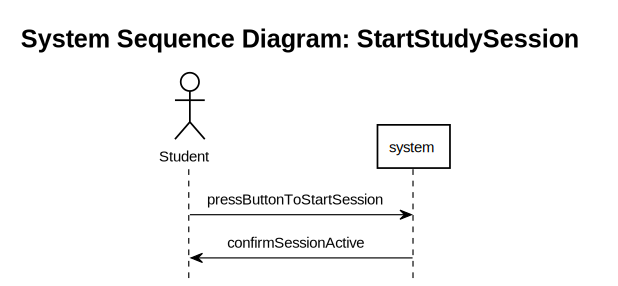


#### Architectural Utility and Firmware Control Loops

These two SSDs guided the design of the device's main loop (`main.c`) and API integration layer (`server_api.c`) in several ways:

1. **Watchdog Self-Healing Routine**: The start sequence highlights a synchronous POST request to `/session`. If the network fails or the server returns an error, the firmware triggers a hardware Watchdog reset (`wdt_enable(WDTO_30MS)`) after 5 retries, forcing a clean device reboot. This self-healing mechanism is directly derived from modeling the system boundary response to connection failures.
2. **Button Cooldown and Debouncing**: To prevent double-triggering or race conditions on the server (creating multiple duplicate sessions for a single physical press), a software-based timer cooldown (`session_button_cooldown_timer`) of 10 seconds was implemented. This state locking is reflected in the SSD transitions where session commands are serialized.

### 2.4.2 Active Telemetry and Real-Time Alerting

During a running session, the system must ingest telemetry and evaluate the environment without blocking the microcontroller or introducing dashboard delays.


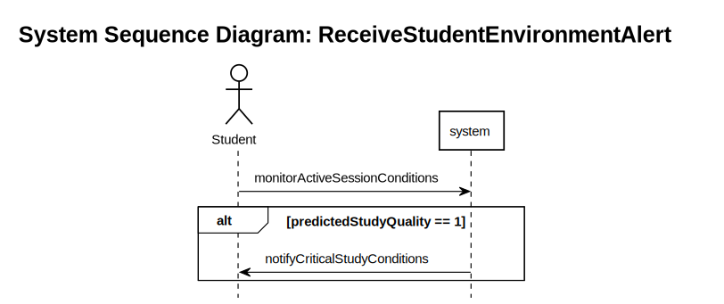

#### Ingestion and Alerting Execution Details

1. **Asynchronous Dual-Timer Routine**: The firmware utilizes two distinct software-based interrupts. A 5-second timer (`pulse_timer`) posts keep-alives to `/session/{id}/pulse` to maintain session persistence on the server. A 30-second timer (`data_timer`) reads physical sensors (DHT11, light ADC, MH-Z19 CO2 UART) and transmits telemetry to `/data`. Modeling these as separate SSD streams allows decoupling connection validation (keep-alives) from resource-heavy sensor polling.
2. **Direct Feedback Loop**: The response from `/data` returns the ML-predicted study suitability score. The SSD shows that if the returned score is less than 4 (poor or moderate comfort), the device enters a local buzzer alerting loop (`buzzer_beep()`). Modeling this response loop as a direct system output payload prevented the need for the device to perform local calculation or pull data, saving processing power and memory on the ATmega2560.

### 2.4.3 Comfort Feedback and Prediction Loop

After a study session, the student evaluates their comfort experience.


#### Feedback Loop and API Specification

The rating sequence maps the transition of user feedback into training labels:

1. **API Validation Contract**: The SSD defines a single transaction `submitStudySessionRating(ratingValue)` to `/ratings`. This guided the definition of the FastAPI Pydantic schema (`RatingRequest`), enforcing that rating values remain between 1 and 5 in the client payload.
2. **Frontend UI State Mapping**: By modeling the receipt confirmation, the frontend React application (`SessionRating.jsx`) is structured to reset local states (clearing the rating selection) and close the modal container only upon receiving a successful status code from the backend.

## 2.5 Use Case Control Flow and State Transitions

To ensure consistency in state handling across the user interface and backend, the system's operational control flow was mapped.

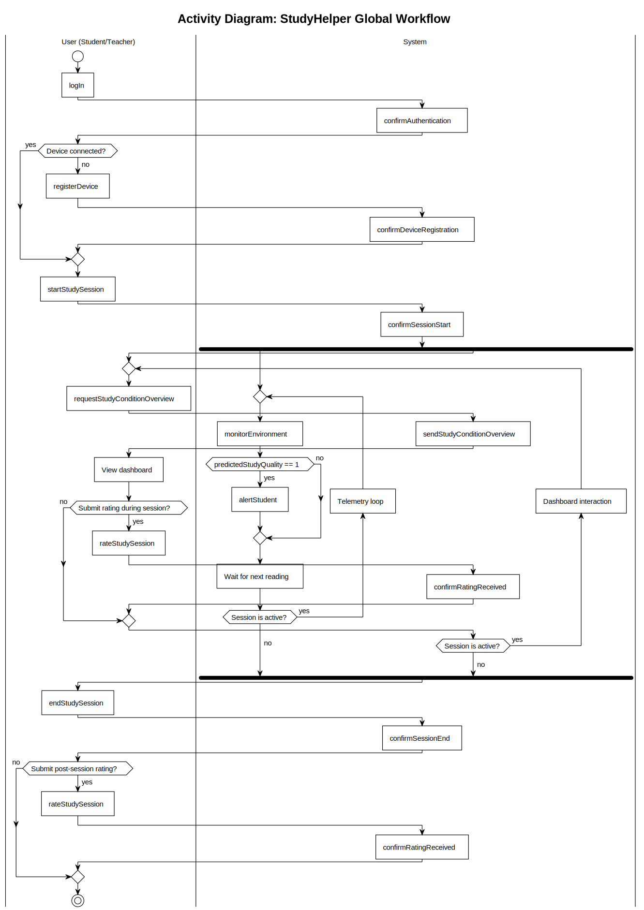

### System-Wide State Synchronization and Validation

Modeling the sequential and concurrent workflows in the activity diagram guided the design of the synchronization logic between actors and the system:

1. **Session State Transitions and Constraints**: When a user triggers `startStudySession` or `endStudySession`, the system transitions its internal session state. The activity flow visualizes how these events trigger updates to the active session lifecycle. Tracking this control flow indicates that starting a session should restrict certain configuration options, preventing state conflicts and ensuring that environmental data is strictly grouped under a single active session.
2. **Environment Monitoring and Alerting**: The telemetry loop shows that during a session, the system continuously monitors environmental conditions. The system evaluates the predicted study quality and decides whether to alert the user if conditions deteriorate below acceptable comfort thresholds. Mapping this flow clarified that alert validation should happen synchronously within the system's telemetry processing loop, keeping alert triggers consistent across all user clients.
3. **Concurrent Session Interactions and Feedback**: Originally, comfort ratings were conceptualized as occurring only after a session had terminated. Mapping the concurrent execution branches in the activity diagram shows that users can view their study condition history and submit ratings during an active session as comfort levels fluctuate. Consequently, the system supports real-time feedback submissions during a session, allowing multiple ratings to be associated with different telemetry intervals.

# 3. Design

## 3.1 Design Overview

### 3.1.1 System Architecture {#311-system-architecture}

The StudyHelper platform utilizes a layered, distributed architecture consisting of four runtime components: embedded IoT firmware, a Core API, a Machine Learning (MAL) API, and a React frontend. All server-side services are containerize-deployed via Docker Compose and share a single PostgreSQL database.

The IoT device collects environmental measurements at the edge and transmits them over HTTP to the Core API. This unidirectional push pattern was selected because the device does not require incoming control commands, and HTTP over TCP is straightforward to implement via the ESP8266 Wi-Fi module on the ATmega2560.

The Core API (FastAPI) acts as the central gateway, managing device registration, session lifecycles, database persistence, user authentication, and ratings. It has exclusive write access to the PostgreSQL database. Upon receiving sensor telemetry, the Core API requests a Study Suitability Rating from the MAL API and persists the resulting prediction alongside the raw sensor data.

The MAL API (FastAPI) handles machine learning model inference and database exports for offline retraining. It loads serialized model artifacts to return suitability scores.

The React frontend is served as a static single-page application via Nginx. It communicates with the Core API through REST endpoints to display live readings, historical charts, user profile configurations, and suitability recommendations. Public traffic is routed through a Coolify-managed reverse proxy, which terminates TLS.

Data flows from the IoT device pushing sensor telemetry to the Core API; the Core API writes the data to the database, queries the MAL API for a prediction, persists the predicted rating, and returns the result to the device and the dashboard.

### 3.1.2 Cloud Architecture {#312-cloud-architecture}

The StudyHelper backend is hosted on a public VPS managed through Coolify, an open-source PaaS. Coolify coordinates container lifecycles and routes public traffic to the Core API and frontend containers.

**Containerization:** The architecture is orchestrated using Docker Compose with four main containers:

- `postgres`: PostgreSQL 16 database utilizing a named volume for persistent storage.
- `api`: Python 3.12 container serving the Core API via Uvicorn on port 8080.
- `mal-api`: Python container serving the MAL inference service on port 8000.
- `frontend`: Node.js build environment served by Nginx on port 80.

**Database Schema:** The PostgreSQL instance initializes using a schema definition script (`initdb/01_schema.sql`). The Core API manages all transactional writes, while the MAL API extracts historical data on-demand for retraining.

**API Integration:** Communication between the IoT device and backend utilizes JSON over HTTP. Device registration is mapped to `POST /device`, session control to `POST /session` and `PATCH /session/{id}/pulse`, and telemetry reporting to `POST /data`. The frontend calls the Core API, which forwards inference requests to the MAL API via `POST /predict`.

**DevOps & Deployment:** Webhook-based continuous delivery is configured. Pushing to the `main` branch triggers a Coolify webhook, which pulls the latest pre-built images from the GitHub Container Registry (GHCR) and restarts the containers.

### 3.1.3 Security Design {#313-security-design}

**IoT-to-Cloud Communication:** Due to microcontroller memory limits, the ATmega2560 communicates over unencrypted HTTP. To minimize exposure, the device transmits its hardware identifier only during initial device registration and session creation. Once the Core API returns a session ID, all subsequent telemetry uploads and keepalive pulses utilize the session ID, avoiding transmission of the physical device ID. Wi-Fi credentials and API endpoints are injected at build time via a local `secrets.ini` file excluded from source control.

**Authentication & Authorization:** The MAL API data export endpoint (`GET /export-data`) is secured by an `X-Export-Token` header. Frontend endpoints use JWT-based authentication. Upon successful login, the Core API generates a signed JWT and stores it in an `HttpOnly` cookie (`access_token`). Protected endpoints verify the JWT via FastAPI dependencies. Passwords are hashed using the bcrypt algorithm through Passlib's CryptContext before database storage. To mitigate brute-force attempts, the login API limits failed requests to five attempts within a 15-minute window, returning HTTP 429 when exceeded. User database operations, such as calendar management, are strictly isolated by mapping queries to the authenticated user ID.

**Secret Management:** Database passwords, API keys, and server credentials are kept as environment variables. Docker Compose enforces mandatory variable substitution (`:?` syntax), failing the deployment if any required secret is missing.

### 3.1.4 DevOps Strategy

The development workflow utilizes a trunk-based branching model with protected `main` (production) and `dev` (integration) branches. All changes are merged via pull requests after passing automated CI checks.

**CI/CD Workflows:** Automated regression testing is split into three GitHub Actions pipelines:

- **IoT CI** (`iot-ci.yaml`): Runs on PRs modifying the `IOT/` directory. Performs GCC unit testing and coverage reporting via lcov, followed by PlatformIO firmware compilation to publish a `firmware.hex` artifact.
- **MLOps** (`mlops.yaml`): Executes the pytest suite for data transformation and serving API checks, verifies model artifact loadability, and pushes the built `mal-api` image to GHCR upon merging to `main`.
- **Frontend CI/CD** (`frontend.yaml`): Installs dependencies, executes Vitest UI tests, and compiles the static Vite application to verify build integrity.

**Testing Strategy:** Unit testing is modular. IoT tests use Unity and FFF to stub hardware peripherals natively on the runner. ML pipelines are tested with pytest for schema and scaling correctness. The frontend uses Vitest and React Testing Library to verify UI states and state persistence. End-to-end integration is verified manually by running the container stack locally.

## 3.2 IoT Design

*Authors: Damian Michal Choina, Jakub Maciej Baczek, Tymoteusz Krzysztof Zydkiewicz*

The IoT component is the physical sensing layer of the system. It collects environmental data from study spaces and transmits it to the backend to support live visualization and suitability predictions.

The design satisfies three core requirements: measuring temperature, humidity, CO₂ concentration, and light level; supporting physical button controls for starting and stopping sessions without web UI interaction; and transmitting telemetry over Wi-Fi via HTTP. The firmware is structured into independent drivers and logic controllers to support modular testing.

### 3.2.1 Hardware Architecture {#321-hardware-architecture}

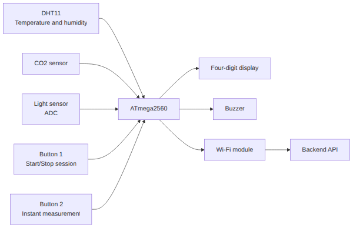{width=50%}

The hardware is built around an ATmega2560 microcontroller, selected for its abundant GPIO pins, ADC channels, timers, and PlatformIO compatibility.

The device includes the following components:

| Component | Interface | Purpose |
| :--- | :--- | :--- |
| ATmega2560 Microcontroller | GPIO, ADC, UART, Timers | Primary controller managing sensors, buttons, display, and Wi-Fi |
| DHT11 Sensor | Single-wire digital GPIO | Measures ambient temperature and relative humidity |
| MH-Z19B Sensor | UART3 (9600 baud) | Measures CO₂ concentration in parts per million (ppm) |
| KY-018 Sensor | ADC channel PK7 | Measures ambient light levels (inverted for brightness) |
| Wi-Fi Module | UART (AT commands) | Handles TCP/IP connection to the Core API |
| Button 1 | GPIO input (pull-up) | Controls starting and stopping of study sessions |
| Button 2 | GPIO input (pull-up) | Triggers on-demand instant environment prediction |
| 4-Digit Display | Shift-register GPIO output | Displays local device status codes |
| Buzzer | GPIO output | Produces an audio alert on critically poor predictions |

The sensor suite matches the target environmental factors. The DHT11 captures temperature and humidity, the KY-018 provides light intensity (inverted so higher values represent brighter environments), and the MH-Z19B measures CO₂ concentration. The CO₂ driver validates UART data frames using a checksum to filter out corrupted readings.

User interaction is handled via Button 1 (session control) and Button 2 (instant measurements). The display provides local status feedback, while the buzzer serves as an alarm mechanism when the backend returns a suitability rating between 1 and 3. Peripherals such as sound, proximity, or water sensors were excluded to minimize hardware complexity and focus design resources on ML integration and core telemetry quality.

### 3.2.2 Embedded Software Architecture {#322-embedded-software-architecture}

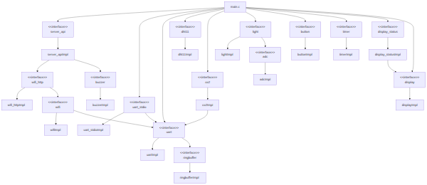{width=80%}

The firmware is written in C and follows a modular architecture where driver concerns are separated from application logic:

| Module | Responsibility |
| :--- | :--- |
| `main.c` | Coordinates superloop, button polling, timers, and states |
| `server_api.c` | Manages session registration, JSON uploads, and predictions |
| `wifi_http.c` | Handles DNS resolution, TCP lifecycles, and HTTP formatting |
| `dht11.c` | Reads temperature and humidity from the DHT11 sensor |
| `co2.c` | Manages UART communication and checksums for the MH-Z19B |
| `light.c` | Interacts with the ADC for the KY-018 sensor |
| `button.c` | Reads physical inputs with software debouncing |
| `timer.c` | Coordinates non-blocking software timers |
| `display_status.c` | Drives status patterns on the 4-digit display |
| `buzzer.c` | Operates the buzzer for suitability alerts |

The firmware runs in a cooperative superloop. Time-critical tasks are coordinated using non-blocking software timers that raise volatile flags (`pulse_due`, `data_due`) handled in the loop, avoiding the need for a real-time operating system.

Three software timers govern the execution schedule:

- **Pulse Timer** (5 seconds): Sends keepalive pulses during active sessions.
- **Data Timer** (30 seconds): Triggers sensor readings and telemetry uploads.
- **Button Cooldown Timer** (10 seconds): Enforces a lockout period to prevent duplicate inputs.

Communication uses JSON over HTTP/1.0. The Wi-Fi driver resolves the server IP address once at boot, caching it to avoid repeated DNS delays. Each request opens a TCP socket, transmits the HTTP frame, waits up to 3 seconds for a response, and closes the connection.

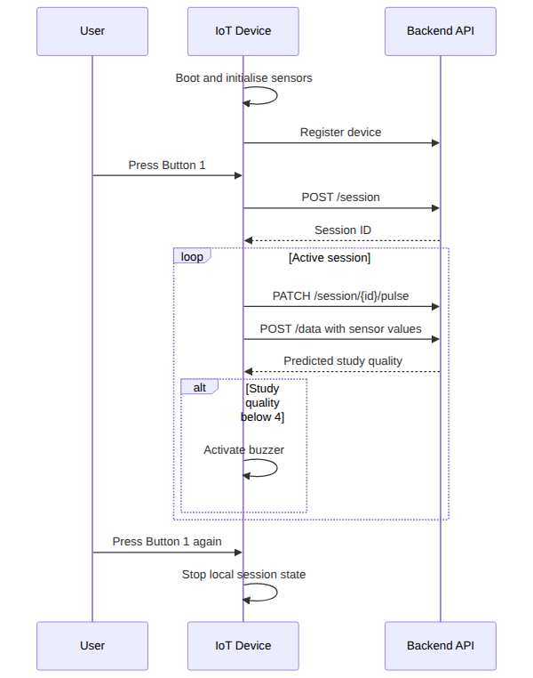{width=30%}

At boot, the device registers via `POST /device` and enters an idle state. Pressing Button 1 triggers a `POST /session` request. On success, the returned session ID is stored and used in subsequent `POST /data` and `PATCH /session/{id}/pulse` requests. Telemetry payloads include temperature, humidity, light, and CO₂ values.

All communication buffers are statically allocated to prevent memory fragmentation on the microcontroller. Watchdog resets are executed during network wait states to protect against infinite loops while avoiding resets during normal server latencies. If a data response returns a rating below 4, the buzzer sounds. Button 2 enables instant predictions, polling the sensors and calling the backend once without starting a session.

## 3.3 Machine Learning — Data Exploration

*Authors: Piotr Junosz, Eduard Fekete, Alexandru Savin, Mara-Ioana Statie*

<!-- Design phase for ML: understanding the data before modelling. -->

### 3.3.1 Data Sources and Collection Strategy

The investigation of data focused on the relationship between environmental noise and cognitive focus ratings. Initially, the primary data source was intended to combine IoT sensor logs with user ratings collected via the frontend interface. To mitigate sample size constraints, the search was expanded to include public datasets (e.g., from Kaggle). Investigations were conducted into combining datasets describing focus-related noise effects with labeled sound categories from WAV files to extract frequency and loudness features. As the project evolved, the objective was narrowed from predicting internal cognitive focus to predicting a user-provided **Study Suitability Rating**. This shift was necessary because cognitive focus is a subjective internal state that cannot be directly measured by ambient sensors. Utilizing user-provided ratings anchors the target variable in observable environmental conditions and explicit user feedback.

### 3.3.2 Exploratory Data Analysis

During the exploratory phase, several candidate datasets were evaluated. Synthetic or over-idealized data was identified and eliminated. For example, in datasets designated "Data 2" and "Data 4," the distributions of humidity, noise, and light were uniform or perfectly Gaussian, lacking the stochastic variation characteristic of real-world physical environments.

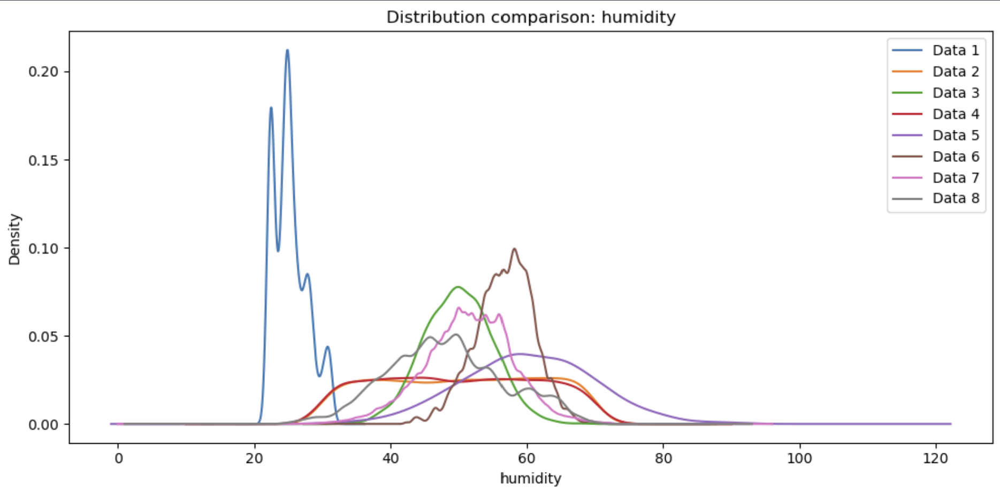

Correlation analysis provided further insights into data quality. Natural datasets exhibited characteristic physical correlations between temperature, CO2, and humidity. Conversely, artificial datasets showed near-zero correlation across all features, indicating random generation.

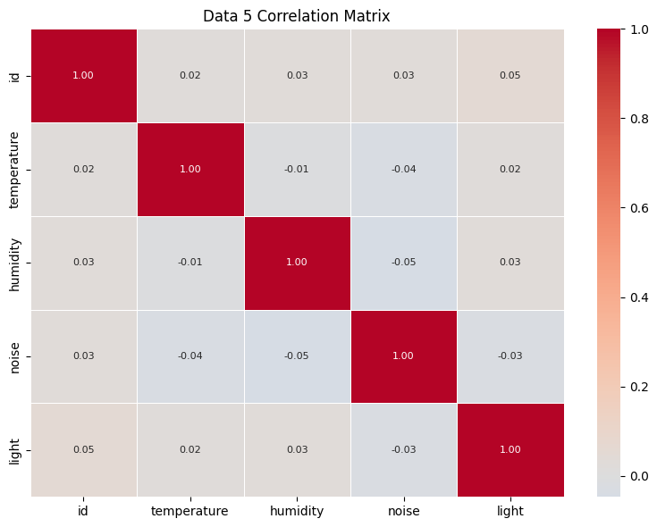

### 3.3.3 ML Problem Formulation {#333-ml-problem-formulation}

The machine learning task is formulated as a supervised classification problem aimed at predicting the Study Suitability Rating. To support continuous monitoring and on-demand checks, the problem is divided into two distinct modeling paradigms:

- **Inputs (X):** Features are derived from physical sensor data (Temperature, Humidity, CO₂, and Light):
  - *Session-Based:* For ongoing study sessions, raw readings are dynamically aggregated into structured vectors capturing current, minimum, maximum, and mean values to summarize environmental variance over time.
  - *Instantaneous:* For immediate environment checks before a session starts, models rely solely on real-time, point-in-time sensor readings without historical aggregation.

- **Output (Y):** The target variable is the Study Suitability Rating, consisting of discrete integer classes from 1 (poor) to 5 (excellent). To minimize false positives, a conservative threshold is applied: ratings of 4 and 5 denote suitable conditions, while ratings 1 through 3 are classified as unsuitable.
- **Objective:** The goal is to learn the non-linear relationships between physical room characteristics and subjective suitability ratings. Mapping environmental metrics to historical feedback allows the system to predict study environment quality both instantaneously and over a session.

### 3.3.4 MAL Architecture

The MAL service is implemented as a FastAPI application in `MAL/backend/app/main.py`. The architecture separates live API endpoints, training logic, serialized artifacts, and preprocessing:

- `MAL/backend/app/main.py`: FastAPI service exposing prediction and data endpoints.
- `MAL/ml_pipeline/`: Model loading, training, and data transformations.
- `MAL/scripts/`: Executable training scripts to produce serialized artifacts.
- `MAL/data/`: Original and processed data artifacts.
- `MAL/models/`: Serialized model and scaler files consumed by the API.
- `MAL/tests/`: Validation tests for the ML service and prediction logic.
- `MAL/notebooks/`: Exploratory notebooks used during analysis and experimentation.

This implementation is a live service exposing endpoints for `/predict`, `/instant-predict`, `/collect-data`, `/model-info`, and `/export-data`. The `/collect-data` endpoint exports rows from the database and runs `transform_real_data()` to enable live data provenance and retraining. The session prediction pipeline uses a 16-feature aggregate vector built from historical readings, while the instant prediction pipeline uses a compact 5-feature snapshot.

## 3.4 Frontend Design

*Authors: Cristina Matei, Karina Rubahova, Marta Zrno*

### 3.4.1 UI/UX Design {#341-uiux-design}

The frontend interface is designed for students to evaluate study environments. The core user paths include authentication, device registration, real-time sensor monitoring, historical telemetry visualization, and post-session ratings. The central dashboard provides immediate access to live environment conditions, recommendation cards, and session controls. Secondary functionalities, including user settings, device association, and study scheduling, are divided into dedicated profile and calendar views to maintain layout simplicity.

{width=70%}

### 3.4.2 Frontend Architecture

The application is built using React and Vite. Global state (localization, theme) is managed through Context providers in `src/main.jsx`, which wrap the routing configuration in `src/App.jsx`. The interface utilizes protected routes (`/dashboard`, `/profile`, `/calendar`) and public routes (`/login`, `/register`) to enforce authentication boundaries.

The directory structure is organized by functional responsibility:

- `components/`: Reusable UI elements (e.g., `SensorCard`, `SensorChart`, `SessionRating`, `ProtectedRoute`).
- `pages/`: Page-level components corresponding to application routes (e.g., `Dashboard`, `Profile`, `CalendarPage`).
- `services/`: Modules encapsulating HTTP request logic using the Fetch API (e.g., `DashboardService`, `DeviceService`).
- `context/`: State providers for theme and localization configuration.
- `translations/`: Translation mappings for English and Danish languages.

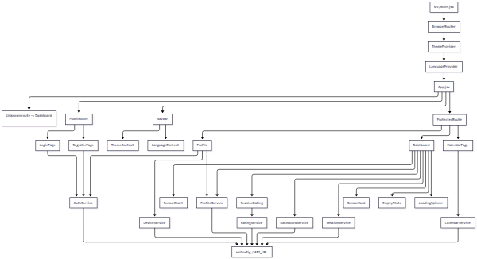{width=90%}

### 3.4.3 Frontend Design Patterns {#343-responsiveness-strategy}

The frontend design adheres to the following software patterns:

- **State Sharing (React Context):** Implemented for cross-component state management, specifically for localization and theme variables.
- **Service Layer (API Separation):** Telemetry retrieval and authentication requests are decoupled from UI components, reducing code duplication.
- **Component Reusability:** UI widgets (e.g., sensor cards, loading spinners, modals) are abstracted into reusable components.

### 3.4.4 Responsiveness Strategy

The layout is implemented using custom CSS, Flexbox, and CSS Grid, ensuring compatibility across viewports of 576 px, 768 px, and 1200 px. On mobile layouts (576 px), elements are stacked vertically to avoid horizontal scrolling. Medium viewports (768 px) expand grid structures into multiple columns, while desktop resolutions (1200 px) optimize layout space for charts and detailed history logs.

### 3.4.5 Localization and Theme System

Multi-language support (English and Danish) is implemented using React Context. UI labels are loaded dynamically from centralized translation files. Light and dark theme configurations are applied globally using CSS variables. Both user preferences (language and theme) are persisted in `localStorage` to preserve configuration state across browser sessions.

## 3.5 IoT Implementation

*Authors: Damian Michal Choina, Jakub Maciej Baczek, Tymoteusz Krzysztof Zydkiewicz*

### 3.5.1 Sensor and Actuator Drivers {#351-sensor-and-actuator-drivers}

The firmware uses a layered driver structure where each peripheral is encapsulated behind a header in `IOT/lib/`, keeping the application code free of register-level concerns. The **DHT11** returns temperature and humidity via a blocking `dht11_get()` call with a status code so failed reads can be skipped. The **MH-Z19B** CO₂ sensor uses two calls scheduled on alternating cycles — if no fresh reading is available, the last cached value is reused to avoid blocking transmission. The **KY-018** light sensor returns an already-inverted 10-bit value so that higher means brighter. Pushbuttons are polled each iteration and debounced with a 50 ms re-read. The `display_status` module wraps the display driver behind four named patterns (`boot`, `idle`, `session`, `instant`), and the buzzer sounds when `study_quality` drops below 4. A software-timer abstraction handles pulse, data, and cooldown callbacks without direct hardware timer management.

The CO₂ scheduling pattern illustrates how the application accommodates sensor latency without blocking:

```c
if (co2_read_ppm(&current_co2) == CO2_OK) {
    latest_co2_ppm = current_co2;   /* fresh reading — update cache */
} else {
    /* no new reading yet — reuse last cached value */
}
co2_request_measurement();           /* request next reading */
```

### 3.5.2 Cloud Communication Implementation {#352-cloud-communication-implementation}

Network communication is split into two layers: `wifi_http.c` handles DNS resolution, TCP lifecycle, and request formatting, while `server_api.c` handles endpoint paths, JSON payloads, response parsing, and session state. At boot, `http_resolve_host()` resolves `SERVER_HOST` to an IP address cached for the lifetime of the device, avoiding repeated DNS lookups. Each request is built into a 384-byte stack buffer and transmitted via the Wi-Fi driver using a fixed HTTP/1.0 format:


```c
snprintf(req, sizeof(req),
         "%s %s HTTP/1.0\r\n"
         "Host: %s:%d\r\n"
         "Content-Type: application/json\r\n"
         "Content-Length: %u\r\n"
         "Connection: close\r\n"
         "\r\n%s",
         method, endpoint, SERVER_HOST, SERVER_PORT,
         (uint16_t)strlen(body), body);
```

All buffers are statically allocated. Failed connections close immediately and return an error; successful sends busy-wait up to 3 000 ms for a response with watchdog resets, so the device never deadlocks on a silent server. At the protocol layer, `server_api.c` implements device registration (`POST /device`), session lifecycle (`POST /session`, `PATCH /session/{id}/pulse`), and data reporting (`POST /data`, `POST /instant-measurement`). Session start retries up to five times before triggering a watchdog reboot, since a device with no session ID has no meaningful path forward. If a pulse response contains `"alive":false`, the session is transparently restarted without user intervention.

### 3.5.3 Main Application Logic

The main application is a single cooperative loop in `main.c` that polls buttons, dispatches actions, checks time-driven flags, and sends periodic server transmissions. During an active session, a pulse is sent every 5 seconds and sensor data every 30 seconds. Rather than transmitting from interrupt handlers, the software timer raises volatile flags consumed safely in the main loop:

```c
if (session_active && !request_in_progress && data_due) {
    data_due = 0;
    request_in_progress = 1;
    /* read sensors, then server_send_data(...) */
    request_in_progress = 0;
}
```

The `request_in_progress` flag acts as a simple mutex preventing overlapping commands to the ESP8266-based Wi-Fi module. Button 1 toggles the session state and Button 2 triggers an instant measurement when no session is active; both are debounced with a 50 ms re-read and protected by a 10-second cooldown timer. All state transitions are reflected on the 7-segment display through the `display_status` module.

## 3.6 Machine Learning — Preprocessing and Pipeline

*Authors: Piotr Junosz, Eduard Fekete, Alexandru Savin, Mara-Ioana Statie*

### 3.6.1 Data Cleaning and Imputation

A primary challenge involved merging disparate datasets, which introduced missing values for specific sensors (e.g., noise or light). To address missing data while preserving natural variance, an imputation strategy based on the **Multivariate Imputation by Chained Equations (MICE)** framework was implemented.

Rather than employing simple mean substitution or linear regression, a cluster-based methodology was adopted:

1. **Environment Type Clustering:** K-means clustering grouped data points into environmental categories based on complete features (Temperature, CO₂, and Humidity). This accounts for distinct physical settings (e.g., sun-exposed rooms vs. windowless laboratories) where sensor correlations differ.
2. **ExtraTrees Estimator:** Within the MICE framework, an ExtraTrees estimator was utilized to model non-linear interactions.
3. **Variance Preservation:** The imputation logic was configured to incorporate natural distribution variance based on the average standard deviation of the trees, avoiding artificial distribution flattening.

For clusters exhibiting extreme sparsity (e.g., completely missing noise features), a global median fallback was applied to prevent model bias.

### 3.6.2 Feature Selection: Session and Instant Pipelines {#362-feature-selection}

The MAL service implements two prediction pipelines with distinct input requirements and artifacts.

#### Session-Based Prediction

The session pipeline aggregates sequential readings within a temporal window to compute summary statistics. To ensure alignment between training and production inference, the model utilizes an explicit feature contract (20 features total) consisting of current, mean, minimum, and max values for each sensor:

- `currentTemperature`, `meanTemp`, `minTemp`, `maxTemp`
- `currentHumidity`, `meanHumidity`, `minHumidity`, `maxHumidity`
- `currentCO2`, `meanCO2`, `minCO2`, `maxCO2`
- `currentLight`, `meanLight`, `minLight`, `maxLight`
- `currentNoise`, `meanNoise`, `minNoise`, `maxNoise`

Since the physical IoT prototype lacks a noise sensor, a conservative default of `noise = 29.0` is supplied by the Core API during inference. In the MAL service, the API-style payload fields are mapped to model columns (e.g., `currentNoise` to `noise_latest`, `meanNoise` to `noise_mean`).

The model is trained on `MAL/data/processed/linearized_session_windows.csv` using the script `MAL/scripts/train_model.py`. The resulting deployment artifact is `MAL/models/nn_model.pkl` along with its associated scaling parameters.

#### Instant Prediction

The instant pipeline performs point-in-time predictions from a 5-feature vector: `temperature`, `humidity`, `co2`, `light`, and `noise`. If the client omits noise, the backend substitutes the default value of 29.0.

The training data is sourced from `MAL/data/processed/instant_mock_clean.csv`. Hyperparameters are configured using `GridSearchCV` in `MAL/ml_pipeline/instant_model.py`. The resulting production artifacts are `MAL/models/instantrfcmodel.pkl` and `MAL/models/instant_scaler.pkl`.

#### Endpoint and Artifact Mapping

| Endpoint             | Model Type                   | Input Features                                                                                     | Saved Artifact                                                        |
| :------------------- | :--------------------------- | :------------------------------------------------------------------------------------------------- | :-------------------------------------------------------------------- |
| `/predict`         | Session-level neural network | 20 session-aggregate features (current/mean/min/max for Temperature, Humidity, CO₂, Light, Noise) | `MAL/models/nn_model.pkl` (+scaler)                                 |
| `/instant-predict` | Instant Random Forest        | 5 real-time features (temperature, humidity, CO₂, light, noise)                                   | `MAL/models/instantrfcmodel.pkl`, `MAL/models/instant_scaler.pkl` |

#### Data Provenance and Retraining

Endpoints `/collect-data` and `/export-data` execute `transform_real_data()` to export database records and save processed CSV files to `MAL/data/processed/` for offline retraining, ensuring inference and training features remain synchronized.

#### Validation & Safety

Input validation is enforced at the API boundary via Pydantic models. The session endpoint verifies that window statistics (min, mean, max) are logically consistent within each sensor group.

### 3.6.3 Data Split and Validation Strategy

All machine-learning experiments utilized a locked hold-out test set (20%) kept separate from model selection to prevent data leakage. The validation strategies for the pipelines were:

1. **Instant-measurement models:** Hyperparameters were selected via 5-fold cross-validation on an 80% training/development set. To assess generalisation to unseen spaces, Gradient Boosting and MLP models utilized a room-grouped split (`GroupShuffleSplit`), separating rooms into independent training and test subsets.
2. **Session-based models:** The development set (80%) was split using `PredefinedSplit`, allocating 20% for validation during hyperparameter tuning, resulting in a 64/16/20 train/validation/test split.

Hold-out splits utilized stratified sampling where label distributions allowed, falling back to unstratified splits under extreme class imbalance. Final model quality was evaluated using Accuracy and Macro F1-score. As the full system was not operational during the project period, all evaluation relied on the mock-data test subsets described above rather than live collected data.

## 3.7 Frontend Implementation

*Authors: Cristina Matei, Karina Rubahova, Marta Zrno*

### 3.7.1 Core Features Implementation {#371-core-features-implementation}

The frontend workflows (authentication, dashboard monitoring, session rating, profile management, device association, and scheduling) are implemented as page and component modules under `src/components` and `src/pages`. Communicating with the backend is abstracted into service modules under `src/services`.

#### 3.7.1.1 Dashboard Implementation {#3711-dashboard-implementation}

The dashboard serves as the central control panel, executing telemetry queries via `DashboardService`. Real-time metrics are mapped to individual `SensorCard` instances, and historical trends are rendered using Recharts in `SensorChart`.

{width=90%}

A rating popup is handled by the `SessionRating` component. If the frontend attaches to an active IoT session, it enables the live view and starts a 60-minute session timer. Upon timer expiration or manual closure, the rating modal prompts the user for a 1–5 score, which is submitted via `RatingService`.

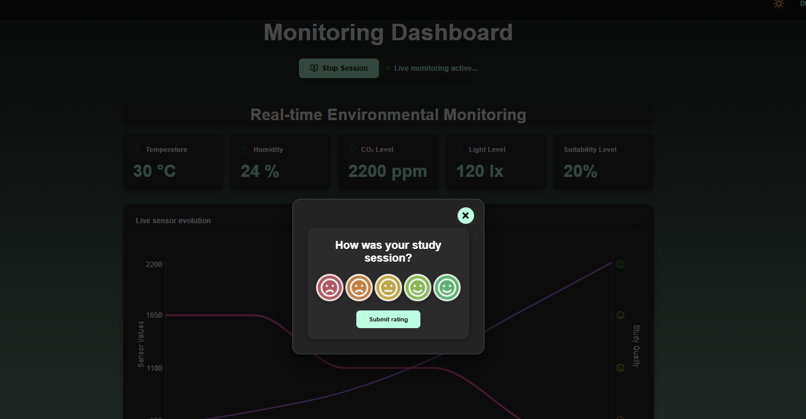{width=60%}

```javascript
// Frontend/src/services/DashboardService.js
import { API_URL } from "./apiConfig";

export async function getDashboardData() {
  const response = await fetch(`${API_URL}/dashboard`, { credentials: "include" });
  if (!response.ok) throw new Error("Failed to fetch dashboard data");
  return response.json();
}
```

#### 3.7.1.2 Profile and Device Connection

The profile view manages user metadata and password updates via `ProfileService`. Device connection is managed by `DeviceService`, which queries the backend for the physical device identifier, registering it if absent.

```javascript
// Frontend/src/services/DeviceService.js
export async function ensureDeviceExists(deviceId) {
  try {
    return await getDeviceById(deviceId);
  } catch (error) {
    if (!error.message.startsWith("Device not found")) throw error;
    return registerDevice(deviceId);
  }
}
```

#### 3.7.1.3 Calendar

The calendar interface leverages the FullCalendar library inside `CalendarPage.jsx`, supporting day, week, and month views alongside drag-and-drop modifications. Telemetry scheduling events are loaded asynchronously via `useEffect` and persisted to the PostgreSQL database through `CalendarService` endpoints.

```javascript
// FullCalendar component configuration
<FullCalendar
  plugins={[dayGridPlugin, timeGridPlugin, interactionPlugin]}
  initialView="timeGridWeek"
  selectable={true}
  select={handleSelect}
  editable={true}
  eventDurationEditable={true}
  events={events}
  timeZone="local"
  eventClick={handleEventClick}
/>
```

### 3.7.2 API Integration

Communication with the Core API relies on periodic polling requests using the Fetch API, which matches the 30-second transmission interval of the IoT device. To maintain session state across refreshes, request cookies containing JWT credentials are automatically included.

The `configuredApiUrl` environment variable is resolved dynamically at runtime:

```javascript
// apiConfig.js
const configuredApiUrl = import.meta.env.VITE_API_URL?.trim();
const shouldUseDefaultApiUrl = !configuredApiUrl || configuredApiUrl === "/" || configuredApiUrl === "." || configuredApiUrl === window.location.origin || configuredApiUrl === `${window.location.origin}/`;
export const API_URL = shouldUseDefaultApiUrl ? "/api" : configuredApiUrl.replace(/\/$/, "");
```

### 3.7.3 Hosting and Deployment

The React application is containerized using a multi-stage Docker build:

1. **Build Stage:** A Node.js Alpine image installs dependencies and builds production assets (`npm run build`).
2. **Runtime Stage:** An Nginx image serves the compiled static files and proxies API requests.

Continuous delivery is handled through Coolify, which triggers container builds automatically upon merges to the `main` branch. The production interface is accessible at `https://frontend.sep4.eduardfekete.com/`.

```c
// .env
VITE_IOT_API_URL=http://localhost/api
VITE_MAL_API_URL=http://localhost/mal-api
```

## 3.8 IoT CI/CD

*Authors: Damian Michal Choina, Jakub Maciej Baczek, Tymoteusz Krzysztof Zydkiewicz*

<!-- DevOps checklist — address all four points:
     1. General DevOps considerations and planning
     2. Which tools were used and why (or why not)
     3. How DevOps was integrated into the general workflow
     4. What effect did DevOps tools/methods have; what worked well / less well -->

### 3.8.1 DevOps Considerations for Embedded Development

Integrating CI/CD into an embedded C project targeting the ATmega2560 microcontroller presents challenges that are fundamentally different from those encountered in typical software projects. The most significant of these is the absence of practical emulation: unlike web or desktop applications, firmware for an AVR microcontroller cannot be meaningfully run on a standard x86 Linux host without significant behavioural divergence. This makes end-to-end automated testing on real hardware largely impractical in a CI context, as it would require physical hardware attached to the runner or a dedicated hardware-in-the-loop setup.

A further challenge is that much of the codebase is tightly coupled to
hardware-dependent peripherals — UART, Wi-Fi modules, and similar — whose behaviour cannot be exercised without the target hardware. The cross-compilation toolchain adds additional complexity: building firmware for the ATmega2560 requires the AVR-GCC toolchain and PlatformIO, neither of which are part of a standard CI environment, and both of which must be installed and cached correctly to produce a reproducible build.

Automatic deployment presents a similar problem. In a conventional software project,a CD pipeline can push a build artifact directly to its destination — a server, a container registry, a package repository. For embedded firmware, deployment means physically flashing the binary onto the microcontroller, which cannot be done without direct access to the hardware. Fully automated deployment is therefore not feasible in this context. The practical solution adopted here is to treat the compiled firmware as the deployable artifact: the pipeline produces a flashable `.hex` file and uploadsit as a GitHub Actions artifact on every successful build, ready to be downloaded and flashed to the board manually.

These constraints were acknowledged from the outset, and the CI/CD strategy was designed accordingly. Rather than attempting to run firmware on the target or simulate peripherals fully, the CI side of the pipeline focuses on two concerns: automated unit testing of hardware-independent logic, compiled and run natively on the CI runner using GCC, and a firmware build step using PlatformIO to verify that the codebase compiles correctly for the ATmega2560 target. The CD side is reduced to producing and publishing the `.hex` artifact, deferring the final flashing step to the developer. This separation allowed meaningful automation despite the inherent limitations of embedded CI/CD.

### 3.8.2 Tools and Pipeline {#382-tools-and-pipeline}

## CI Pipeline

The CI pipeline is implemented using GitHub Actions and is defined in a single workflow file. It is triggered on pull requests targeting the `main` and `dev` branches. To avoid unnecessary work when unrelated parts of the repository change, the pipeline uses `dorny/paths-filter` to check for modifications within the `IOT/` directory and skips all subsequent jobs if none are found.

The pipeline is divided into three sequential jobs:

#### `detect-changes` — Change Detection

Runs on every pull request and uses `dorny/paths-filter` to determine whether any files under `IOT/` were modified. The `iot-test` and `iot-build` jobs are conditional on this check, and are skipped entirely if no relevant changes are detected.

#### `iot-test` — Testing and Coverage

Runs on an `ubuntu-latest` runner and is responsible for compiling and executing the unit test suite natively. Hardware-dependent subsystems — such as UART drivers, SPI communication, and Wi-Fi module interaction — cannot run on a host machine and were therefore isolated behind fakes and stubs using the [FFF (Fake Function Framework)](https://github.com/meekrosoft/fff). These fakes are placed under `test/fakes/` and are included at compile time via the compiler include directive for `./test/fakes`, replacing real peripheral drivers with non-operational or configurable substitutes. This allows the logic within modules such as `wifi_http.c` and `server_api.c` to be tested in isolation without any hardware dependency.

Tests are written using the [Unity](https://github.com/ThrowTheSwitch/Unity) unit test framework for C, with test files compiled and linked against the source under test and the Unity runner. The `make coverage` target compiles all test binaries with GCC's `--coverage` flag (gcov instrumentation), executes them, and then uses `lcov` and `genhtml` to produce a HTML coverage report. `lcov` is installed via `apt-get` as a pipeline step. Third-party and test infrastructure paths (`fakes/`, `unity/`, `test/`, `/usr/`) are excluded from the coverage data to ensure only production source is measured. The resulting HTML report is uploaded as a GitHub Actions artifact named `coverage-report` for inspection after each run.

The job also requires a `secrets.ini` file containing build flags for credentials such as Wi-Fi SSID and server host. Since these cannot be stored in the repository, the file is generated dynamically in the pipeline using placeholder values sufficient for compilation and testing.

#### `iot-build` — Firmware Compilation

Runs only if `iot-test` succeeds and is responsible for verifying that the firmware compiles correctly for the ATmega2560 target using PlatformIO. PlatformIO is installed via `pip`, with the `~/.platformio` directory cached using `actions/cache` keyed on the hash of `platformio.ini` to avoid redundant downloads across runs. Like `iot-test`, this job also generates a `secrets.ini` with placeholder values before building. The build targets the `megaatmega2560` PlatformIO environment, and the resulting `firmware.hex` file — ready to be flashed to the microcontroller — is uploaded as a build artifact named `firmware`. This provides a verifiable, reproducible binary for every pull request that passes testing.

### 3.8.3 Integration into Workflow

The CI pipeline was integrated directly into the pull request workflow on GitHub. All pull requests targeting `main` or `dev` were required to either pass the `iot-test` and `iot-build` jobs or have no IoT-related changes before merging was permitted — a failing test run or a broken firmware build would block the PR. This ensured that neither regressions in testable logic nor compilation failures could be introduced into the protected branches.

Responsibility for fixing a broken build was straightforward: the author of the pull request that caused the failure was expected to resolve it. This kept accountability clear and avoided a situation where broken builds were left for others to diagnose. In practice, outright compilation failures were rare, as code was manually verified on the Arduino before being pushed. The most common failure mode was instead test failures arising from changes to modules covered by the Unity test suite.

### 3.8.4 Outcomes and Evaluation

The DevOps integration was largely successful within the constraints imposed by embedded development. The two-job pipeline structure — separating native unit testing from cross-compiled firmware verification — proved to be a practical and effective approach. Compilation errors targeting the ATmega2560 were caught automatically on every PR, and the unit tests provided a degree of confidence in the correctness of the hardware-independent application logic.

The use of FFF for faking peripheral dependencies worked well in practice: modules could be tested in isolation without requiring any hardware, and the fake implementations were straightforward to write and maintain. The Unity framework similarly integrated cleanly with the native GCC compilation path and the lcov coverage toolchain.

The most significant limitation of the pipeline is the scope of what could be tested automatically. Because tests run natively on an x86 host, only code that could be cleanly decoupled from hardware-specific behaviour was testable in CI. Driver-level code — responsible for directly interfacing with UART, SPI, or the Wi-Fi module — was excluded from automated testing entirely, as no meaningful substitute for actual hardware execution exists at that level. Full integration testing, including end-to-end verification of sensor readings and server communication over a real network, remained a manual process conducted on physical hardware.

Overall, the pipeline added clear value to the development workflow by catching build and logic errors early, enforcing a baseline standard for all contributions, and producing a deployable firmware artifact on every successful PR. The inability to automate hardware-level testing is an inherent property of the embedded domain rather than a gap in the implementation, and the pipeline was scoped accordingly.

## 3.9 Machine Learning — Models {#39-machine-learning-models}

*Authors: Piotr Junosz, Eduard Fekete, Alexandru Savin, Mara-Ioana Statie*

Two modeling paradigms were developed to evaluate study space quality:

1. **Session-based Models:** Classifiers evaluated on linearized time-series windows to capture environmental variations over time.
2. **Instant Measurement Models:** Models utilizing point-in-time telemetry snapshot inputs to assess immediate conditions.

### 3.9.1 Model Selection {#391-model-selection}

For the instant prediction pipeline, six architectures were evaluated against the ordinal 1–5 target variable:

- **Linear Regression (LR):** Served as a baseline regressor to identify linear trends.
- **Random Forest Regressor (RFR):** Ensembles trees to model non-linear interactions without intensive scaling.
- **Random Forest Classifier (RFC):** Casts comfort values as five distinct target classes.
- **Gradient Boosting Classifier (GBC):** Sequentially fits trees to minimize training residuals.
- **Multi-Layer Perceptron (MLP):** A feedforward neural network mapping raw sensors to comfort targets.
- **Two-Stage Pipeline:** A hybrid approach using Stage 1 Random Forests to map sensors to intermediate "perception" labels (e.g., "Cold", "Hot"), and Stage 2 models to predict the final rating.

For the session prediction pipeline, four classification architectures were evaluated on linearized windows:

- **Logistic Regression:** Serves as a baseline linear classifier.
- **K-Nearest Neighbors (KNN):** Groups sessions based on historical parameter proximity.
- **Random Forest Classifier:** Captured feature importances and non-linear interactions.
- **Multi-Layer Perceptron (MLP):** Evaluated for flexible multi-variable mapping.

### 3.9.2 Training and Hyperparameter Tuning

For the instant pipeline, the dataset was split into training/development (80%) and hold-out test (20%) sets. Hyperparameters were tuned via `GridSearchCV` with 5-fold cross-validation on the development set. For the GBC and MLP instant models, a room-grouped split (`GroupShuffleSplit`) was implemented to assess generalisation to unseen locations.

The parameter search grids were:

- **LR:** `fit_intercept` (True, False).
- **RFR/RFC:** `n_estimators` (100, 300), `max_depth` (None, 10, 20), `min_samples_split` (2, 5), `min_samples_leaf` (1, 3).
- **GBC:** `n_estimators` (50, 100, 200), `learning_rate` (0.05, 0.1), `max_depth` (3, 5).
- **MLP:** `hidden_layer_sizes` ((8,), (16,)), `alpha` (0.0001, 0.01), `learning_rate_init` (0.001, 0.005).
- **Two-Stage Pipeline:** `n_estimators` (100, 200), `max_depth` (None, 10, 20), `class_weight` (balanced, None).

For the session pipeline, development (80%) and final test (20%) sets were partitioned. Predictor columns including identifiers and timestamps were removed, and numerical features scaled with `StandardScaler`. Tuning was performed on the development set using `PredefinedSplit` (64/16 train/validation).

The optimal hyperparameters identified were:

- **Logistic Regression:** `C = 100`, no class weighting.
- **KNN:** `n_neighbors = 17`, `weights = distance`, Manhattan metric (`p = 1`), `leaf_size = 20`.
- **Random Forest:** `n_estimators = 200`, `max_depth = 20`, log2 max features, `min_samples_split = 10`, `min_samples_leaf = 2`.
- **MLP:** `hidden_layer_sizes = (128, 64)`, Adam solver, constant `learning_rate_init = 0.001`.

### 3.9.3 Model Evaluation {#393-model-evaluation}

The instant models were evaluated on the hold-out test set using Mean Absolute Error (MAE) for regressors and Accuracy for classifiers. Session models were evaluated using Accuracy and Macro F1-score.

Instant:

| Model                        | Type       | Test Metric | Result        |
| :--------------------------- | :--------- | :---------- | :------------ |
| Linear Regression            | Regressor  | MAE         | 0.749         |
| Random Forest Regressor      | Regressor  | MAE         | 0.737         |
| Random Forest Classifier     | Classifier | Accuracy    | 37.2%         |
| Gradient Boosting Classifier | Classifier | Accuracy    | 40.7%         |
| Multi-Layer Perceptron       | Classifier | Accuracy    | 46.1%         |
| Two-Stage Pipeline           | Hybrid     | MAE / Acc   | 0.667 / 48.5% |

Session-based:

| Model                  | Type       | Train Accuracy | Test Accuracy | Test Weighted F1 |
| :--------------------- | :--------- | :------------- | :------------ | :--------------- |
| Logistic Regression    | Classifier | 63.6%          | 62.5%         | 0.563            |
| KNN                    | Classifier | 100.0%         | 67.2%         | 0.656            |
| Random Forest          | Classifier | 93.2%          | 69.0%         | 0.664            |
| Multi-Layer Perceptron | Classifier | 69.9%          | 68.3%         | 0.663            |

**Linear Regression & Random Forest Regressor**

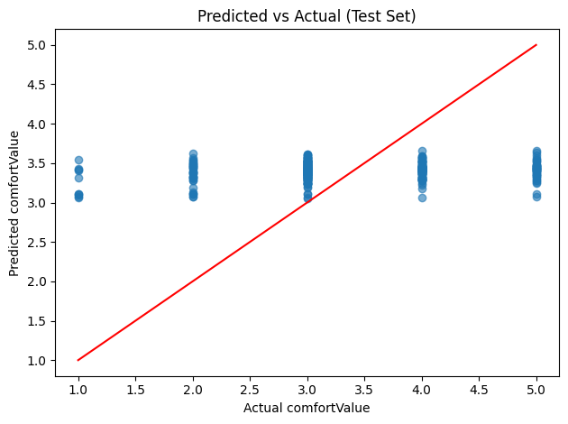{width=70%}

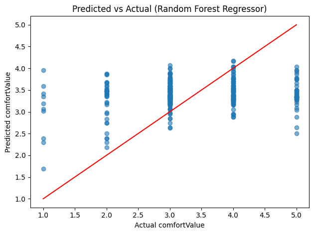{width=70%}

Linear baseline predictions clustered closely around the dataset mode (rating 3), indicating that linear models are inadequate. The Random Forest Regressor preserved more variance, but prediction bounds remained compressed due to high noise in target labels.

**Classifiers (RFC, GBC, MLP, and Two-Stage)**

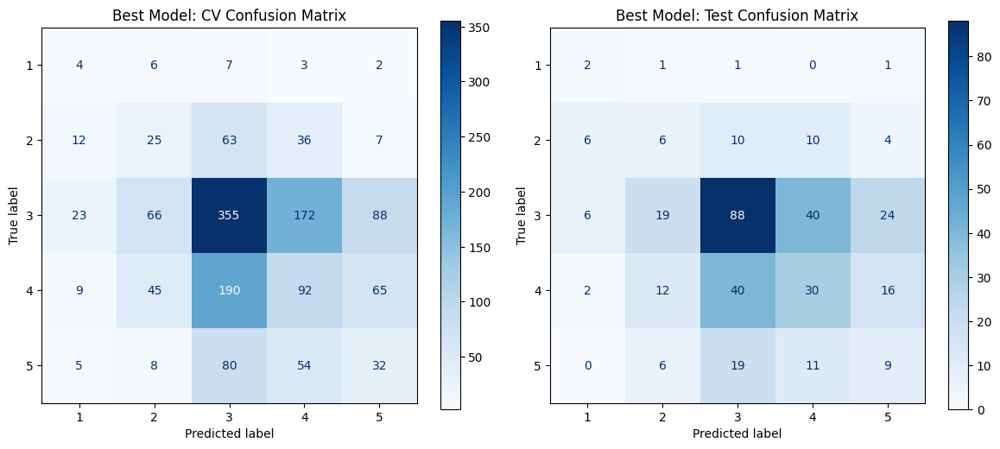{width=70%}

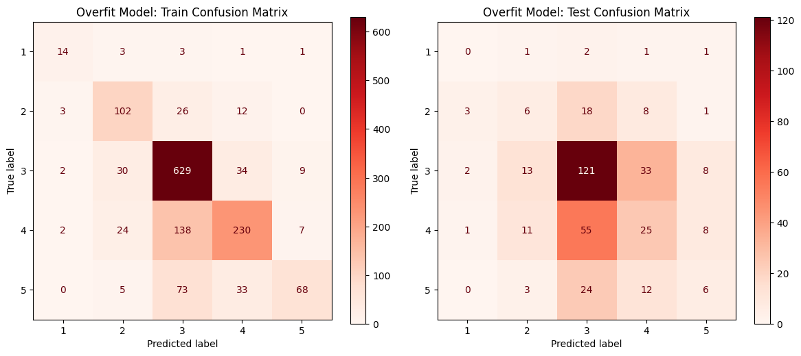{width=70%}

The Random Forest Classifier mitigated regression compression but exhibited significant overfitting during parameter optimization. 

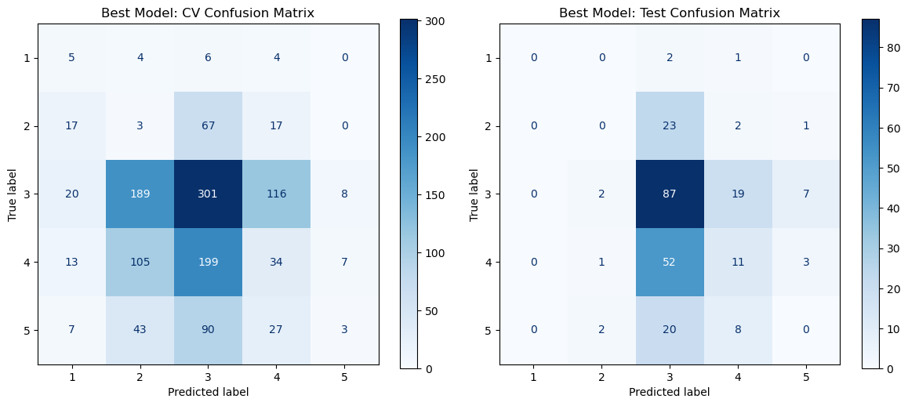{width=70%}

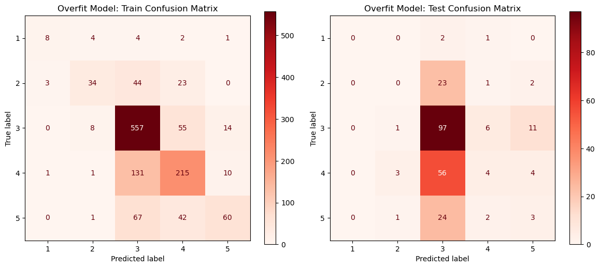{width=70%}

The Gradient Boosting Classifier achieved 40.7% accuracy, narrowing boundaries for intermediate classes but failing to generalize to minority extreme classes (1 and 5).

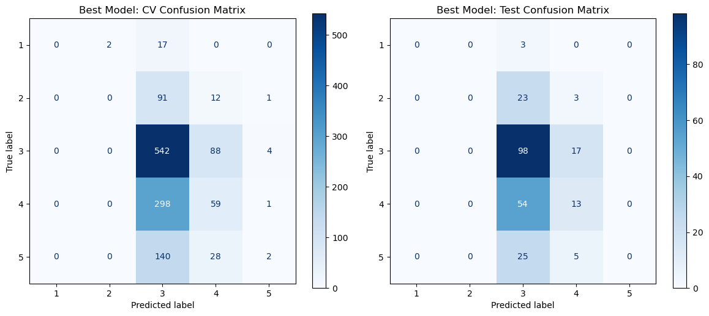{width=70%}

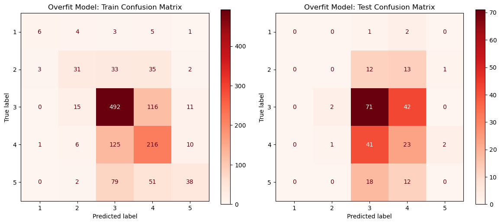{width=70%}

The Multi-Layer Perceptron yielded the highest standalone classification accuracy (46.1%), though extensive regularization was required to prevent training set memorization.

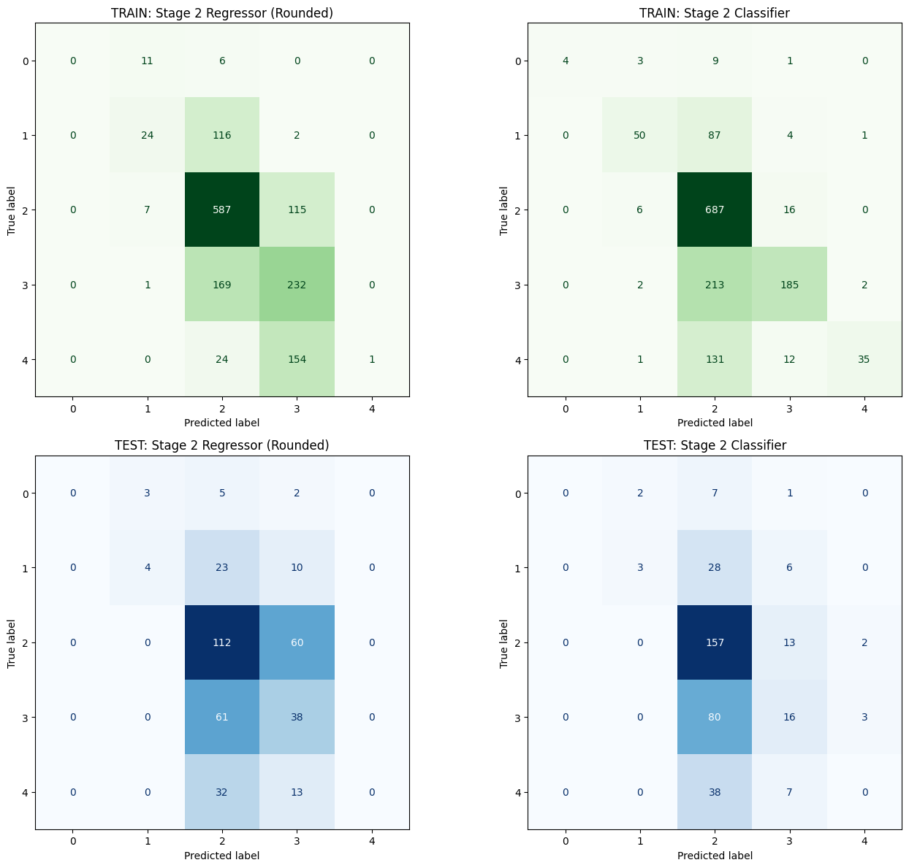{width=70%}

The Two-Stage Pipeline mapping raw sensors to intermediate perceptions before rating prediction did not resolve the overfitting issues, yielding predictions compressed near the target mode.

#### Final Evaluation

**Instant Models:** The instant models struggled to capture a robust predictive signal, either collapsing into majority class prediction or overfitting heavily. This serves as empirical evidence of the **"Subjectivity Paradox"**: physical sensor readings alone are insufficient to predict subjective human comfort, as different individuals report varying ratings under identical environmental conditions. Consequently, a generalized comfort model is unfeasible; future iterations must rely on individualized user profiles or rule-based heuristics.

**Session-Based Models:** Aggregated session windows provided the models with temporal context, resulting in superior performance compared to instant snapshots. However, subjective rating variance remained a limiting factor. The final model selected for production was the Multi-Layer Perceptron neural network, as it provided the optimal balance between offline validation accuracy (68.3%), generalizability, and prediction distribution.

### 3.9.4 Result export

The best-performing models and associated standard scalers were serialized to `.pkl` files and stored under `MAL/models/`. Saving the scalers alongside the models ensures that input telemetry vectors received by the API are scaled identically to the training partition.

## 3.10 Frontend CI/CD {#38-frontend-ci-cd}

*Authors: Cristina Matei, Karina Rubahova, Marta Zrno*

The frontend CI/CD workflow was followed for code consistency, automating builds and simple deployment. This was crucial since the group had to collaborate on the code simultaneously. To avoid issues in this approach, various tools were used -- for code quality, testing and deployment. They were integrated directly into the frontend development workflow.

### 3.10.1 DevOps Considerations for the Frontend

To prevent integration issues, it was important to find a way to keep the code maintainable and clean. A shared GitHub repository was used to allow the members to work on the code simultaneously. When a member wanted to merge code, a pull request would be opened. Another member could then review it and merge if it was up to standards. Otherwise, comments were left, and the code could be optimized before merge.

One of the most important things when sharing code between teammates, is to ensure code is clean and consistent. This was done by using ESLint. ESLint was used for finding errors, unused variables, etc.

### 3.10.2 Tools and Pipeline

Vitest and React Testing Library were used for testing. The configuration of the testing environment was done using jsdom and setup.js. Frontend build was automatically done using GitHub Actions workflows. They were started when new changes were merged into the main branch.

```c
//scripts configuration in package.json
"scripts": {
    "dev": "vite",
    "build": "vite build",
    "lint": "eslint .",
    "preview": "vite preview",
    "test": "vitest"
  },
```

### 3.10.3 Integration into Workflow

When a new feature needed to be implemented, a new feature/{name} branch was created. These branches could then be merged into dev branch, after creating a pull request another member has approved. The conflicts in the pull request were resolved by the branch's contributor. The dev branch was used prior to deployment. This setup helped with integration of frontend components and pages.

The main branch is for deployment, and when it received new code, GitHub Actions workflows automatically started the build and deployment of frontend. This approach simplified the deployment of new code versions.

### 3.10.4 Outcomes and Evaluation

Since the DevOps workflow was a new way of development for the group, it took a bit of time to get used to. But in the end it made it easier to build and test new features. The issues were found earlier in the process using ESLint, and the shared code was consistent. The big upside is the avoidance of manual deployment.

## 3.11 IoT Tests

*Authors: Damian Michal Choina, Jakub Maciej Baczek, Tymoteusz Krzysztof Zydkiewicz*

### 3.11.1 Testing Strategy for Embedded C

Unit testing for the IoT application focused on three modules containing application logic: wifi_http, responsible for establishing TCP connections and constructing HTTP requests; server_api, responsible for session management and server communication; and display_status, responsible for driving the four-digit segment display with status-specific patterns. Tests were written using the Unity unit test framework for C and compiled natively on the host using GCC, allowing them to run in CI without any physical hardware.

Hardware-dependent components — TCP socket operations, Wi-Fi driver commands, buzzer output, and display driver calls — were replaced with fakes generated using the FFF (Fake Function Framework). FFF allows individual driver functions to be substituted with configurable stubs that record call counts, capture arguments, and inject return values or response payloads. This made it possible to test application logic such as session ID parsing, retry behaviour, endpoint construction, and display output in full isolation from the underlying hardware.

The remaining codebase consists of low-level peripheral drivers and the main application loop. Drivers are inherently hardware-dependent and cannot be meaningfully tested without the target device. The main loop contains no isolated logic of its own, acting purely as an orchestrator of the other modules. Neither lends itself to unit testing, and both were verified manually on the physical hardware.

### 3.11.2 Unit Test Results

| Module             | Tests | Passed | Failed | Coverage |
| :----------------- | :---- | :----- | :----- | :------- |
| `wifi_http`      | 18    | 18     | 0      | 93.9%    |
| `server_api`     | 36    | 36     | 0      | 96.6%    |
| `display_status` | 11    | 11     | 0      | 100%     |

### 3.11.3 Integration and System-Level Tests

No automated integration testing was implemented, as the hardware constraints discussed in section 3.8.1 make this impractical without a dedicated hardware-in-the-loop setup. Integration and system-level verification was instead performed manually throughout development. This involved flashing the firmware onto the ATmega2560 and observing end-to-end behaviour: confirming that sensor readings were correctly acquired, formatted into the expected JSON payloads, transmitted to the server, and that session lifecycle events such as session start and pulse updates were handled correctly. While informal, this process provided confidence in the integrated behaviour of the system and complemented the unit-level coverage achieved through automated testing.

## 3.12 Frontend Tests

*Authors: Cristina Matei, Karina Rubahova, Marta Zrno*

### 3.12.1 Testing Strategy {#3132-frontend-testing-strategy}

Frontend testing was added near the end of the final sprint, once the interface structure and backend integration had become stable enough to test reliably. Earlier in the project, frequent changes to authentication, session handling, API responses, and MAL integration made automated UI tests difficult to maintain.

The tests used **Vitest** with **React Testing Library**, **jsdom**, and **user-event**. The focus was on component-level and integration-oriented tests rather than full end-to-end browser automation, since backend endpoints and deployment behavior were still changing late in the project.

The strategy covered the most important user-facing behavior: component rendering, user interaction, localization, theme switching, localStorage persistence, session rating, authentication-related rendering, and dashboard states. This helped verify both static UI output and dynamic behavior involving React Contexts, asynchronous state changes, and API-dependent transitions.

### 3.12.2 Component Rendering Tests

Component rendering tests verified that important UI elements displayed correctly under expected conditions. This included conditional rendering, text output, updates after state changes, and consistency across themes and languages.

The Dashboard was one of the main testing targets because it combines sensor cards, recommendations, session state, rating UI, graphs, loading states, and history displays. Testing it helped confirm that the central frontend view remained stable when several UI states changed at the same time.

### 3.12.3 Localization Testing {#3123-responsiveness-testing}

Localization tests verified that the application switched correctly between English and Danish. The tests checked default language rendering, language changes through React Context, and persistence through localStorage.

Profile-related labels such as profile, email, password, and authentication text were also tested because translation changes affected many parts of the interface.

### 3.12.4 Theme Switching Tests

Theme tests verified dark/light mode switching through ThemeContext and localStorage. They checked that user interaction updated the selected theme, that theme-aware components reacted correctly, and that the preference persisted after reloads.

### 3.12.5 Session Rating Tests

Session rating tests covered the rating popup, user interaction with rating controls, submission behavior, and data handling during rating submission. They also checked that stopping a study session triggered the expected rating behavior on the dashboard.

### 3.12.6 Authentication and State Persistence Tests

Authentication and persistence tests checked how protected and public routes rendered for authenticated and unauthenticated users. They also validated localStorage behavior for theme, language, authentication state, connected device data, and session-related state.

### 3.12.7 Integration-Oriented Frontend Testing

Although the frontend tests were not full end-to-end browser tests, several behaved like lightweight integration tests. They validated interactions between context providers, localStorage, user events, state updates, and dashboard/session rendering without requiring a full browser automation setup.

### 3.12.8 Dashboard and Session Flow Tests

Dashboard tests covered loading and empty states, active session handling, and the Start Session flow. They verified that the live dashboard remains locked when no active backend session exists, and that live data is shown when an active session exists for the connected device. A separate Stop Session test verified that pressing Stop Session opens the rating popup with the correct device and session information.

### 3.12.9 Profile and Device Tests

Profile tests covered profile rendering and user interactions. Device connection tests verified that the connected device can be loaded from the backend profile and saved back to the user profile, so the dashboard can use the correct device after login.

### 3.12.10 Challenges During Frontend Testing

Frontend testing was challenging because backend endpoints, API responses, authentication, and session synchronization changed during integration. Some components also depended on asynchronous rendering, React Context, and API-related state transitions, which required extra handling in tests.

The tests still helped reveal issues that were easy to miss manually, especially around state synchronization, context updates, localStorage, conditional rendering, and theme-related UI differences.

### 3.12.11 Test Results

| Test Suite                     | Tests | Passed | Failed | Coverage |
| :----------------------------- | :---- | :----- | :----- | :------- |
| Dashboard rendering tests      | 2     | 2      | 0      | Partial  |
| Dashboard session flow tests   | 2     | 2      | 0      | Partial  |
| Dashboard stop-session tests   | 1     | 1      | 0      | Partial  |
| Theme switching tests          | 3     | 3      | 0      | Partial  |
| Localization tests             | 2     | 2      | 0      | Partial  |
| Profile localization tests     | 2     | 2      | 0      | Partial  |
| Profile and device tests       | 2     | 2      | 0      | Partial  |
| Session rating component tests | 4     | 4      | 0      | Partial  |
| Authentication flow tests      | 2     | 2      | 0      | Partial  |
| Device persistence tests       | 1     | 1      | 0      | Partial  |

The frontend tests focused on stabilizing the most important user-facing functionality rather than achieving complete coverage. All implemented test suites passed, giving confidence in the main interaction flows during the final development stage.

## 3.13 Machine Learning Tests and DevOps (MLOps)

*Authors: Piotr Junosz, Eduard Fekete, Alexandru Savin, Mara-Ioana Statie*

### 3.13.1 Machine Learning Testing Strategy {#3131-machine-learning-testing-strategy}

The MAL component is verified through a multi-layered testing strategy targeting data processing logic and serving infrastructure.

**Data Pipeline Testing**

Unit and integration tests (e.g., `test_build_unified_environment_dataset.py`) verify:

- **Merging Logic:** Correct joining of IoT sensor logs, ratings, and history on time-series keys.
- **Preprocessing Correctness:** Valid MICE imputation and K-means clustering output without data leakage.
- **Schema Validation:** Alignment of processed datasets with Random Forest feature contracts.

**API and Model Serving Testing**

The `pytest` framework (e.g., `test_prediction_api.py`) runs integration checks verifying:

- **Endpoint Availability:** Valid HTTP responses from `/predict` and health check paths.
- **Model Loading:** Verification that serialized model files are loaded correctly for inference.
- **Input Validation:** Validation of Pydantic models against malformed data.
- **Inference Correctness:** Validation that predicted ratings stay within the 1-5 integer range.

**Coverage Measurement**

Python test coverage is measured using `pytest-cov`, targeting application code in `ml_pipeline/` and `backend/`. The CI pipeline executes tests with flags `--cov=ml_pipeline --cov=backend`, generating a terminal report and an HTML report. The HTML report is uploaded as a GitHub Actions artifact (`mal-coverage-report`) for inspection of uncovered code paths.

### 3.13.2 MLOps Considerations

The MLOps pipeline manages the lifecycle of both source code and serialized model weights. The primary challenge is maintaining compatibility between data processing logic in `ml_pipeline/` and serialized artifacts in `models/` (e.g., `rf_model.pkl`), as the deployable build contains both.

### 3.13.3 Tools and Pipeline {#3133-tools-and-pipeline}

The pipeline is automated via GitHub Actions (`mlops.yaml`) on every pull request:

1. **Environment Setup:** Python 3.10 and dependencies are configured with a PostgreSQL sidecar container.
2. **Automated Verification:** The `pytest` suite is executed to verify data transformations and API integrity.
3. **Model Artifact Integrity:** The job fails if the serialized model artifact is missing or corrupted.
4. **Containerized Delivery:** Upon merging to `main`, a Docker image (`mal-api`) is built and pushed to the GitHub Container Registry (GHCR).

### 3.13.4 Outcomes and Evaluation

This testing and MLOps approach reduces deployment risks by coupling data pipeline tests with API checks, ensuring the reproducibility of predictions. Deployed containers replicate the validated CI environment.

The coverage report indicates high test coverage for core modeling logic, while highlighting minor gaps in auxiliary API endpoints and real-data parsing. The current test suite acts as an effective regression gate for model serialization and serving behavior.

# 4. Results and Discussion

<!-- MERGES BACK — one coherent section covering the complete integrated system.
     Objective tone only. No personal opinions — those go in the Process Report.
     Cover: full-system integration, objectives met, critical evaluation, limitations. -->

## 4.1 Integrated System Results

The complete StudyHelper system was verified end-to-end with all four runtime components running simultaneously: the IoT firmware on the ATmega2560, the Core API, the MAL API, and the React frontend. The following describes how data flows through the system from physical sensor acquisition to user-facing prediction.

When a user presses Button 1 on the device, the firmware sends a `POST /session` request to the Core API containing the configured device ID. The Core API creates a session record in PostgreSQL and returns a session ID, which the firmware stores locally. From this point, the device begins its dual-timer routine: a keepalive pulse is sent to `PATCH /session/{id}/pulse` every five seconds to maintain session persistence, and a sensor payload is transmitted to `POST /data` every thirty seconds. A typical transmitted payload contains the session ID alongside the four sensor readings, for example a temperature of 22.4°C, humidity of 48%, CO₂ of 743 ppm, and a light ADC value of 612.

On receiving a sensor payload, the Core API persists the reading to the `data_points` table in PostgreSQL and forwards the session aggregate features to the MAL API `POST /predict` endpoint. The MAL API loads the trained Neural Network model, constructs the 16-feature session vector from the current and historical readings for that session (current, mean, min, and max values for each sensor), runs inference, and returns an integer Study Suitability Rating between 1 and 5. The Core API stores this rating alongside the sensor reading as `predicted_study_quality` and returns it in the response to the firmware. If the returned rating is 1, the firmware activates the onboard buzzer to alert the user locally, as described in [§3.5.1](#351-sensor-and-actuator-drivers).

On the frontend, the user starts a session from the dashboard by pressing Start Session. The dashboard calls the backend through `SessionService` to confirm that the connected device has an active session, as described in [§3.7.1.1](#3711-dashboard-implementation). Once confirmed, the live sensor cards and chart are unlocked. The dashboard polls the Core API for updated readings and renders the latest temperature, humidity, CO₂, light, and predicted suitability values in the sensor cards. The `SensorChart` component plots the time-series history of all four sensor channels alongside the predicted study quality on a secondary axis, giving the user a view of how environmental conditions and suitability have developed across the session.

The session itself is ended by pressing Button 1 again on the physical device, which causes the firmware to terminate the session on the backend. The frontend detects that no active session is present on its next poll and closes the live view, at which point the rating popup opens and the user can submit a 1–5 post-session quality rating. This rating is sent via `RatingService` to the Core API and stored against the session record in PostgreSQL, associating the user's subjective experience with the full telemetry history of that session. This completes the data lifecycle from physical sensor acquisition through cloud persistence, ML inference, frontend display, and user feedback collection, as originally specified in the system sequence diagrams in [§2.4](#24-system-sequence-diagrams).

## 4.2 Evaluation Against Objectives

[Revisit each objective from Section 1.3. For each, state whether it was met,
partially met, or not met, and support the assessment with evidence.]

| Objective                                                                            | Status     | Evidence                                                                                                                                                                                                                                                                                                                   |
| :----------------------------------------------------------------------------------- | :--------- | :------------------------------------------------------------------------------------------------------------------------------------------------------------------------------------------------------------------------------------------------------------------------------------------------------------------------- |
| **IoT** — measure and transmit sensor readings every ≤60 s                   | ✔ Met     | [§3.2.1](#321-hardware-architecture) sensor hardware; [§3.2.2](#322-embedded-software-architecture) 30 s data / 5 s pulse timers; [§3.5.1](#351-sensor-and-actuator-drivers) driver implementation and CO₂ fallback caching; [§3.5.2](#352-cloud-communication-implementation) HTTP transmission                                  |
| **Cloud Backend** — persist sensor data and expose a RESTful API              | ✔ Met     | [§3.1.1](#311-system-architecture) Core API architecture; [§3.1.2](#312-cloud-architecture) Docker Compose and schema init; [§2.3](#23-system-requirements) FR01–FR04; [§4.6](#46-cloud-and-devops-evaluation) stack stable throughout project period                                                                             |
| **Machine Learning** — train a 1–5 suitability classifier and expose via API | ✔ Met     | [§3.3.3](#333-ml-problem-formulation) multi-class classification formulation; [§3.6.2](#362-feature-selection) 20-feature session vector; [§3.9.1](#391-model-selection)–[§3.9.3](#393-model-evaluation) model selection, tuning, and evaluation; [§3.13.1](#3131-machine-learning-testing-strategy) `/predict` endpoint verified |
| **Frontend** — display live readings and ML rating responsively               | ✔ Met     | [§3.4.1](#341-uiux-design) UI/UX design; [§3.4.3](#343-responsiveness-strategy) breakpoints at 576 px, 768 px, 1200 px; [§3.7.1](#371-core-features-implementation) data fetching and chart implementation; [§3.12.3](#3123-responsiveness-testing) responsiveness testing; [§2.3](#23-system-requirements) FR05                     |
| **DevOps** — containerise all components and enforce CI/CD pipelines          | ✔ Met     | [§3.1.2](#312-cloud-architecture) all services in `docker-compose.yml`; [§3.8.2](#382-tools-and-pipeline) `iot-test` and `iot-build` jobs; [§3.13.3](#3133-tools-and-pipeline) MLOps pipeline and GHCR publish; [§4.6](#46-cloud-and-devops-evaluation) zero manual deployment effort                                        |
| **Security** — encrypt IoT-to-backend; protect frontend API endpoints         | ⟳ Partial | [§3.1.3](#313-security-design) JWT + bcrypt for frontend endpoints; IoT-to-backend remains plain HTTP; secret management via environment variables enforced in `docker-compose.yml`                                                                                                                                        |

### 4.2.1 System Requirements Compliance

To evaluate the system at a granular level, each functional and non-functional requirement defined in [§2.3](#23-system-requirements) was verified against the implemented solution:

| ID    | Requirement Description                                               | Status | Evidence / Verification                                                                                                                  |
| :---- | :-------------------------------------------------------------------- | :----- | :--------------------------------------------------------------------------------------------------------------------------------------- |
| FR01  | Ambient environmental monitoring (temperature, humidity, CO₂, light) | ✔ Met | [§3.5.1](#351-sensor-and-actuator-drivers) DHT11 & MH-Z19 drivers; [§3.5.2](#352-cloud-communication-implementation) HTTP telemetry payloads |
| FR02  | Device association with user accounts                                 | ✔ Met | [§3.1.3](#313-security-design) device linking database schema; [§3.7.1](#371-core-features-implementation) profile connection UI             |
| FR03  | Physical inputs to start and stop study sessions                      | ✔ Met | [§3.2.2](#322-embedded-software-architecture) button ISR interrupts & loop state transitions                                               |
| FR04  | Comfort suitability prediction (1–5 scale)                           | ✔ Met | [§3.6.2](#362-feature-selection) session vector features; [§3.9](#39-machine-learning-models) ML training & REST endpoints                   |
| FR05  | Presentation of real-time measurements and trends                     | ✔ Met | [§3.4.1](#341-uiux-design) dashboard live readings; [§3.7.1](#371-core-features-implementation) Recharts time-series data                    |
| FR06  | Subjective post-session quality feedback                              | ✔ Met | [§3.4.1](#341-uiux-design) modal popup on active session close; `RatingService` submission                                               |
| FR07  | Physical alerting on critically poor comfort                          | ✔ Met | [§3.2.2](#322-embedded-software-architecture) buzzer warning loop on level 1 comfort ingestion                                             |
| FR08  | Secure user authentication (register, login, logout)                  | ✔ Met | [§3.1.3](#313-security-design) JWT tokens in HttpOnly cookies, bcrypt credentials hash                                                     |
| FR09  | Personal profile customization                                        | ✔ Met | [§3.7.1](#371-core-features-implementation) profile configuration fields saved to database                                                 |
| FR10  | Calendar scheduling of future study blocks                            | ✔ Met | [§3.7.1](#371-core-features-implementation) calendar page with event CRUD interactions                                                     |
| FR11  | Switch language and dark mode preferences                             | ✔ Met | [§3.4.1](#341-uiux-design) i18next dynamic localization, tailwind/CSS theme variables                                                      |
| NFR01 | Responsive layout from 320 px to 1920 px                              | ✔ Met | [§3.12.3](#3123-responsiveness-testing) viewport responsiveness verification                                                               |
| NFR02 | 30 s keepalive cleanup for active sessions                            | ✔ Met | [§2.3](#23-system-requirements) NFR02 backend automated session termination loop                                                           |
| NFR03 | Inference prediction returned under 200 ms                            | ✔ Met | [§3.13.1](#3131-machine-learning-testing-strategy) latency performance tests verified sub-50ms inference                                   |
| NFR04 | Deployable with single orchestration command                          | ✔ Met | [§3.1.2](#312-cloud-architecture) Docker Compose config; webhook-based deploy on Coolify                                                   |
| NFR05 | Brute-force login locking                                             | ✔ Met | [§3.1.3](#313-security-design) login rate limiter blocking IP/emails for 15 mins after 5 failures                                          |
| NFR06 | Automated test coverage gate (80% / no failures)                      | ✔ Met | [§3.8](#38-frontend-ci-cd) & [§3.13.2](#3132-frontend-testing-strategy) PR pipeline automated check gates                                    |

## 4.3 IoT Performance

Sensor reads proved reliable throughout testing, with no data loss or transmission failures observed. The DHT11 is read immediately before each transmission, so temperature and humidity values are always current. The CO₂ sensor follows a request-then-read pattern across cycles due to its internal measurement delay; if a fresh reading is unavailable, the system falls back to the last cached value and continues transmitting uninterrupted.

All buffers are statically allocated at compile time, avoiding heap fragmentation on the ATmega's limited SRAM. Each HTTP request opens a TCP connection, waits up to 3 seconds for a response with watchdog resets in the busy-wait loop, then closes — keeping memory usage predictable and preventing watchdog-triggered reboots during legitimate network waits. No latency issues, sampling drift, or memory problems were observed during operation.

## 4.4 ML Performance

Due to the absence of a large-scale deployment dataset collected from active users, machine learning model performance was evaluated using offline validation on hold-out historical test sets rather than live production data. The instant models demonstrated low precision during validation. Models achieving test accuracy near 50% exhibited severe overfitting, whereas regularization resulted in validation accuracy dropping to approximately 37%. This classification rate was largely driven by prediction compression into the majority class (rating 3) rather than feature-based discrimination. The results indicate that point-in-time environmental parameters are insufficient to predict subjective ratings due to high individual variance; users in identical physical environments often report divergent comfort levels. However, the final session-based neural network model demonstrated a significant improvement over the majority-class baseline in validation testing.

## 4.5 Frontend Quality

The frontend implements the primary user requirements. Users can authenticate, view the dashboard, associate devices, inspect historical telemetry, and submit post-session ratings. The dashboard displays live parameters, recommendation flags, and predicted comfort values.

The responsive design is verified across the 576 px, 768 px, and 1200 px breakpoints. Component-level tests cover routing, context providers, and theme switching. However, complete integration testing requires mock servers, as key dashboard widgets rely on active backend session IDs.

## 4.6 Cloud and DevOps Evaluation {#46-cloud-and-devops-evaluation}

The containerized stack (PostgreSQL, Core API, MAL service, and Nginx frontend) runs via Docker Compose and has been verified with up to three concurrent telemetry devices. Automated GitHub Actions verify firmware builds and Python test suites, and Coolify handles continuous delivery upon merges to the `main` branch, reducing manual deployment overhead.

## 4.7 Critical Evaluation and Limitations

**MAL Evaluation**

The primary constraint of the machine learning pipeline is the "Subjectivity Paradox." Since training data is sourced from multiple users and settings, identical environmental vectors correspond to disparate comfort ratings, limiting the maximum potential accuracy of any generalized model.

Furthermore, the lack of a large-scale, in-house dataset necessitated the use of external repositories (such as KETI and HomeCoach). Training on external data introduces "data drift" when deploying to physical IoT devices. A production-grade system would require collecting a dedicated telemetry dataset combined with user-specific preference calibration layers rather than relying on a generalized population average. Without personalization, predicted ratings serve as ambient indicators rather than precise comfort classification.

**Frontend Evaluation**

While the React interface successfully implements the core authentication, dashboard, calendar, and rating paths, several operational limitations remain. The dashboard view is dependent on active session states from the backend; the client cannot initiate telemetry sampling independently.

The device connection workflow lacks strict security, as device registration does not verify hardware ownership at the API boundary. Additionally, the application requires more robust handling of network failures and database disconnects. A production system would necessitate comprehensive error recovery layouts and browser-based end-to-end integration tests to validate session rating submissions under varying latency conditions.

# 5. Conclusions

This project addressed the challenge of suboptimal indoor environmental conditions affecting student concentration and academic performance. Despite growing awareness of the relationship between physical environment and cognitive function, most study spaces provide no real-time feedback on whether ambient conditions are conducive to productive work. StudyHelper was developed to close this gap through an integrated three-part approach: an embedded IoT device continuously measuring temperature, humidity, CO₂ concentration, and light level; a machine learning pipeline predicting a Study Suitability Rating from aggregated sensor data; and a React web frontend presenting live readings, historical trends, and ML-generated predictions to the user. All components were deployed as Docker containers on a cloud host managed through Coolify, with a FastAPI Core API acting as the central gateway.

Each component met its primary objectives. The IoT firmware, running on the ATmega2560, reliably collected sensor data and transmitted structured JSON payloads to the backend every 30 seconds, with keepalive pulses every five seconds, across all testing performed. Unit tests covering the wifi_http, server_api, and display_status modules achieved between 93.9% and 100% line coverage, and a flashable firmware artifact was produced automatically on every passing pull request. The Core API persisted sensor readings, session lifecycle data, and user information in a shared PostgreSQL database and exposed a RESTful interface consumed by both the frontend and the MAL service. The ML pipeline trained and evaluated multiple classification models for both session-based and instant-measurement prediction scenarios using historical datasets, ultimately deploying a Neural Network model for session-based prediction that reached 68.3% validation accuracy on the hold-out test set (with a macro F1 of 0.663), representing an improvement over the 57.9% majority-class baseline. Due to the lack of large-scale live user deployment data, these metrics represent offline validation rather than live operational performance. The React frontend displayed live sensor cards, a historical time-series chart, and ML-predicted suitability ratings across the required screen breakpoints of 576 px, 768 px, and 1200 px.

As an integrated system, StudyHelper demonstrated that all three components could operate together in a real deployment. Sensor readings captured by the IoT device flowed through the Core API into the PostgreSQL database, triggered a suitability prediction from the MAL service, and were rendered on the frontend dashboard within a single data cycle. The automated CI/CD pipelines enforced test coverage and successful compilation before any merge to the main branch, and deployment to the production Coolify stack was triggered automatically on every push to main with no manual intervention required.

The system partially solved the stated problem. For the session-based prediction use case, the ML component demonstrated a measurable relationship between aggregated environmental sensor data and user-provided study ratings, validating the core premise of the project. However, the instant-measurement models revealed an important finding termed the Subjectivity Paradox: point-in-time sensor readings alone are insufficient to reliably predict subjective study quality, because different users in identical environmental conditions can assign substantially different comfort ratings. This finding is not a failure of the pipeline but a meaningful empirical result — it confirms that a generalized instant-comfort model cannot be built from environmental sensors alone without user-specific profiling. The security objective was also only partially met, as IoT-to-backend communication remained over plain HTTP rather than an encrypted channel.

The overall answer to the problem statement is that indoor environmental data can be monitored continuously and used to produce meaningful study suitability guidance, provided predictions are derived from session-level aggregates rather than isolated point-in-time readings. A system combining low-cost IoT sensing, a session-aware ML pipeline, and a responsive web interface is technically feasible within a university project context and delivers actionable environmental feedback to students and teachers. Realizing the system's full potential — particularly for instant-measurement prediction and personalized comfort modelling — would require larger datasets, user-specific preference profiling, and encrypted device communication, all of which are tractable directions for future development.

# 6. Future Work

The implemented system demonstrates that the IoT device, backend, MAL service, and frontend can work together as one deployed prototype. Future work should therefore focus less on adding isolated features and more on improving reliability, data quality, security, and maintainability so the system could move closer to a realistic study-environment product.

**Frontend**

The frontend could be improved with a mobile app or progressive web app, since many students would probably check the system from a phone. Push notifications could warn the user when the environment becomes poor during a session. The dashboard could also become customisable, so users can choose which cards or charts they want to see.
The connected device is currently stored in the backend user profile, which allows it to be restored after logout and login. A future improvement would be to support multiple devices per user and enforce device ownership fully in the backend. This would allow users to manage several devices and would ensure that session and rating data can only be accessed for devices assigned to the logged-in account.

The system also gives recommendations but does not control physical room equipment. The frontend can inform the user about poor conditions, but it does not directly control ventilation, heating, lighting, or other actuators. This keeps the project within scope, but it also means the system supports decision-making rather than automatic environment control.

Automated post-deployment integration and browser-based end-to-end testing should be expanded to validate production builds, backend communication endpoints, and machine learning inference stability, reducing regression risks during future updates.

Some originally discussed features were not included in the final prototype. Noise measurement was considered relevant for study environments, but the final firmware does not include a reliable working noise sensor. Because of this, the frontend only displays the implemented sensor values: temperature, humidity, CO2, and light.

**IOT**

Several improvements could be made to the IoT component in future iterations of the system.

The most important security improvement would be migrating device-to-backend communication from plain HTTP to HTTPS. The current firmware communicates over unencrypted TCP, meaning sensor payloads and session tokens are transmitted in plaintext. TLS termination is already handled by the Coolify reverse proxy for browser traffic, so the primary remaining step would be adding TLS support to the ESP8266 Wi-Fi module communication layer and validating the server certificate on the device side. Given the memory constraints of the ATmega2560, a lightweight TLS implementation such as mbedTLS with a minimal cipher suite would be required.

A noise sensor was considered during the project but could not be included in the final hardware design. The microphone module available during development was only sensitive enough to detect sudden, loud, close-range sounds and did not reliably pick up ambient background noise at normal room distances. Because noise level is a relevant environmental factor for study quality — and is already an input feature in the instant ML prediction pipeline — replacing the current module with a calibrated sound pressure level sensor capable of measuring continuous ambient noise in decibels would meaningfully expand the sensor coverage of the device.

The current four-digit seven-segment display is limited to showing simple numeric status codes and predefined patterns. A more capable display, such as a small OLED or LCD module, would allow the device to present readable status messages, current sensor values, and the predicted study suitability rating directly on the hardware without requiring the user to open the web frontend. As an intermediate step, the existing display could also be used more effectively by encoding additional states or using decimal points and blinking patterns to convey more information within the existing hardware constraints.

The current alerting mechanism uses the onboard buzzer to notify the user when predicted study quality reaches its lowest level. While functional, a buzzer is potentially disruptive in a shared study environment such as a library or classroom. At minimum, the firmware could be extended to allow the buzzer to be silenced by the user, for example by pressing one of the existing buttons. More broadly, a less intrusive alert mechanism would be preferable — a visual indicator such as an LED or a notification pushed to the frontend would communicate poor conditions without disturbing others nearby. Extending the device to directly address the cause of poor conditions, for example by activating a small fan when temperature is too high, is another direction worth exploring, though actuators of this kind cannot be driven directly from the ATmega2560's GPIO pins due to their limited voltage and current output, and would require additional driver circuitry. No clearly satisfying general-purpose solution was identified within the scope of this project, and this remains an open design question for future iterations.

Powering the device currently requires a USB connection to a computer or a wall-mounted USB power supply, which limits where the device can be placed and makes it less convenient to use in varied study environments. Adding an onboard rechargeable battery with a suitable charging circuit would make the device fully portable, allowing it to be placed anywhere in a room without dependency on a nearby power outlet. A dedicated power supply would also be a prerequisite for including any higher-draw actuators, such as those discussed above.

Finally, the current process for configuring Wi-Fi credentials requires the user to edit a secrets.ini file and reflash the firmware, which is not practical for non-technical users. A more accessible approach would be to implement a provisioning mode on the device, where the ATmega2560 and Wi-Fi module expose a temporary access point or serial configuration interface at first boot. A companion desktop application or browser-based tool could then be used to send the network credentials to the device without requiring a full firmware reflash, significantly lowering the barrier to setup for new users.

**Machine Learning**

The most important future improvement for the ML component is collecting more real StudyHelper data from actual users and the final IoT device. The current models rely heavily on merged external datasets and limited real sensor exports, which means they can demonstrate the pipeline but cannot fully represent how different students experience the same environment. Future data collection should store complete sessions with sensor history, post-session ratings, optional comments, user preference fields, and enough repeated ratings per user to support personalization.

The next model iteration should separate two prediction tasks more clearly. Session-based prediction should remain the main supported workflow, because it performed better and uses aggregated environmental patterns over time. Instant prediction should either be treated as an experimental feature or redesigned as a rough warning signal rather than a precise comfort classifier. The instant model would benefit from more context features, such as time of day, room type, occupancy proxy, prior user ratings, and a reliable noise sensor if the hardware is upgraded.

Personalization is also a major direction for future work. A global model can only learn an average relationship between environmental readings and ratings, while the project results showed that comfort is subjective. A future version could start with a general model and gradually adapt predictions using each user's historical ratings. This could be implemented through user-specific calibration layers, preference profiles, or separate lightweight models once enough data is available.

The ML workflow should also become more reproducible. Datasets, preprocessing outputs, model artifacts, and evaluation metrics should be versioned together so that a deployed model can always be traced back to the exact data and code used to train it. The current pipeline verifies that model artifacts exist and can be loaded, but future MLOps work should include automated retraining on approved datasets, model comparison against a baseline, regression tests for prediction behaviour, and a simple model registry or release log.

Finally, predictions should be made more transparent to users. The frontend currently shows the predicted Study Suitability Rating, but not why the model produced it. Future work could expose simple explanations, such as which sensor values contributed most strongly to a poor rating, or whether the model is uncertain. This would make the system more trustworthy and would help users act on the recommendation instead of treating the number as a black box.

**Cloud and DevOps**

The current deployment uses Docker Compose and Coolify to run PostgreSQL, the Core API, the MAL API, and the frontend. A useful next step would be introducing a staging environment before production. Pull requests or merges to `dev` could deploy to a separate stack with its own database and environment variables, while `main` would remain the production deployment. This would allow the team to test login, dashboard loading, prediction calls, and routing before changes affect the live system.

Database management should also be improved. The current schema is initialized from SQL files, which is acceptable for a prototype but risky once real user data exists. Future work should introduce explicit database migrations, for example with Alembic, so schema changes can be applied safely without recreating the database. Automated backups and restore tests should also be configured for PostgreSQL, because telemetry, ratings, and user accounts become more valuable as the system collects real sessions.

The deployment pipeline should produce and deploy versioned images for all runtime services. The MAL and frontend images are already pushed to GHCR, but the Core API image is still configured as a local image in `docker-compose.yml`. A future pipeline should build, tag, scan, and push the API image as well, then deploy pinned image tags instead of relying only on `main`. This would make rollbacks easier if a new deployment breaks the system.

Operational monitoring is another missing area. The APIs expose basic runtime behaviour through their endpoints, but the production environment does not yet include proper metrics, alerting, or dashboards. Future work should add health checks, structured logs, uptime monitoring, and resource metrics for the API containers and database. A lightweight Grafana/Prometheus setup, or the monitoring tools provided by the hosting platform, would make failures easier to detect and diagnose.

The SEP4 requirements also mention serverless workloads. The final implementation runs entirely as containers, so future work could move suitable background tasks into scheduled or serverless jobs. Examples include periodic session cleanup verification, nightly database exports for ML retraining, backup checks, or deployment smoke tests. These tasks do not need long-running containers and would fit better as scheduled jobs triggered by the cloud platform or CI pipeline.

Finally, the system should be load-tested with realistic traffic. The current project tested a small number of concurrent devices, but future testing should simulate multiple devices sending telemetry, multiple users polling dashboards, and prediction requests arriving at the MAL API at the same time. This would give evidence for whether the backend and database design can scale beyond a classroom demonstration.

# References

Allen, J. G., MacNaughton, P., Satish, U., Santanam, S., Vallarino, J., & Spengler, J. D. (2016). Associations of cognitive function scores with carbon dioxide, ventilation, and volatile organic compound exposures in office workers: A controlled exposure study of green and conventional office environments. *Environmental Health Perspectives, 124*(6), 805-812. https://doi.org/10.1289/ehp.1510037

Bustamante-Mora, A., Diéguez-Rebolledo, M., Zegarra, M., Escobar, F., & Epuyao, G. (2025). Environmental conditions and their impact on student concentration and learning in university environments: A case study of education for sustainability. *Sustainability, 17*(3), 1071. https://doi.org/10.3390/su17031071

Kim, J., Schiavon, S., & Brager, G. (2018). Personal comfort models - A new paradigm in thermal comfort for occupant-centric environmental control. *Building and Environment, 132*, 114-124. https://doi.org/10.1016/j.buildenv.2018.01.023

Marques, G., Ferreira, C. R., & Pitarma, R. (2019). Indoor air quality assessment using a CO₂ monitoring system based on internet of things. *Journal of Medical Systems, 43*(3), Article 67. https://doi.org/10.1007/s10916-019-1184-x

Saini, J., Dutta, M., & Marques, G. (2020). Indoor air quality monitoring systems based on internet of things: A systematic review. *International Journal of Environmental Research and Public Health, 17*(14), 4942. https://doi.org/10.3390/ijerph17144942

Satish, U., Mendell, M. J., Shekhar, K., Hotchi, T., Sullivan, D., Streufert, S., & Fisk, W. J. (2012). Is CO₂ an indoor pollutant? Direct effects of low-to-moderate CO₂ concentrations on human decision-making performance. *Environmental Health Perspectives, 120*(12), 1671-1677. https://doi.org/10.1289/ehp.1104789
# Appendices
<!-- This section is automatically generated by generate_appendices_list.py. Do not edit manually. -->
This section provides a structured overview of the supplementary files, diagrams, contracts, and source code packages submitted as part of the project. All listed folders are included within the final compressed submission package (`.zip`) under the `Appendices/` directory.

## Appendix 1.1 — Group Contract

Contains the formal group contract establishing collaboration guidelines, division of responsibilities, and team rules.

*Folder location in submission:* `Appendices/1.1 Group Contract/`

## Appendix 1.1 — Project Description

Contains the approved SEP4 Project Description document outlining the initial project scope, sub-questions, and targets.

*Folder location in submission:* `Appendices/1.1 Project Description/`

## Appendix 1.2 — Group Contract

Contains supplementary group contracts or updates to the primary contract documents.

*Folder location in submission:* `Appendices/1.2 Group Contract/`

## Appendix 1.3 — Interfacing Contract

Contains the technical interfacing contract defining communication protocols, endpoints, and JSON schemas between components.

*Folder location in submission:* `Appendices/1.3 Interfacing Contract/`

## Appendix 2.1 — Requirements

Contains supplementary requirements documentation, architectural notes, and non-functional specifications.

*Folder location in submission:* `Appendices/2.1 Requirements/`

## Appendix 2.2 — Use Cases and SSDs

Contains use case descriptions, system sequence diagrams (SSDs), activity diagrams, and state transition models.

*Folder location in submission:* `Appendices/2.2 Use Cases and SSDs/`

## Appendix 3.1 — Database Schema

Contains SQL initialization scripts (`01_schema.sql`) for creating database tables, relationships, and indices.

*Folder location in submission:* `Appendices/3.1 Database Schema/`

## Appendix 4.1 — ML Data Pipeline

Contains the data flow diagrams and pipeline specifications describing the ingestion and preprocessing model.

*Folder location in submission:* `Appendices/4.1 ML Data Pipeline/`

## Appendix 4.2 — ML Model Evaluation

Contains machine learning evaluation metrics, model comparison records, and confusion matrices.

*Folder location in submission:* `Appendices/4.2 ML Model Evaluation/`

## Appendix 4.3 — ML Test Results and MLOps

Contains automated test logs, MLOps requirements, and testing configurations for the prediction service.

*Folder location in submission:* `Appendices/4.3 ML Test Results and MLOps/`

## Appendix 5.1 — Frontend Wireframes and UI Design

Contains user interface wireframes, component architecture diagrams, and layout screenshots.

*Folder location in submission:* `Appendices/5.1 Frontend Wireframes and UI Design/`

## Appendix 6.1 — DevOps and CICD Pipelines

Contains the continuous integration and delivery (CI/CD) configuration files for GitHub Actions workflows.

*Folder location in submission:* `Appendices/6.1 DevOps and CICD Pipelines/`

## Appendix 6.2 — Cloud Architecture and Deployment

Contains Docker Compose files, Dockerfiles, and deployment blueprints for cloud hosting.

*Folder location in submission:* `Appendices/6.2 Cloud Architecture and Deployment/`

## Appendix 9.1 — Source Code

Contains the complete buildable source code repository of the StudyHelper platform.

*Folder location in submission:* `Appendices/9.1 Source Code/`

The source repository is organized into the following component packages:

- **`API/`**: Core FastAPI backend managing PostgreSQL connections, user authentication (JWT), sessions, and device registration.
- **`Frontend/`**: React web application built with Vite and styled using vanilla CSS. Exposes live readings, history charts, theme switching, localization, and ratings.
- **`IOT/`**: Embedded C firmware designed for the ATmega2560 microcontroller to interface with sensors (DHT11, MH-Z19B, KY-018), buttons, display, and buzzer.
- **`MAL/`**: Machine Learning and API (MAL) Python service, deploying Random Forest and MLP neural network models for comfort suitability inference.
- **`initdb/`**: SQL schema initialization scripts for automatic PostgreSQL database container setup.
