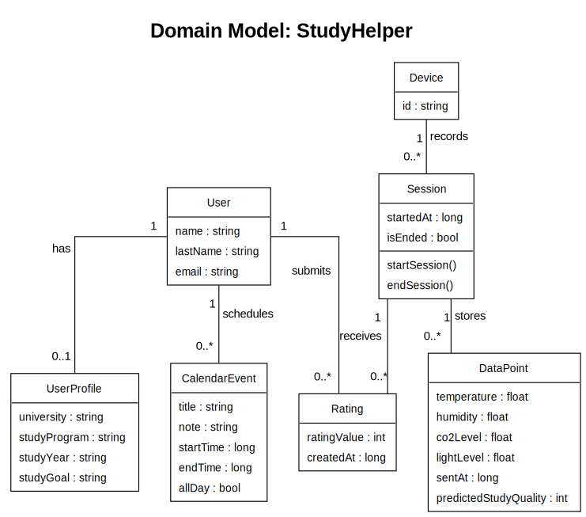
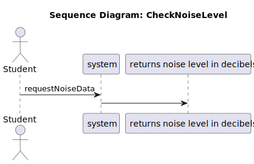

# Introduction

This document demonstrates the streamlined reporting capabilities for the **StudyHelper** project. It combines clean Markdown with automated academic formatting.

# Analysis Artifacts

All diagrams in this section are automatically integrated into the document from the MDD generation pipeline.

## Domain Model

The structural foundation of the system.



## System Sequence Diagram

A behavioral view of the noise monitoring use case.



# Technical Specification

## Code Implementation

Below is a demonstration of the system's core logic with academic-style syntax highlighting.

```typescript
/**
 * Processes environmental data and checks thresholds.
 */
import { SensorData, Notification } from './types';

export class EnvironmentAnalyzer {
  private readonly CO2_THRESHOLD = 1000;

  public analyze(data: SensorData): Notification | null {
    if (data.co2Level > this.CO2_THRESHOLD) {
      return {
        type: 'AIR_QUALITY',
        priority: 'HIGH',
        message: 'CO2 level high. Please ventilate the room.'
      };
    }
    return null;
  }
}
```

## Mathematical Modeling

Professional LaTeX typesetting is fully supported for all technical documentation.

**CO2 Parts Per Million Calculation:**

$$
\begin{aligned}
  Ratio &= \frac{V_{out}}{V_{ref}} \\
  CO2_{ppm} &= Ratio \times \text{ScaleFactor} + \text{Offset}
\end{aligned}
$$

# Academic Standards

## Requirements Mapping

Semantic status indicators help in tracking the project's functional completeness.

| ID | Requirement        |                        Status                         | Artifact                 |
| :- | :----------------- | :---------------------------------------------------: | :----------------------- |
| R1 | Monitor CO2 Levels |   <span class="status-done">✔ Done</span>             | CheckCO2Level.ssd.svg    |
| R2 | Notify Student     | <span class="status-progress">⟳ In Progress</span>   | NotificationService.ts   |
| R3 | Data Persistence   |   <span class="status-todo">☐ Todo</span>             | PostgreSQL Schema         |

## Citations

- **Parenthetical:** Complex systems require continuous refactoring to maintain quality [@fowler2018].
- **Narrative:** According to @via2024, software projects must follow a structured lifecycle.

# References

::: {#refs}
:::
